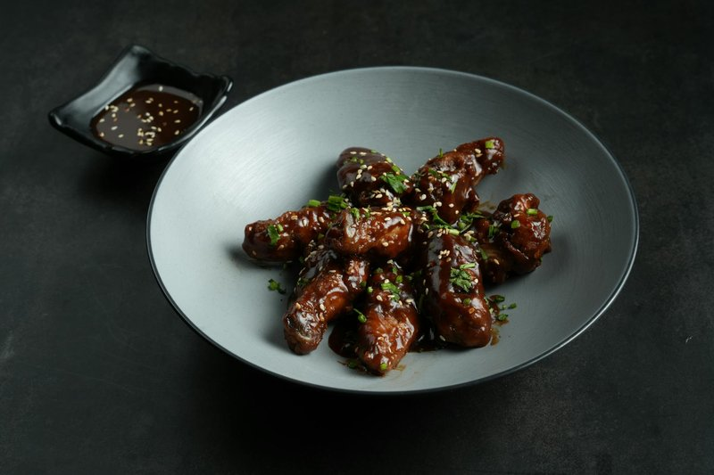

# Sesame Soy Chicken

*An Asian-inspired weeknight chicken: thighs glazed in sweet-savoury soy and sesame, finished with toasted sesame seeds. Hot sesame oil and brown sugar caramel.*

**Serves:** 6

**Prep Time:** 10 minutes (plus 2 hours marinating)

**Cook Time:** 15 minutes

## Overview
A short, high-impact recipe that turns boneless chicken thighs into something you'd expect off a restaurant menu. You lean on the familiar Asian-American pantry: soy for salt and umami, seasoned rice vinegar for brightness, brown sugar for the caramel-rich glaze, toasted sesame oil for nuttiness, and a touch of five spice and chilli humming in the background. Thighs are the right cut because their fat renders during the sear and keeps the meat juicy once the marinade reduces down to a glossy coating. The order matters: sear first to build colour, then return the marinade and let it cook off into a glaze that clings to each piece. The flavour is sweet-salty with a gentle hum of chilli and the toasted-sesame perfume that hits you in the doorway when someone walks past the kitchen. Equally at home sliced over rice bowls, in lettuce cups, tucked into bao, or eaten straight off the cutting board.

## Ingredients

### Chicken and marinade
- 900 g boneless skinless chicken thighs
- 80 ml soy sauce
- 80 ml seasoned rice vinegar
- 25 g packed brown sugar
- 5 ml toasted sesame oil (for the marinade)
- 1 g five spice powder
- 1 g red pepper flakes

### To finish
- 15 ml toasted sesame oil (for the pan)
- Sesame seeds, for garnish

## Method

### Stage 1 - Marinate
1. Pat the chicken thighs dry and lay them in a shallow dish or resealable bag.
1. Whisk the soy sauce, rice vinegar, brown sugar, 5 ml of sesame oil, five spice and chilli flakes together.
1. Pour over the chicken and turn until every piece is coated.
1. Cover and refrigerate at least 2 hours, or overnight.
1. Pull the chicken out of the fridge 20-30 minutes before cooking so it loses its chill.

### Stage 2 - Sear
1. Heat the 15 ml of sesame oil in a large skillet over medium-high until shimmering.
1. Lift the chicken out of the marinade, letting excess drip back into the dish, and reserve the marinade.
1. Working in batches, lay the thighs into the pan in a single layer.
1. Sear undisturbed for 5-6 minutes until deep golden underneath.
1. Flip and cook another 2-3 minutes, to an internal temperature of 74C.
1. Transfer seared pieces to a clean plate while you cook the rest.

### Stage 3 - Glaze and serve
1. Return all the chicken to the skillet.
1. Pour over the reserved marinade.
1. Bring to a gentle boil and spoon the liquid over the chicken as it reduces.
1. Cook until the marinade thickens to a glossy glaze that coats the pieces, about 2-3 minutes.
1. Move to a board, rest 5 minutes, scatter with sesame seeds.
1. Slice or serve whole over rice, in bowls, or with greens.

## Notes
- **Thighs over breasts:** dark meat stays juicy through the glaze stage; breasts work but watch carefully so they do not dry out.
- **Grill option:** preheat to 200C, grill 5-7 minutes per side to 74C, then reduce the marinade separately for 10-12 minutes in a small pan and brush on.
- **The marinade must boil:** because it has touched raw chicken, bring it to a proper boil while reducing to make it safe.
- **Seasoned rice vinegar:** already contains a little sugar and salt; if using plain rice vinegar, add an extra pinch of each.

## Storage
- Keeps 3 days refrigerated in a sealed container.
- Reheat gently in a covered pan with a splash of water to loosen the glaze.
- Freezes well for up to 2 months; thaw overnight in the fridge.
