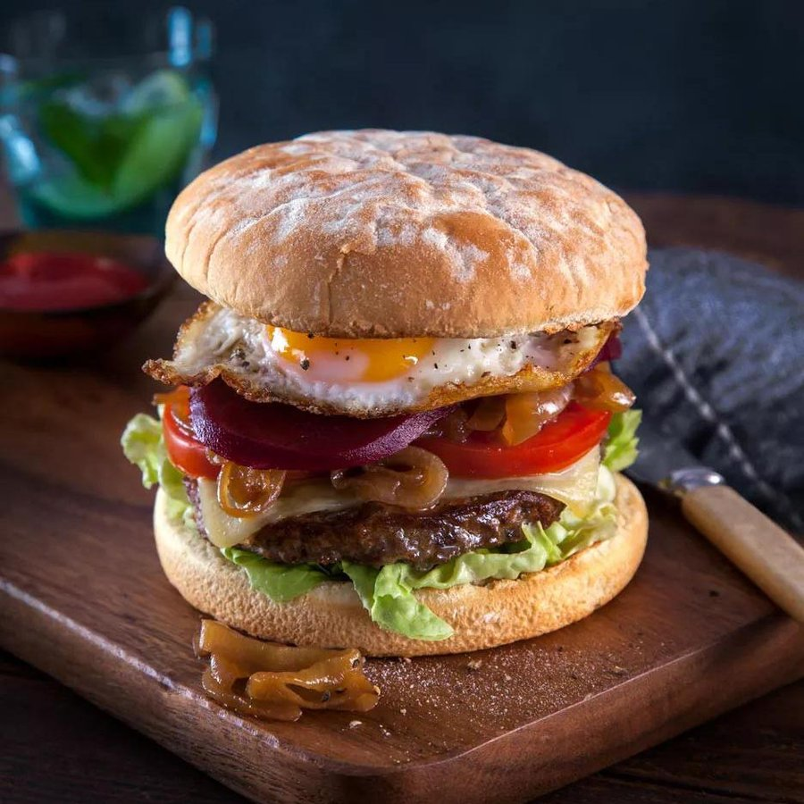

# Aussie Burger with Beetroot

*A towering stack of beef, bacon, fried egg, melted cheese, a slice of pineapple and the unmistakable purple-pink leak of pickled beetroot. It smells of charcoal and tomato chutney, and tastes like a service-station lunch on a road trip up the Pacific Highway.*

**Serves:** 4

**Prep Time:** 20 minutes

**Cook Time:** 20 minutes

## Overview
The Aussie burger, sometimes called "the lot", is a milk-bar institution that emerged in Australia in the mid-twentieth century when European immigrants and returning soldiers reshaped the corner takeaway. What distinguishes it from any American or British burger is the insistence on tinned pickled beetroot, a slice of canned pineapple, a fried egg and rashers of streaky bacon, all stacked under a thick beef patty on a toasted bun. The beetroot is non-negotiable: it stains the bread, it stains your fingers, it leaks down your wrist, and it is the entire point. The combination sounds chaotic but works because each layer plays a clear role: sweet pineapple against salty bacon, earthy beetroot against rich egg yolk, sharp tomato chutney cutting through melted cheese. The patty itself is generously sized, hand-shaped, and seasoned simply so the toppings can do the talking. Difficulty is low; the only real skill is timing several pans at once so the egg, bacon and patty all arrive hot together. This is not delicate food. It is built to be eaten leaning forward over a paper wrapper with napkins and a cold drink. Serve it at a backyard barbecue and watch grown adults negotiate the architecture of the bite.

## Ingredients

### Patties
- 600 g beef mince, 20% fat
- 1 tsp salt
- ½ tsp black pepper
- 1 tbsp Worcestershire sauce

### Toppings
- 4 rashers streaky bacon
- 4 eggs
- 4 canned pineapple rings, drained and patted dry
- 4 slices canned (or jarred pickled beetroot)
- 4 slices tasty cheddar cheese
- 4 lettuce leaves (large, iceberg or cos)
- 1 tomato (large), sliced
- 1 brown onion (small), sliced into rings

### To assemble
- 4 soft sesame burger buns, split
- Butter for toasting
- 4 tbsp tomato chutney (or Australian tomato sauce)
- 1 tbsp neutral oil for the grill

## Method

### Stage 1 - Patties
1. Mix the beef, salt, pepper and Worcestershire gently with your hands. Do not knead.
2. Divide into 4 patties slightly wider than the buns, about 1 ½ cm thick. Dimple the centres. Rest in the fridge.

### Stage 2 - Components
1. Heat a heavy frying pan over medium heat. Cook the bacon until crisp, transfer to paper towel.
2. In the bacon fat, fry the onion rings until soft and golden, about 5 minutes. Remove.
3. Add the pineapple rings to the same pan and caramelise for 1 to 2 minutes per side. Remove.
4. Wipe the pan, add a knob of butter and fry the eggs sunny-side up. Set aside warm.

### Stage 3 - Grill the patties
1. Heat a barbecue or griddle to high and oil lightly.
2. Grill the patties 3 to 4 minutes per side for medium.
3. In the last minute, lay a slice of cheese on each patty and close the lid (or tent with foil) until melted.

### Stage 4 - Toast the buns
1. Butter the cut faces of the buns and toast on the grill until golden.

### Stage 5 - Build
1. Spread tomato chutney generously on the bottom bun.
2. Layer in this order from the bottom: lettuce, tomato slice, onion rings, cheesy patty, bacon, pineapple, beetroot, fried egg.
3. Cap with the top bun, press lightly and serve immediately with a stack of napkins.

## Notes
- **The order matters:** lettuce on the bottom shields the bun from the patty juices. Beetroot near the top is traditional, partly so it does not soak the whole thing pink before the first bite.
- **Pat the beetroot dry:** straight from the jar it will flood the burger. Press it briefly between paper towel.
- **Tomato sauce vs chutney:** purists insist on a thick, sweet tomato chutney; bottled Aussie tomato sauce is the everyday compromise.
- **Egg yolk:** leave it runny on purpose. The yolk is part of the sauce.

## Storage
- Build burgers fresh. Cooked patties, bacon and onions keep 2 days refrigerated and reheat well in a dry pan. Do not store assembled burgers.
