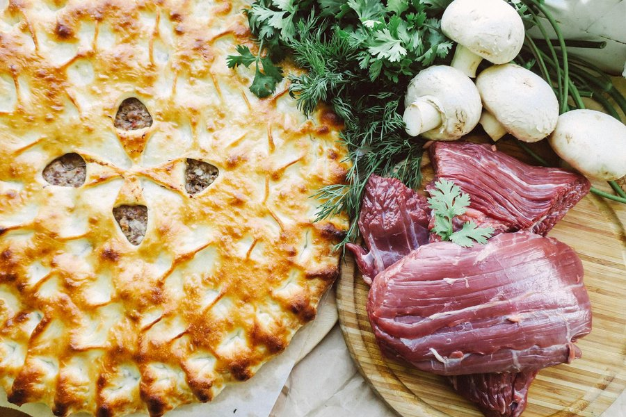

# Beef Meat Pie

*Australia's hand-held lunch: hot beef gravy in a shortcrust base under a flaky puff lid. Eat standing up at the footy with tomato sauce.*

**Serves:** 6 pies

**Prep Time:** 40 minutes (plus 30 minutes chilling)

**Cook Time:** 1 hour 30 minutes

## Overview
Australia's hand-held lunch and the unofficial national snack: hot beef gravy in a shortcrust base under a flaky puff lid, eaten standing up at the footy with tomato sauce running down your wrist. You build the filling like a thick gravy: minced beef cooked down with onion, beef stock, Worcestershire, tomato and a dark roux until it's sliceable when cool. The cold-filling trick is the one rule a pie shop never breaks: never fill a pie case with hot, loose gravy, because the bottom will go soggy in the oven and your pie will leak the moment you bite it. The chilled filling goes into shortcrust bases, gets a puff pastry lid crimped sharp at the edge, and bakes hot until the top is bronzed and shattering. Eat hot from the bag with a squeezy bottle of tomato sauce, or build a proper plate around it with mushy peas and gravy.

## Ingredients

### Shortcrust bases (or use 6 ready-made cases)
- 300 g plain flour
- ½ teaspoon salt
- 150 g cold unsalted butter, cubed
- 1 egg yolk
- 4-6 tablespoons ice water

### Filling
- 2 tablespoons vegetable oil
- 1 onion (large, finely chopped)
- 2 garlic cloves (crushed)
- 600 g beef mince (20% fat)
- 2 tablespoons plain flour
- 400 ml beef stock
- 2 tablespoons tomato sauce (or ketchup)
- 2 tablespoons Worcestershire sauce
- 1 tablespoon dark soy sauce
- 1 teaspoon Vegemite (optional but traditional; see Notes)
- ½ teaspoon ground black pepper
- 1 bay leaf

### Pastry top
- 1 sheet ready-rolled all-butter puff pastry (about 320 g)
- 1 egg (beaten, for glazing)

### To serve
- Tomato sauce (ketchup), squeezed on top, ideally a hot day, ideally at a sports ground

## Method

### Stage 1 - Make the shortcrust (skip if using ready-made)
1. Whisk the flour and salt together in a bowl.
2. Rub the cold butter into the flour with your fingertips until the mix looks like coarse breadcrumbs.
3. Stir in the yolk, then add ice water a tablespoon at a time, mixing with a knife, until the dough just comes together.
4. Tip out, press into a flat disc, wrap and chill 30 minutes.

### Stage 2 - Make the filling
1. Heat the oil in a wide pan over medium heat. Cook the onion for 6 minutes until soft.
2. Add the garlic and cook 1 minute.
3. Crank the heat to medium-high and add the mince. Break it up with a wooden spoon and brown deeply, 8-10 minutes. Push it around hard; you want browned bits sticking to the pan.
4. Sprinkle in the flour and stir for 1 minute.
5. Pour in the stock slowly while stirring; it will thicken at once.
6. Add the tomato sauce, Worcestershire, soy, Vegemite, pepper and bay leaf.
7. Lower the heat and simmer 25-30 minutes, stirring occasionally, until the mixture is dark, thick and almost dry (no loose liquid). It should hold its shape on a spoon.
8. Discard the bay leaf. Taste and adjust seasoning.
9. Spread the filling on a tray and cool to room temperature, then refrigerate at least 30 minutes until cold and firm. Do not skip this.

### Stage 3 - Line the pie tins
1. Preheat the oven to 200°C / 180°C fan.
2. Grease six 12 cm individual pie tins (or a 6-hole jumbo muffin tin).
3. Roll the shortcrust out to 3 mm thick on a floured surface. Cut six discs each 2 cm wider than the tin.
4. Press a disc into each tin, working the pastry into the corners and trimming the top edge flush.
5. Spoon cold filling into each, mounding slightly above the rim.

### Stage 4 - Top with puff and bake
1. Unroll the puff pastry and cut six discs slightly larger than the tin tops.
2. Brush the shortcrust rim with beaten egg.
3. Lay a puff disc on top of each pie. Press the edge to seal against the shortcrust rim.
4. Cut a small steam hole in the centre of each top.
5. Brush the puff tops with beaten egg.
6. Bake on the middle shelf for 25-30 minutes, until the puff has risen, the tops are deep golden and the bases are crisp underneath (lift one carefully with a knife to check).

### Stage 5 - Rest and serve
1. Cool in the tins for 5 minutes. The filling sets further as it rests; pies pulled straight from the oven explode when bitten into.
2. Lift out, plate up, and serve with a squeeze of tomato sauce across the top.

## Notes
- **Cold filling is the rule:** Hot gravy soaks the pastry base and you get a soggy pie. Chill the mince mixture until cold and firm before assembly. This is the single biggest secret to a proper pie.
- **Vegemite:** A teaspoon adds a savoury depth without tasting of itself. Marmite works the same way. Skip it without guilt if you have neither.
- **Shortcrust base, puff top:** The combination is classic and structural; shortcrust holds gravy, puff is the flaky theatre on top. All-puff makes a worse pie.
- **Pie tin size:** 12 cm individual tins (often called "small pie tins" in Australia) are ideal. A 6-hole jumbo muffin tin is a good substitute. A single large 25 cm tin works too; bake 35-40 minutes.

## Variations
- **Steak and mushroom:** Replace 200 g of the mince with diced chuck steak; brown first, simmer 1 hour, then add mince and 200 g of sliced mushrooms.
- **Curry beef pie:** Add 1 tablespoon of mild curry powder with the flour. Common in country bakeries through Queensland and New South Wales.

## Serving
- Serve with: Tomato sauce on top, hot chips on the side, mushy peas if you want to be fancy.
- Garnish with: A grind of pepper.

## Storage
- Keeps 3 days refrigerated. Reheat at 180°C for 12 minutes to crisp the pastry back up.
- Freezes well unbaked for 2 months: assemble fully, freeze on a tray then bag. Bake from frozen at 200°C for 40 minutes.
- Baked and frozen also works, 1 month; defrost overnight and reheat.
