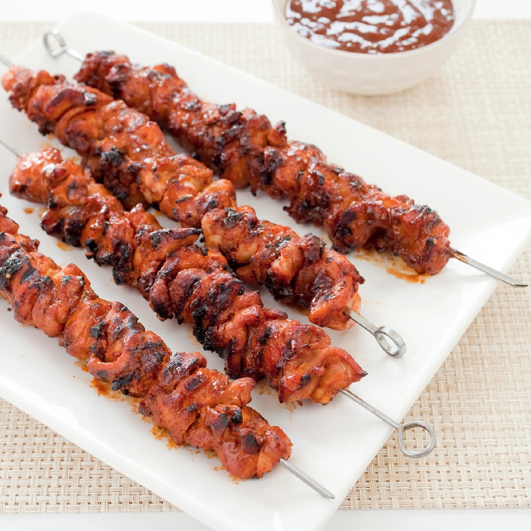

# Charcoal Chicken Shop Chicken Skewers

*The flavour you get at a Melbourne charcoal-chicken takeaway, made at home. Chicken thigh in a dry-rub-meets-marinade of garlic powder, onion powder, paprika and a quiet hit of curry, soaked overnight, threaded onto skewers, pan-seared hot. The lemon at the table is non-negotiable.*

**Serves:** 4-5 (makes 10-12 skewers)

**Prep Time:** 15 minutes (plus 12-24 hours marinating)

**Cook Time:** 20 minutes

## Overview
The flavour you'd get at a Melbourne charcoal-chicken takeaway, distilled into something you can run at home with a heavy pan instead of a rotisserie. You build a mostly-dry rub from the pantry: garlic powder, onion powder, sweet paprika, mustard powder, dried oregano, and a small amount of curry powder for the warmth that defines suburban-Australian charcoal-chicken shops. The rub wets out with olive oil and a generous squeeze of lemon, and the chicken thighs go in to marinate for twelve to twenty-four hours so the salt and spices penetrate properly. Thread onto skewers, sear hot in batches, rest briefly under foil so the juices settle. The lemon at the table is non-negotiable. Serve with warm flatbread, a chopped salad and a garlic-yogurt or hummus on the side, the kind of plate that arrives wrapped in butcher's paper at the takeaway.

## Ingredients

### The chicken
- 800 g boneless skinless chicken thighs (cut into 2.5 cm cubes)
- 3-4 tablespoons olive oil (for cooking)

### The marinade
- 1 ½ tablespoons garlic powder
- 1 tablespoon onion powder
- 1 tablespoon sweet paprika
- 1 teaspoon mustard powder
- 1 teaspoon dried oregano
- ½ teaspoon curry powder (mild, not vindaloo-strength)
- 1 ¼ teaspoons fine sea salt (or kosher salt)
- ½ teaspoon black pepper
- 3 tablespoons extra-virgin olive oil
- 2 tablespoons lemon juice (or white wine vinegar)

### To serve
- Warm flatbreads or pita
- A simple chopped salad (tomato, cucumber, red onion, parsley)
- Lemon wedges
- A sauce: [garlic toum](../arabian/side-dishes/toum.md) or [lemon yogurt sauce](../../sauces/sauce-savory/lemon-yogurt-sauce.md)

## Method

### Stage 1 - Make the marinade
1. In a wide bowl, combine the garlic powder, onion powder, paprika, mustard powder, oregano, curry powder, salt and pepper. Whisk briefly.
2. Add the olive oil and lemon juice. Stir to a thick paste - like wet sand.

### Stage 2 - Marinate
1. Add the chicken cubes to the bowl. Toss with your hands until every piece is fully coated. The paste should cling to each cube.
2. Cover and refrigerate for 12-24 hours. A minimum of 3 hours works; overnight is what gives the deep flavour.

### Stage 3 - Skewer
1. If using bamboo skewers, soak them in water for 30 minutes first to prevent burning.
2. Thread the chicken onto the skewers - about 3-4 pieces per skewer. Don't squash them tight; small gaps let the heat get into the sides.

### Stage 4 - Cook
1. Heat a large heavy frying pan or grill pan over medium-high. Add the olive oil - enough to cover the base in a thin film.
2. Cook the skewers in batches (don't crowd the pan or they steam). 3 minutes on the first side, until deep golden with crisp edges.
3. Turn and cook 3 more minutes on the second side. The chicken should be just cooked through (internal temp 75°C / 165°F) with a deeply caramelised crust.
4. If the spices start to burn at the edges before the chicken's done, drop the heat - the marinade has sugar in the onion and garlic powders and will catch.
5. Lift onto a plate and cover loosely with foil while you cook the rest.

### Stage 5 - Rest and serve
1. Rest for 3-5 minutes - the juices settle back into the meat.
2. Serve on a wide platter with the flatbreads, salads and sauce alongside. Squeeze a lemon wedge over the skewers just before eating.

## Notes
- **Chicken thigh, not breast**: breast goes dry under the long marinade-and-sear. Thigh stays juicy and stands up to the bold spice rub.
- **No charcoal needed**: the dry rub does the work that charcoal smoke would in a takeaway shop. For an even closer match, grill on charcoal or under a hot oven grill at 230°C, 4 minutes per side.
- **Curry powder is the secret**: half a teaspoon - just enough to add warmth without tasting curry-flavoured. Skipping it gives a fine but less rounded result.

## Serving
Pull the chicken off the skewers onto warm flatbread. Pile salad and sauce on top, fold, eat with your hands. Or serve skewers whole alongside roasted potatoes and the salad as a proper Sunday dinner.

## Storage
- Cooked chicken keeps in the fridge for 3 days. Reheat in a hot pan for 90 seconds per side.
- Marinated raw chicken can be frozen for 2 months in a sealed bag (the marinade continues to work during the thaw). Defrost overnight in the fridge.
