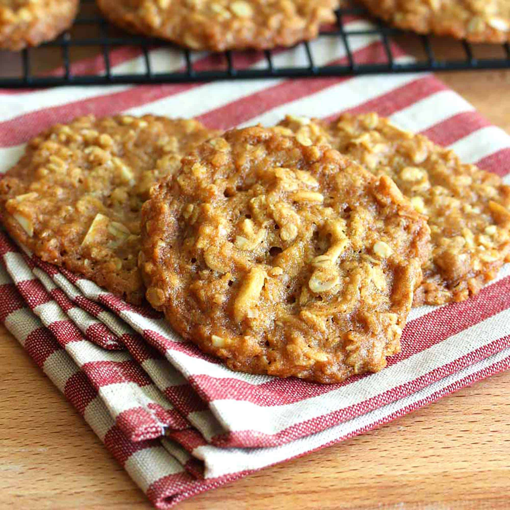

# ANZAC Biscuits

*Australia and New Zealand's military tribute biscuit: a chewy-crisp golden oat-and-coconut biscuit sweetened with golden syrup and bound with melted butter and brown sugar. The biscuit named for the ANZAC troops of WWI, baked across both countries on April 25th and many other days of the year.*

**Serves:** Makes 24 biscuits

**Prep Time:** 15 minutes

**Cook Time:** 18 minutes

## Overview
ANZAC biscuits are a national institution in both Australia and New Zealand: a chewy-crisp golden biscuit made from rolled oats, desiccated coconut, plain flour, brown sugar, melted butter and golden syrup, leavened with bicarbonate of soda dissolved in boiling water (no eggs). The biscuit traditionally celebrates the ANZAC troops who landed at Gallipoli on 25 April 1915; the biscuits were said to have been sent by wives and mothers to soldiers at the front because they kept well on the long sea voyage. The recipe has remained largely unchanged for over a century; both Australians and New Zealanders consider it their national biscuit. Golden syrup is essential for the caramelised butterscotch flavour; treacle or honey-and-brown-sugar substitute in a pinch, maple syrup does not. Cook for less time for chewy ANZACs, longer for crisp; both are correct. The bicarbonate of soda must dissolve in boiling water before going in, not added dry; that's what gives the proper rise.

## Ingredients

- 200 g rolled oats (not steel-cut, not quick-cook)
- 200 g plain flour
- 200 g desiccated coconut (unsweetened)
- 200 g caster sugar (or use 100 g caster + 100 g light brown sugar for richer flavour)
- 200 g unsalted butter
- 100 g golden syrup (the traditional ingredient; available at supermarkets in the baking aisle)
- 2 tablespoons boiling water
- 1 teaspoon bicarbonate of soda
- ½ teaspoon fine sea salt

## Method

### Stage 1 - Prepare the oven and tins
1. Preheat the oven to 160°C (320°F) for chewy ANZACs, or 180°C (350°F) for crisp ANZACs.
2. Line 2 large baking sheets with parchment paper.

### Stage 2 - Mix the dry ingredients
1. In a wide bowl, combine the rolled oats, plain flour, desiccated coconut, sugar and salt.
2. Whisk briefly to distribute evenly.

### Stage 3 - Melt the wet ingredients
1. In a small saucepan, combine the butter and golden syrup.
2. Heat over low heat, stirring, till the butter is fully melted and the syrup is incorporated; don't bring to a boil.
3. Take off the heat.

### Stage 4 - Activate the bicarb
1. In a small heatproof cup, combine the boiling water and bicarbonate of soda; stir; the mixture will foam up briefly.
2. Pour the foamy mixture into the melted butter-syrup; whisk to combine; the whole thing will foam and froth (this is the right reaction).

### Stage 5 - Combine
1. Pour the foaming butter mixture into the dry ingredients.
2. Mix thoroughly with a wooden spoon till a sticky dough forms; the mixture should hold together when squeezed.

### Stage 6 - Shape and bake
1. Scoop heaped tablespoons of the dough; roll into balls about 3 cm across.
2. Place on the prepared baking sheets, leaving 5 cm between each (they spread considerably).
3. Flatten each ball slightly with the bottom of a glass or a flat spatula.
4. For chewy: bake at 160°C for 18-20 minutes.
5. For crisp: bake at 180°C for 12-15 minutes.
6. The biscuits should be deep golden-brown all over; the centres might look slightly underdone (this is right; they firm up as they cool).

### Stage 7 - Cool
1. Let cool on the trays for 5 minutes (the biscuits are very soft when hot; they firm up as they cool).
2. Transfer carefully to a wire rack to cool completely.

### Stage 8 - Serve
1. Pile on a serving plate.
2. Serve with strong tea or coffee.

## Notes
- **Golden syrup is essential:** the proper ANZAC biscuit depends on golden syrup for its caramel-butterscotch flavour and chewy-crisp texture. Treacle is too dark; maple syrup is too thin and wrong-flavoured; honey + brown sugar works in an emergency but isn't the proper thing.
- **Chewy or crisp:** the temperature and time difference is the only change. 160°C for 18-20 minutes gives chewy ANZACs; 180°C for 12-15 minutes gives crisp ones. Both are valid Australian/Kiwi versions.
- **The bicarb-in-boiling-water step:** dissolving the bicarbonate of soda in boiling water before adding to the butter mixture gives proper even leavening; adding it dry gives uneven rise and possible bitter spots.
- **Don't over-bake:** the biscuits look slightly underdone when they come out of the oven; they firm up as they cool. Over-baking gives hard tooth-breaking biscuits.
- **Space well apart:** the dough spreads considerably during baking; 5 cm between balls is the minimum. Crowded baking gives joined-together biscuits.

## Variations
- **Chocolate-dipped ANZAC biscuits:** dip half of each cooled biscuit in melted dark chocolate; let set on parchment. Common modern Aussie variation.
- **Macadamia ANZAC biscuits:** stir 100 g of chopped roasted macadamias into the dough; gives a nutty Aussie variation.
- **Wholemeal ANZAC biscuits:** swap 100 g of the flour for wholemeal; gives a slightly heartier biscuit with extra fibre. Healthier variation.
- **Mini ANZAC biscuits:** use teaspoons instead of tablespoons; makes 48 mini biscuits. Great for parties or kids' lunchboxes.

## Serving
- With strong tea (the proper Australian way: a "cuppa" with milk and possibly sugar), or with milky coffee. At Sunday afternoon family gatherings, school lunchboxes, picnics, or on ANZAC Day (25 April) with proper reflection. A great biscuit for sending in the mail to someone overseas; they keep well.

## Storage
- Keep in a sealed container at room temperature 2 weeks; the chewy version stays soft for the first week, then firms up; the crisp version stays crisp throughout.
- Don't refrigerate; the texture goes wrong (chewy biscuits go hard).
- Freeze 3 months in a sealed container; defrost at room temperature.
- The dough freezes 3 months unbaked; freeze balls flat on a tray, transfer to a bag. Bake from frozen, adding 3-4 minutes to the cook time.
- Day-old crumbled ANZAC biscuits are excellent over yogurt and berries.
