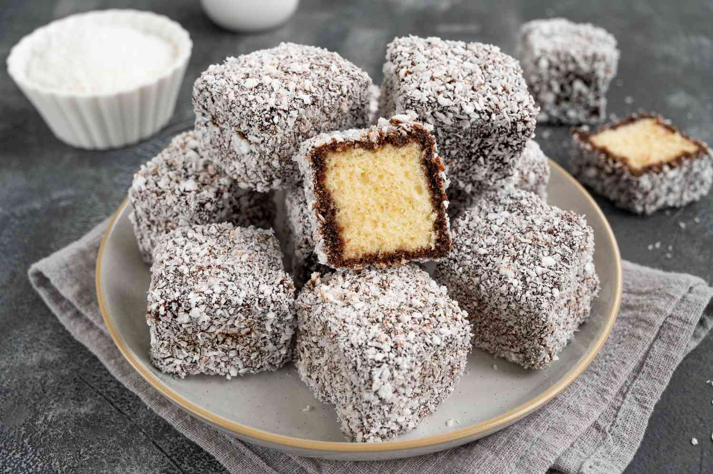

# Lamingtons

*Australia's national cake: cubes of light vanilla sponge dipped in chocolate icing, then rolled in desiccated coconut. The slightly old-fashioned afternoon-tea treat that every Australian grandmother bakes for the school cake stall.*

**Serves:** 16 lamingtons

**Prep Time:** 45 minutes (plus overnight resting)

**Cook Time:** 35 minutes

## Overview
Lamingtons are Australia's most iconic cake and a national institution: cubes of light vanilla butter-sponge dipped in thin chocolate icing, then immediately rolled in desiccated coconut so the icing seals the cake inside a coconut-dusted chocolate shell. Often (but not always) split horizontally and sandwiched with whipped cream and raspberry jam. The Australian afternoon-tea cake; it turns up at every CWA bake stall, every school fundraiser, every Melbourne and Adelaide bakery, and Sunday gatherings across the country. Named after Lord Lamington, Governor of Queensland in the 1890s, possibly invented by his cook after the Governor knocked a cake into a tray of chocolate, possibly invented in New Zealand (a long-running dispute between the two countries). The sponge must be slightly stale; bake the day before so it holds together when dipped. The icing wants single-cream consistency: thin enough to flow, thick enough to coat. Once dipped, the lamington needs to go straight into the coconut while the icing is still wet; a two-hand production line keeps it moving.

## Ingredients

### Sponge cake
- 250 g unsalted butter (softened)
- 250 g caster sugar
- 4 large eggs
- 2 teaspoons vanilla extract
- 300 g self-raising flour (or 300 g plain flour + 3 teaspoons baking powder)
- 150 ml milk
- ½ teaspoon fine sea salt

### Chocolate icing
- 500 g icing sugar (sifted)
- 50 g cocoa powder
- 30 g unsalted butter (softened)
- 200 ml hot water (or hot milk)
- 1 teaspoon vanilla extract
- Pinch of salt

### Coating
- 300 g desiccated coconut (unsweetened)

### Optional filling (the "proper" lamington split-and-fill version)
- 200 ml whipping cream
- 2 tablespoons icing sugar
- 100 g raspberry jam

## Method

### Stage 1 - Make the sponge cake (the day before)
1. Preheat the oven to 180°C (350°F).
2. Grease a 30 cm × 20 cm (or similar) rectangular baking tin; line with parchment paper.
3. In a large bowl, cream the softened butter and caster sugar with an electric mixer for 4-5 minutes till pale and fluffy.
4. Add the eggs one at a time, beating well after each addition; add the vanilla.
5. Sift in the flour and salt; fold in gently with a metal spoon, alternating with the milk in 3 batches, till just combined.
6. Pour into the prepared tin; smooth the top.
7. Bake 30-35 minutes till a skewer inserted into the centre comes out clean and the top is pale gold.
8. Cool in the tin for 10 minutes; turn onto a wire rack to cool completely.

### Stage 2 - Refrigerate overnight
1. Once cool, wrap the cake in cling film and refrigerate overnight (or at least 6 hours).
2. This is essential for proper lamington-making; fresh cake falls apart in the icing.

### Stage 3 - Cut the cake
1. The next day, take the cake out of the fridge.
2. Cut into 16 even squares (about 5 cm × 5 cm each; or cut into rectangles for more traditional shape).

### Stage 4 - Make the chocolate icing
1. Sift the icing sugar and cocoa powder into a wide bowl.
2. Add the softened butter, hot water (or hot milk), vanilla and salt.
3. Whisk till smooth.
4. The consistency should be like single cream; coats the back of a spoon but flows easily.
5. If too thick, add 1 tablespoon hot water; if too thin, add 2 tablespoons icing sugar.

### Stage 5 - Set up the dipping station
1. Tip the desiccated coconut into a wide shallow plate.
2. Have a wire rack ready over a tray (to catch drips).
3. Place the chocolate icing bowl next to the coconut.

### Stage 6 - Dip and roll
1. Using two forks (or one fork and a spoon), pick up one cake cube; dip it into the chocolate icing, turning to coat all sides.
2. Lift out; let any excess icing drip off briefly.
3. Drop the iced cube into the plate of coconut.
4. Using a clean fork (or the other fork), roll the cube in the coconut till every side is coated.
5. Lift out; place on the wire rack to set.
6. Repeat with the remaining cubes, working in batches.
7. If the icing thickens as you work, add 1-2 tablespoons of hot water and whisk to thin.

### Stage 7 - Set
1. Let the lamingtons set on the wire rack for 30 minutes at room temperature; the icing should firm up.
2. Transfer to a serving plate or storage container.

### Stage 8 (optional) - Split and fill with cream and jam
1. For the proper "filled lamington": once the icing is fully set, cut each lamington horizontally in half.
2. Whip the cream with the icing sugar to soft peaks.
3. Spread a small amount of raspberry jam on the bottom half, then a spoonful of whipped cream.
4. Sandwich with the top half.
5. Serve immediately; the cream filling means these have to be eaten within a few hours and refrigerated.

## Notes
- **Stale cake is essential:** day-old (or 2-day-old) cake holds together when dipped. Fresh cake falls apart in the icing. Don't try to make lamingtons on the day you bake the sponge.
- **Thin icing, not thick:** the proper chocolate icing should flow easily and coat thinly. Thick icing gives heavy clumpy lamingtons. Test the consistency before dipping; adjust with hot water.
- **Work fast:** the icing sets as it cools. Have everything ready before you start dipping; work in batches; reheat the icing if it thickens too much (or add hot water).
- **Coconut, not flakes:** desiccated coconut (the fine dried coconut) is the traditional coating; coconut flakes (the larger flakes) give the wrong texture.
- **Filled vs plain:** both are properly Australian. Plain lamingtons (just chocolate-and-coconut, no filling) keep better and are more common at cake stalls. Filled lamingtons (with cream and jam) are the fancy version for afternoon tea.

## Variations
- **Raspberry lamingtons:** dip in pink raspberry icing instead of chocolate (use raspberry coulis or raspberry essence with pink colouring); coat in coconut. Common variation.
- **Strawberry lamingtons:** same as raspberry but with strawberry. Less traditional.
- **Mini lamingtons:** cut the cake into smaller cubes (3 cm); makes 36 mini lamingtons. Great for parties.
- **Lamington fingers:** cut the cake into rectangles instead of cubes; same dipping process. Common at CWA stalls.

## Serving
- On a plate or tiered cake stand at afternoon tea; with strong tea, milky coffee, or hot chocolate. Often part of a Sunday afternoon family spread alongside ANZAC biscuits, scones with jam-and-cream, and other Aussie-Kiwi sweets.

## Storage
- Plain lamingtons (no cream filling) keep in a sealed container at room temperature 3 days; refrigerated 1 week.
- Filled lamingtons (with cream) must be refrigerated and eaten within 2 days.
- Plain lamingtons freeze 2 months wrapped tightly; defrost at room temperature for 2 hours.
- Don't microwave; the chocolate icing melts and the coconut goes off-texture.
- Day-old lamingtons are excellent in lamington-trifle: layer with custard, whipped cream and berries.
