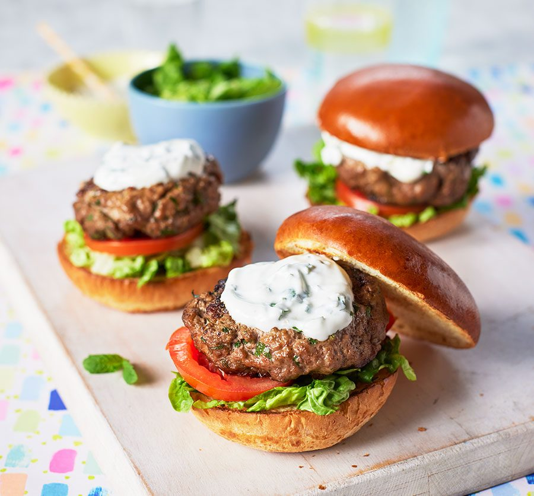

# Lamb, Mint, Coriander and Chilli Burger

*Australia's herb-and-spice lamb burger: a juicy patty of ground lamb shoulder loaded with fresh mint, fresh coriander, finely chopped red chilli, garlic and cumin, grilled till deeply crusted and pink in the middle, served on a soft brioche bun with a cooling yogurt-mint sauce, crisp lettuce, cucumber, tomato and pickled red onion. The Australian gastropub classic; lamb country meets the spice notes that the Australian-Asian fusion kitchen knows best.*

**Serves:** 4

**Prep Time:** 25 minutes (plus 30 minutes mixture chill)

**Cook Time:** 12 minutes

## Overview
The lamb-mint-coriander-chilli burger is a quintessentially Australian gastropub creation that takes advantage of two things Australia does brilliantly: high-quality grass-fed lamb and the fusion-friendly herb-and-chilli flavours absorbed from Asian-Australian and Middle-Eastern-Australian cross-pollination. The patty is built from ground lamb shoulder mixed with masses of fresh mint and coriander, finely chopped red chilli, crushed garlic, cumin, paprika, salt and pepper. Grilled till deeply crusted and just pink inside (lamb is at its best at medium, around 60°C). Served on a soft brioche bun with a yogurt-mint cooling sauce, crisp cos lettuce, cucumber, tomato and quick-pickled red onion. Lamb shoulder with about 20% fat is the right cut; leg or rump dries out. Fresh herbs in generous quantity, not garnish: green flecks should be visible throughout the patty. The yogurt-mint sauce balances the chilli and the lamb richness; mayonnaise would muddy it.

## Ingredients

### Lamb patty
- 800 g ground lamb shoulder (20% fat)
- 6 garlic cloves (crushed)
- 1 small bunch fresh mint (chopped fine; about 40 g leaves; reserve a few sprigs for the sauce)
- 1 small bunch fresh coriander (chopped fine; about 40 g)
- 2 fresh red chillies (deseeded for medium; seeds-in for hot; very finely chopped)
- 2 teaspoons ground cumin
- 1 teaspoon paprika
- 1 teaspoon ground coriander seed
- 1 teaspoon fine sea salt
- 1 teaspoon ground black pepper
- 1 small red onion (very finely chopped; about 60 g; for the patty)

### Yogurt-mint sauce
- 300 g thick Greek yogurt
- 1 small bunch fresh mint (chopped fine; about 30 g leaves)
- 1 small garlic clove (crushed)
- Juice of 1 lemon
- 1 teaspoon ground cumin
- ½ teaspoon fine sea salt
- 1 tablespoon olive oil

### Quick-pickled red onion
- 1 small red onion (thinly sliced)
- 3 tablespoons white wine vinegar
- 1 tablespoon caster sugar
- 1 teaspoon fine sea salt

### Buns and salad
- 4 brioche burger buns (split)
- 2 tablespoons butter (softened, for toasting buns)
- 1 cos lettuce heart (leaves separated)
- 1 large tomato (sliced)
- ½ cucumber (sliced into thin rounds)
- 4 leaves fresh mint (for the burger build)

### To serve
- Hand-cut chips or shoestring fries
- Cold lager or Australian Shiraz

## Method

### Stage 1 - Make pickled onion
1. Whisk vinegar, sugar and salt in a small bowl till dissolved.
2. Toss in the thinly sliced red onion.
3. Rest 30 minutes; the onion turns bright pink and soft.

### Stage 2 - Make yogurt-mint sauce
1. Stir together yogurt, chopped mint, crushed garlic, lemon juice, cumin and salt.
2. Drizzle in olive oil and stir.
3. Refrigerate till needed.

### Stage 3 - Mix the patty
1. In a wide bowl, combine the lamb mince, crushed garlic, chopped mint, chopped coriander, chopped chilli, cumin, paprika, ground coriander, salt, pepper, and finely chopped red onion.
2. Mix gently with clean hands; don't overwork (compacted patties go tough).
3. Form into 4 patties about 12 cm wide (they shrink slightly during cooking) and 2 cm thick. Press a shallow dimple into the centre of each (stops them puffing into balls on the grill).
4. Refrigerate 30 minutes to firm up.

### Stage 4 - Toast the buns
1. Spread the soft butter on the cut sides of the buns.
2. Toast cut-side-down in a wide pan over medium heat 90 seconds till golden and slightly crisp at the edges. Set aside.

### Stage 5 - Cook the patties
1. Heat a cast-iron pan or a barbecue to high.
2. Lay the patties down; don't crowd.
3. Cook 3-4 minutes per side for medium (60°C internal). Don't press down; that squeezes juices out.
4. Rest the patties on a warm plate 3 minutes before building.

### Stage 6 - Build the burgers
1. Spread a generous spoon of yogurt-mint sauce on the bottom half of each bun.
2. Layer a lettuce leaf, a slice of tomato, a few slices of cucumber.
3. Top with the rested lamb patty.
4. Pile on the pickled red onion.
5. A mint leaf on top.
6. More yogurt-mint sauce on the top half of the bun.
7. Close. Press gently to settle.

### Stage 7 - Serve
1. Cut diagonally for the photogenic ooze.
2. Chips on the side.
3. The remaining yogurt-mint sauce in a small ramekin for dipping the chips.

## Notes
- **Lamb shoulder, 20% fat:** essential. Lean lamb leg or rump gives a dry crumbly patty. Ask the butcher to coarse-grind shoulder if you can't find ready-ground.
- **Fresh herbs in volume:** the mint and coriander aren't garnish; they're a major patty ingredient. Skimping turns the burger into a generic spiced lamb burger.
- **Don't overwork the mince:** mix till just combined. Overworked patties bind into a tough hockey-puck texture.
- **Yogurt-mint sauce not mayo:** the cooling yogurt is what balances the chilli heat and cuts the lamb richness. Mayo muddies it.
- **Medium (60°C), not well-done:** lamb at medium has its proper sweet-rich flavour. Cooked till grey, it tastes mutton-y.

## Variations
**With feta:** crumble 100 g feta over the patty in the last minute of cooking; pairs with the mint-coriander beautifully.
**Halloumi-lamb:** add a slice of grilled halloumi between patty and tomato.
**Spicier:** include both chillies with seeds, plus a drizzle of harissa under the yogurt.
**With harissa-yogurt sauce:** swap the mint-yogurt for yogurt mixed with rose harissa for a Moroccan-tilted version.
**With raita instead of yogurt sauce:** cucumber-mint raita pushes it Indian.
**Open-face on flatbread:** swap the bun for warm flatbread, build as an open sandwich.
**Lamb-kofta variation:** shape into elongated kofta forms instead of patties.

## Serving
At a backyard barbecue with cold beer. At a gastropub lunch with a side of chips and a glass of Shiraz. At a casual dinner with a green salad.

## Storage
- Best fresh.
- Raw patties refrigerate 1 day; freeze 2 months.
- Cooked patties refrigerate 2 days; reheat briefly under a low grill (the herbs lose lift if blasted on high).
- Yogurt-mint sauce keeps refrigerated 3 days.
- Pickled red onion keeps refrigerated 2 weeks.
