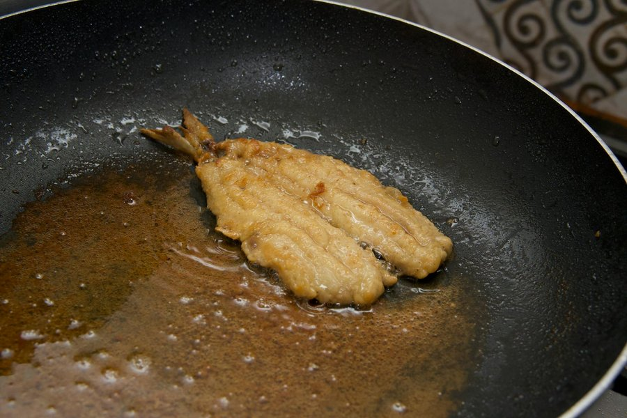

# Pan-Fried Barramundi

*Australia's pub-menu fish: skin-on barramundi fillets pan-fried to crackling crispness and served with lemon and parsley.*

**Serves:** 2

**Prep Time:** 10 minutes

**Cook Time:** 10 minutes

## Overview
Australia's pub-menu fish, the one you order on a hot summer afternoon at a beachside bistro and follow with a cold glass of something white. The trick to crispy-skin barramundi is the trick to crispy-skin anything: very dry fillets, very hot oil, salt on the skin, fish pressed flat into the pan for the first thirty seconds, and the patience to leave it alone until the flesh is opaque most of the way through before you flip. Once you turn it, the second side needs only a minute. While the fish rests on a plate you make a brown butter, lemon and caper sauce in the same pan in the time it takes the fillets to settle. Sea bass, snapper or yellowtail kingfish all stand in beautifully if barramundi isn't on the slab. Plated with the crisp side up so every diner sees the skin, lemon and parsley scattered over, a glass of cold riesling on the table.

## Ingredients

### Fish
- 2 barramundi fillets, skin on (about 180-200 g each), pin bones removed
- 2 teaspoons flaky sea salt
- 2 tablespoons neutral oil (sunflower, grapeseed or rice bran)
- Freshly ground black pepper

### Brown butter sauce
- 50 g unsalted butter
- 1 tablespoon small capers (drained, patted dry)
- 1 garlic clove (thinly sliced)
- ½ lemon (juice)
- 1 tablespoon chopped flat-leaf parsley

### To serve
- 1 lemon (cut in wedges)
- Flaky salt

## Method

### Stage 1 - Dry the fish
1. Lift the fillets out of the fridge 15 minutes before cooking; cold fish steams in the pan.
2. Pat the skin and the flesh side aggressively dry with kitchen paper. Then pat again. Moisture on the skin is the only thing that stops it crisping.
3. Sprinkle salt evenly over the skin side. Leave to sit 5 minutes; the salt will draw out a little more moisture, which you can pat off again right before cooking.
4. Score the skin lightly in 3 diagonal cuts, just through the skin, not into the flesh. This stops the fillet from curling.

### Stage 2 - Heat the pan
1. Set a heavy frying pan (ideally cast iron or stainless steel, not non-stick) over medium-high heat.
2. Pour in the oil and let it heat until the surface shimmers and is just starting to wisp. You want it hot enough that a flick of water dropped in spits at once.

### Stage 3 - Cook the fish
1. Pat the skin dry one final time.
2. Lay each fillet into the pan skin side down, away from you to avoid splatter.
3. Immediately press each fillet flat with a fish slice or the flat of a spatula for 30 seconds. The skin will try to buckle as it contracts; flattening it keeps it in full contact with the pan and is the difference between crisp and chewy.
4. Lower the heat slightly to medium. Cook undisturbed for 4-5 minutes. Resist any urge to lift or poke. Look at the side of the fillet: the flesh will turn opaque from the bottom up, about ⅔ of the way through.
5. Flip carefully with a fish slice. Cook the flesh side just 1 minute more.
6. Lift the fillets out, skin side up, onto a warm plate. Grind a little pepper over.

### Stage 4 - Make the brown butter sauce
1. Pour off any oil from the pan and wipe lightly with kitchen paper, leaving any browned residue.
2. Drop the butter in. Set heat to medium. The butter will foam, then the foam will subside and the milk solids will turn golden at the bottom of the pan; about 90 seconds. As soon as it smells nutty and the colour is hazelnut, not coffee, move fast.
3. Toss in the capers and garlic. They will sizzle and the capers may pop; stir for 20 seconds.
4. Off the heat, squeeze in the lemon juice. It will hiss; stir to combine.
5. Stir in the parsley.

### Stage 5 - Plate
1. Set each fillet on a plate, skin side up.
2. Spoon the brown butter, capers and lemon over and around the fish.
3. Sprinkle a little flaky salt over the skin.
4. Serve with a lemon wedge alongside.

## Notes
- **Substitute fish:** Sea bass, snapper, yellowtail kingfish or even mahi-mahi work beautifully and use the same technique. The fillet should be 2-3 cm thick at its thickest; thinner fillets overcook before the skin crisps.
- **Cast iron or stainless, not non-stick:** Non-stick coatings cannot get hot enough to crisp fish skin properly. A heavy cast iron skillet is the right tool.
- **The skin sticks until it does not:** Skin glues itself to a hot pan and only releases when fully crisp. If you try to lift it after 2 minutes and it resists, leave it. Lift it after 4 minutes and it should release cleanly.
- **Brown butter window is short:** Butter goes from golden to burnt in about 15 seconds. Have the capers and garlic prepped and ready by the stove before you start it browning.

## Variations
**Asian-inflected:** Replace capers and parsley with sliced ginger, spring onion and a teaspoon of soy sauce stirred in at the end.
**Bush-tucker twist:** Sprinkle a pinch of native lemon myrtle over the brown butter, or finish with a small spoonful of bush-tomato chutney.

## Serving
Serve with: A bowl of buttered new potatoes and a green salad with mustard vinaigrette, or a chunk of crusty bread to mop up the sauce. Steamed greens (broccoli, asparagus) sit well alongside.
Garnish with: A wedge of lemon.

## Storage
- Best eaten straight from the pan; skin loses its crispness within minutes of plating.
- Leftover cooked fish keeps 1 day refrigerated; eat cold, flaked over a salad. Do not reheat.
