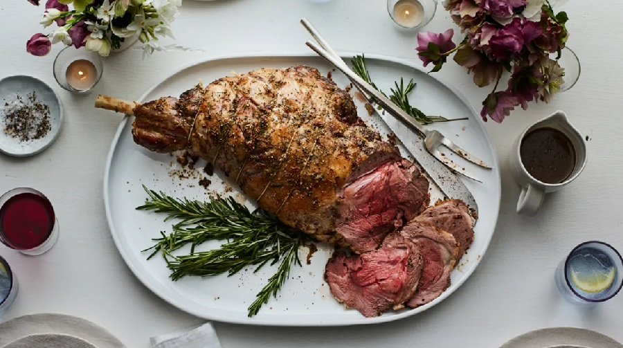

# Roast Lamb with Rosemary and Garlic

*Australia's Sunday lamb: a bone-in leg studded with garlic and rosemary, roasted high then low till mahogany-crusted outside and blushing pink within.*

**Serves:** 6-8

**Prep Time:** 20 minutes (plus 1 hour resting at room temperature)

**Cook Time:** 1 hour 30 minutes

## Overview
Australia's Sunday lamb, the centre of the long-lunch table and the smell that fills the kitchen all afternoon. You stud a 2.2 kg bone-in leg with slivers of garlic and rosemary pushed deep against the meat, rub the whole thing with oil, salt and pepper, and start it in a very hot oven for twenty-five minutes to lock in a crust. The temperature drops to 180°C from there and the lamb roasts on until a probe in the thickest part reads 60°C internal for blushing pink. Then comes the part most home cooks skip and shouldn't: a twenty-five-minute rest while you build the gravy in the deglazed pan with stock, a spoon of redcurrant or quince jelly for sweetness, and a splash of red wine. The lamb carves into juicy, rose-coloured slices that fall away in long pieces from the bone. Roast potatoes, mint sauce, a green vegetable on the side, the wine you opened earlier already in the glass.

## Ingredients

### Lamb
- 1 bone-in leg of lamb, 2.2-2 ½ kg
- 8 garlic cloves (cut lengthways into slivers, about 4 slivers per clove)
- 6 sprigs rosemary (leaves stripped, leaving 12 small tufts; finely chop the rest)
- 3 tablespoons olive oil
- 2 teaspoons flaky sea salt
- 1 teaspoon ground black pepper

### Roasting tin aromatics
- 1 onion (large, cut in 8 wedges)
- 2 carrots (cut in thick rounds)
- 1 head garlic, halved across the equator
- A few extra rosemary sprigs

### Gravy
- 250 ml red wine (or extra stock)
- 500 ml lamb (or beef stock, good quality)
- 2 tablespoons redcurrant (or quince jelly)
- 1 teaspoon Dijon mustard
- 1 tablespoon plain flour (optional, for thickening)
- salt
- pepper

### To serve
- [Mint Sauce](../british/side-dishes/mint-sauce.md) (or mint jelly, see Notes)

## Method

### Stage 1 - Take the lamb out and prepare
1. Lift the lamb out of the fridge 1 hour before cooking. A cold leg roasts unevenly; room temperature is essential.
2. Pat the lamb dry all over.
3. With a small sharp knife, stab the lamb 24 times all over, going 3 cm deep at an angle.
4. Push a garlic sliver and a small tuft of rosemary into each stab.
5. Rub the lamb all over with olive oil, then with the salt, pepper and the finely chopped rosemary.

### Stage 2 - Start the roast hot
1. Preheat the oven to 230°C / 210°C fan.
2. Scatter the onion, carrots, halved garlic head and extra rosemary into a heavy roasting tin.
3. Sit the lamb on top, fat side up.
4. Roast for 25 minutes, until the fat is sizzling and the surface is starting to colour.

### Stage 3 - Drop heat and finish to temperature
1. Lower the oven to 180°C / 160°C fan.
2. Continue roasting. Total time for medium (just pink throughout) is roughly 18 minutes per 500 g including the initial hot blast. For a 2.2 kg leg, that is about 1 hour 20 minutes total in the oven; for 2 ½ kg about 1 hour 30 minutes.
3. The only reliable way to nail doneness is a probe thermometer in the thickest part of the leg, away from the bone:
   - 55°C for rare
   - 60°C for medium-rare (this is the Aussie pub standard)
   - 65°C for medium
   - 70°C+ for well done
4. Pull the lamb out when the probe reads 3°C below your target; it will climb during resting.

### Stage 4 - Rest the lamb
1. Transfer the lamb to a warm carving board.
2. Tent loosely with foil.
3. Rest for a full 25 minutes. Do not rush this. The juices need to redistribute; carved too soon, you lose half of them onto the board.

### Stage 5 - Make the gravy
1. Spoon off the excess fat from the roasting tin, leaving the dark juices and aromatics.
2. Set the tin over medium-high heat on the hob.
3. Pour in the wine. Scrape the bottom with a wooden spoon to lift every browned bit. Bubble hard 3 minutes to drive off the alcohol.
4. Pour in the stock and bring to a simmer.
5. Stir in the jelly and the mustard.
6. If you want a thicker gravy, mash 1 tablespoon of flour with a tablespoon of butter and whisk in pieces; simmer 3 minutes.
7. Strain through a sieve into a jug, pressing the aromatics to extract the flavour. Taste and season.

### Stage 6 - Carve and serve
1. Carve the lamb across the grain in slices no thicker than a finger.
2. Plate up, spoon any resting juices back over the meat.
3. Pour gravy at the table.

## Notes
- **Probe thermometer:** Roasting times in a recipe are guidance only; ovens and leg shapes vary. A probe takes the guesswork out and saves a £40 leg from going dry.
- **Mint sauce vs mint jelly:** Both are traditional. Mint sauce (chopped mint, vinegar, sugar) is sharper; mint jelly is sweeter and gentler. Pick whichever you grew up with.
- **Resting is not optional:** 25 minutes is the floor. The leg holds heat through a thick layer of fat; it will not go cold.
- **Pink lamb is the Australian default:** Cooked to 60°C and rested, you get a rose-pink centre and a deeply browned crust. Anyone who wants more cooked can have the end slices.

## Variations
**Slow roast shoulder:** Substitute a 2 kg shoulder on the bone. Sit on the aromatics, cover with foil, roast at 150°C for 4 hours, then uncover and crank to 220°C for 20 minutes. The meat shreds rather than slices. Make the same gravy.
**Garlic and anchovy:** Push a small piece of anchovy into each stab alongside the garlic. It melts away invisibly and adds depth; a chef's trick.

## Serving
Serve with: Roast potatoes (par-boiled, fluffed, then roasted in goose fat or olive oil), buttered green beans, roast pumpkin, peas with mint.
Garnish with: A sprig of rosemary on the platter.

## Storage
- Sliced leftovers keep 3 days refrigerated.
- Gravy keeps 4 days; freezes 2 months.
- Reheat sliced lamb gently in gravy in a covered pan; do not microwave (toughens fast).
