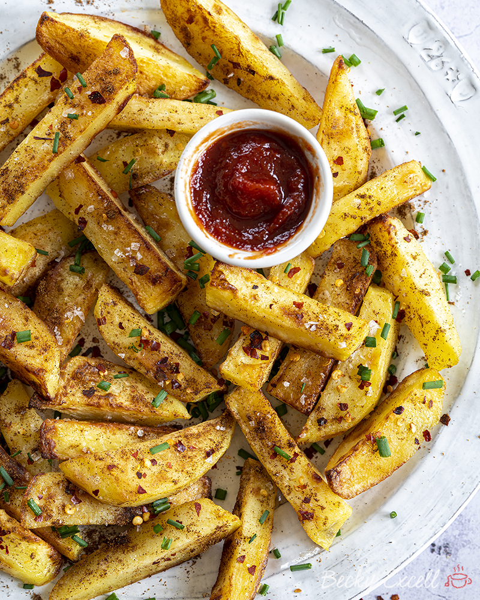

# Salt and Pepper Fries

*Australia's pub-classic seasoned chips: hand-cut potatoes twice-fried till deeply crispy, then tossed with a generous shaking of "chicken salt" (the Aussie seasoned salt that's slightly umami-savoury), cracked black pepper, white pepper, and a sprinkle of dried herbs. The Aussie pub-side standard that arrives in a basket alongside every counter meal.*

**Serves:** 4

**Prep Time:** 20 minutes (plus 30 minutes potato soaking)

**Cook Time:** 15 minutes

## Overview
Salt-and-pepper fries (chips in Aussie English) is one of Australia's most beloved pub-side standards: hand-cut potato batons (thicker than American fries, about 1 cm × 1 cm × 8 cm) twice-fried for proper crispness, then tossed hot with chicken salt (the iconic Australian seasoned salt blend), cracked black pepper, ground white pepper and dried parsley. The pub-counter mainstay alongside a steak, a parmi or a chicken schnitzel, what every Aussie kid grew up dipping in tomato sauce, and where every "salt-and-pepper" variant on a Chinese-Australian menu started from. The two-fry technique is non-negotiable; single-fried fries are soggy. Chicken salt is the canonical seasoning; outside Australia, look for it at Aussie-import shops or make your own (sea salt, garlic powder, onion powder, paprika, a pinch of MSG). Season immediately while hot; cold fries shed the seasoning.

## Ingredients

### Fries
- 1.2 kg floury potatoes (Russet, Maris Piper, King Edward; peeled and cut into 1 cm × 8 cm batons)
- Vegetable oil for deep-frying (about 1.5 litres; or enough for 7 cm depth)

### Seasoning (the canonical Aussie chicken-salt mix)
- 2 tablespoons flaky sea salt
- 2 teaspoons garlic powder
- 2 teaspoons onion powder
- 1 teaspoon paprika
- 1 teaspoon ground white pepper
- 1 teaspoon cracked black pepper
- ½ teaspoon ground celery seed (optional)
- ½ teaspoon MSG (optional but very Aussie; gives umami)
- 1 teaspoon dried parsley
- 1 teaspoon dried oregano

### Alternative: shop-bought
- 2 tablespoons Australian chicken salt (sold at Australian import shops; or use the homemade mix above)

### To serve
- Tomato sauce (the canonical Aussie dipping sauce)
- Aioli or garlic mayo
- Lemon wedges
- Cold beer (Coopers, VB, Carlton)

## Method

### Stage 1 - Soak the potatoes
1. Cut potatoes into batons.
2. Place in a wide bowl of cold water; soak 30 minutes.
3. Drain; pat thoroughly dry on tea towels.

### Stage 2 - Make the seasoning
1. Combine all seasoning ingredients in a small bowl.
2. Mix thoroughly.

### Stage 3 - First fry (blanching)
1. Heat the oil in a deep heavy pot to 160°C (320°F).
2. Add the potatoes in batches; fry 4-5 minutes till just cooked through but pale gold (not browned).
3. Lift out; drain on kitchen paper.
4. Let cool 10 minutes (the cool-down lets the inside steam dry).

### Stage 4 - Second fry
1. Heat the oil up to 190°C (375°F).
2. Add the blanched potatoes back in batches.
3. Fry 2-3 minutes till deeply golden and crispy.
4. Lift out with a slotted spoon; drain briefly on kitchen paper.

### Stage 5 - Season immediately
1. While still hot, tip the fries into a wide bowl.
2. Sprinkle generously with the seasoning mix (about 1 tablespoon per portion).
3. Toss thoroughly to coat.

### Stage 6 - Serve
1. Pile into a serving basket lined with greaseproof paper (the proper Aussie pub presentation).
2. Provide tomato sauce, aioli, lemon wedges.
3. Eat immediately.

## Notes
- **Twice-fried for crispness:** essential. First fry cooks through; second fry crisps.
- **Chicken salt is canonical Aussie:** the homemade mix is the substitute outside Australia.
- **Season while hot:** seasoning sticks to hot fries.
- **Don't overcrowd the fryer:** crowded fries steam instead of crisping.
- **Dry the potatoes thoroughly:** wet potatoes spit and steam.

## Variations
**Chinese salt-and-pepper fries:** add 1 teaspoon of Chinese five-spice powder and 1 teaspoon of Sichuan peppercorn powder to the seasoning; gives the Chinese-Australian fusion version popular in Sydney and Melbourne.
**Cheesy salt-and-pepper fries:** sprinkle 80 g of finely grated Parmesan + truffle oil along with the seasoning; gives a more luxurious gastropub version.
**Sweet potato variant:** swap regular potatoes for sweet potatoes; cook the same way; sweeter version.
**Air-fried (lighter):** toss with 3 tablespoons of oil; air-fry at 200°C for 18-20 minutes shaking halfway; sprinkle with seasoning; less crisp but lighter.

## Serving
In a basket lined with greaseproof paper, with tomato sauce, aioli or garlic mayo. Alongside a parmi, steak, schnitzel, or fish and chips. Drink: VB, Coopers Pale Ale, XXXX Gold, or a glass of Aussie shiraz. At the pub on Friday night.

## Storage
- Best eaten immediately.
- Keep in a sealed container 1 day; reheat in a hot oven (220°C / 425°F) for 5 minutes to re-crisp.
- Don't microwave; soggy.
- Seasoning mix keeps in a jar 3 months at room temperature.
