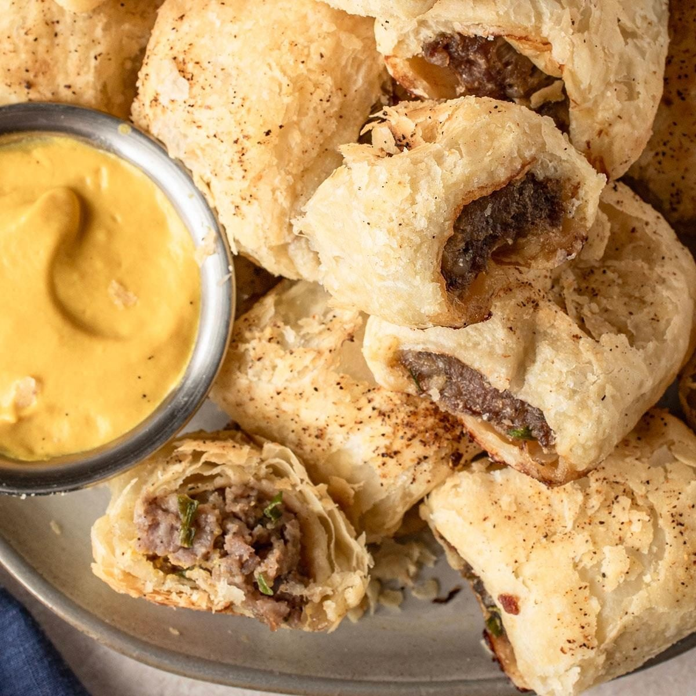

# Australian Sausage Roll

*Australia's iconic bakery snack: spiced minced beef-and-pork filling wrapped in flaky puff pastry, brushed with egg wash and baked till golden. The lunch-counter classic eaten with tomato sauce at every Aussie bakery, cafe and footy match from Perth to Cairns.*

**Serves:** 6 (12 sausage rolls)

**Prep Time:** 30 minutes

**Cook Time:** 30 minutes

## Overview
The sausage roll is one of Australia's most beloved bakery and lunch-counter snacks, found at every milk bar, suburban bakery, cafe and footy ground across the country: a spiced beef-and-pork mince filling (pork for fat and tenderness, beef for body) seasoned with onion, garlic, parsley, thyme, Worcestershire and bound with breadcrumbs and a small amount of grated apple or carrot, wrapped in flaky puff pastry, brushed with beaten egg, scored and baked till the pastry is deep golden and the filling is just cooked. Distinguishes itself from the British version by being slightly larger, more seasoned, and almost always served with a generous squirt of tomato sauce (Australian and Kiwi terminology for ketchup). The mince must be properly seasoned; underseasoned mince gives bland rolls. The breadcrumbs absorb juices and prevent the filling from going greasy; the grated apple or carrot keeps it moist and adds a faint sweetness. Use good all-butter puff pastry, keep it cold till baking, score for steam release, and bake hot (220°C) for a properly puffed crisp result.

## Ingredients

### Filling
- 400 g minced beef (or all beef if you prefer)
- 400 g minced pork (or use 800 g minced beef for an all-beef version)
- 1 medium onion (finely grated, or very finely chopped)
- 4 garlic cloves (crushed)
- 1 small apple (grated, no skin; or 1 medium carrot grated)
- 80 g fresh breadcrumbs (from white bread; soft, not dried)
- 2 tablespoons Worcestershire sauce
- 2 tablespoons tomato ketchup (BBQ sauce works too)
- 2 large eggs (1 for the filling, 1 for the egg wash)
- 3 tablespoons fresh parsley (finely chopped)
- 1 tablespoon fresh thyme leaves (or 1 teaspoon dried)
- 1 ½ teaspoons fine sea salt
- 1 ½ teaspoons ground black pepper
- 1 teaspoon sweet paprika
- ½ teaspoon ground nutmeg

### Pastry
- 2 sheets ready-made all-butter puff pastry (about 30 cm × 30 cm each; keep cold till using)

### Egg wash
- 1 egg (beaten with 1 tablespoon milk)
- 2 teaspoons sesame seeds (optional)

### To serve
- Tomato sauce (ketchup)
- BBQ sauce

## Method

### Stage 1 - Mix the filling
1. In a wide bowl, combine the minced beef, minced pork, finely grated onion, crushed garlic, grated apple (or carrot), breadcrumbs, Worcestershire sauce, tomato ketchup, 1 beaten egg, chopped parsley, thyme, salt, pepper, paprika and nutmeg.
2. Mix thoroughly with your hands or a wooden spoon till the mixture is fully combined and slightly sticky.
3. Don't over-mix; just till uniform. Overworked mince goes tough when cooked.

### Stage 2 - Test the seasoning
1. Cook a small spoonful of the mix in a hot pan for 1 minute to test the seasoning.
2. Taste; adjust salt and pepper before shaping (you can't taste raw meat).

### Stage 3 - Prep the pastry
1. Preheat the oven to 220°C (425°F).
2. Line a large baking sheet with parchment paper.
3. Roll out each sheet of puff pastry slightly to about 32 cm × 24 cm if not already that size.
4. Cut each sheet in half lengthwise, giving you 4 long strips about 32 cm × 12 cm.

### Stage 4 - Fill and roll
1. Take one pastry strip; mentally divide it lengthwise into a centre strip about 4 cm wide.
2. Spoon a long sausage of filling (about ¼ of the total filling) down the centre of the strip.
3. Brush one long edge of the pastry with beaten egg wash.
4. Fold the unbrushed side over the filling; bring the egg-washed side over and press to seal along the edge.
5. Place the sausage roll seam-side down on the baking sheet.
6. Repeat with the remaining 3 pastry strips and filling.

### Stage 5 - Cut and finish
1. Once you have 4 long rolls, cut each into 3 equal pieces; you'll have 12 sausage rolls total.
2. Arrange on the baking sheet leaving 3 cm between each.
3. Brush the tops generously with egg wash.
4. Score the top of each with a sharp knife (2-3 diagonal slashes) for steam release.
5. Sprinkle with sesame seeds if using.

### Stage 6 - Bake
1. Bake at 220°C for 25-30 minutes till the pastry is deep golden and the filling is cooked through (check by inserting a thermometer into one; internal temperature should reach 75°C / 165°F).
2. If the tops are browning too fast, drop the temperature to 200°C for the final 10 minutes.

### Stage 7 - Cool briefly and serve
1. Let cool on the tray for 5 minutes; the filling is properly hot just out of the oven.
2. Transfer to a serving plate; serve warm with tomato sauce (and BBQ sauce, if you want both).
3. Eat with the hands.

## Notes
- **Beef and pork together is the proper Australian version:** the combination gives the right fat content and flavour. All-beef gives a leaner roll; all-pork is too rich. The 50/50 mix is the traditional balance.
- **Grated apple or carrot for moisture:** the small amount of grated apple (or carrot) keeps the filling moist during baking. Skipping it gives a denser drier roll.
- **Breadcrumbs absorb juices:** without breadcrumbs, the meat juices leak into the pastry and give soggy bottoms. The breadcrumbs are essential.
- **Don't overwork the mince:** mix till just combined; over-mixing develops the proteins and gives a tough rubbery filling.
- **220°C for the proper puff:** high heat at the start gives the proper puffed pastry. Drop the temperature halfway through only if browning too fast.

## Variations
**Cheese-and-bacon sausage rolls:** add 100 g of grated tasty cheddar and 80 g of finely chopped cooked bacon to the filling; gives a richer Aussie milk-bar version.
**Vegetarian sausage rolls:** swap the meat for 700 g of grated zucchini (squeezed dry), 200 g of grated carrot, 200 g of cooked lentils and 100 g of breadcrumbs; bind with egg and seasonings as in the recipe.
**Lamb-and-rosemary version:** swap the beef and pork for minced lamb; replace the thyme with chopped rosemary. Common Aussie variation.
**Curried sausage rolls:** add 2 tablespoons of curry powder to the filling and 50 g of chopped sultanas; gives a curry-puff Aussie style.

## Serving
On a paper plate or in a paper napkin with tomato sauce squirted on top (the traditional Australian way). At a footy match, in a pie warmer at a milk bar, or at a kid's birthday party. Drink: cold light beer (XXXX, Tooheys, Carlton); or a cup of strong tea.

## Storage
- Best eaten warm and fresh out of the oven; reheat well.
- Keep refrigerated 3 days; reheat in a 180°C / 350°F oven for 8-10 minutes till piping hot in the centre.
- Don't microwave; the pastry goes soggy.
- The unbaked sausage rolls freeze 3 months; freeze flat on a tray, transfer to a bag. Bake from frozen at 220°C for 35-40 minutes (add 10 minutes to the bake time).
- The filling alone keeps refrigerated 2 days; use within or freeze.
