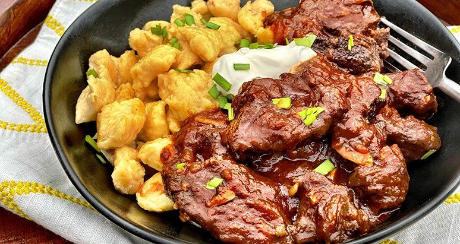

# Austrian Goulash

*Viennese beef goulash, the proper one: onions, sweet paprika and beef simmered low and slow until the gravy is dark as treacle.*

**Serves:** 4-6

**Prep Time:** 20 minutes

**Cook Time:** 2 ½ hours

## Overview
The Viennese answer to its Hungarian cousin: slower, deeper, almost spoonable, the gravy as dark as treacle from hours of careful reduction rather than from any thickener. The defining technique is a one-to-one ratio of onion to beef by weight, which sounds wrong until you taste what it does. The onions cook down to a sweet, brown, almost-marmalade paste before the paprika and meat ever join them, and that paste is the body of the sauce. You use beef shin or chuck and simmer it very slowly in this paprika-onion base with stock, garlic, marjoram, caraway, vinegar and tomato until the gravy clings to every cube. Lard is the right fat. No flour. No quick fixes. Serve with bread dumplings (Semmelknödel), spätzle or thick slices of dark rye, and pickled cucumbers on the side to cut the richness. A bowl that warms you from the centre out on a winter night.

## Ingredients

### Onion base
- 800 g brown onions (peeled, finely diced, this should weigh nearly the same as the beef)
- 80 g lard (or beef dripping; vegetable oil at a push)
- 3 garlic cloves (crushed)
- 1 heaping tablespoon Hungarian sweet paprika (édesnemes / noble-sweet)
- 1 teaspoon hot paprika (or ½ teaspoon cayenne)
- 1 tablespoon tomato purée

### Beef and braise
- 800 g beef shin (or beef chuck, cut into 3 cm cubes)
- 2 teaspoons salt
- 1 teaspoon caraway seeds (roughly crushed)
- 1 teaspoon dried marjoram
- 1 bay leaf (small)
- 2 teaspoons cider vinegar (or red wine vinegar)
- ½ lemon (zest)
- 600-800 ml beef stock (just enough to cover)
- Freshly ground black pepper

### To finish
- 1 tablespoon chopped flat-leaf parsley (optional)

### To serve
- Bread dumplings (Semmelknödel), buttered noodles or chunks of dark sourdough rye

## Method

### Stage 1 - The onion paste (this is the dish)
1. Melt the lard in a wide heavy casserole over medium-low heat. The pot should be roomy, the onions need surface area.
1. Add the diced onions and a small pinch of salt. Stir.
1. Cook 35-45 minutes on medium-low, stirring every few minutes. The onions should soften, then collapse, then darken to a deep chestnut colour and reduce to about a third of their starting volume. Do not let them catch and burn; lower the heat if they do.
1. Stir in the garlic. Cook 1 minute.

### Stage 2 - Build the base
1. Pull the pot off the heat, paprika scorches and turns bitter on direct heat.
1. Stir in both paprikas and the tomato purée. The mass should turn brick-red.
1. Return to low heat for 30 seconds.

### Stage 3 - Add the beef
1. Add the cubed beef to the pot dry, not browned separately, the Viennese method braises the meat in the onion paste from raw, so the meat releases its juices into the gravy.
1. Stir to coat each cube in the paste.
1. Add the caraway, marjoram, bay leaf, vinegar, lemon zest, salt and pepper.
1. Pour in enough stock to just cover the meat (start with 600 ml).

### Stage 4 - Slow braise
1. Bring to a bare simmer. Cover with the lid slightly ajar.
1. Cook on the lowest heat for 1 ½-2 hours, stirring every 20 minutes and topping up with a splash of stock if it threatens to go dry. The meat should be fork-tender and the gravy thick and glossy. Onions should have melted invisibly into the sauce.
1. Uncover for the last 15 minutes if the gravy is too loose; the finished sauce should coat the back of a spoon without running off.

### Stage 5 - Rest and serve
1. Take the pot off the heat; let it sit 10 minutes. Discard the bay leaf.
1. Taste; adjust salt and add a few drops more vinegar if the dish needs sharpening.
1. Spoon over Semmelknödel or buttered noodles; scatter parsley.

## Notes
- **One-to-one onion to beef:** this is not a typo. The dish is as much onion as it is meat by weight, and the onions need to fully render down to be the body of the sauce. Skimping on onions gives a thin gravy that no amount of beef can fix.
- **Real Hungarian paprika:** noble-sweet (édesnemes) Hungarian paprika is mandatory. Spanish pimentón is smokier and wrong. Supermarket paprika that has sat in the cupboard for a year has lost its colour and flavour and gives a flat brown stew.
- **Paprika off the heat:** paprika burns at a low temperature and goes bitter and dusty. Always add it to the pot off the heat or at very low temperature.
- **No flour:** the thickening comes from collapsed onions, not roux. Adding flour gives a pastel, gluey gravy. If yours is too loose, reduce uncovered.
- **Improves overnight:** like most slow-braised stews, it gets noticeably better the next day as the paprika mellows and the gravy thickens further.

## Variations
**Fiakergulasch:** the cab-driver's breakfast variant, a portion topped with a fried egg, a small frankfurter sausage and a pickled gherkin. Sometimes a slice of dumpling alongside.
**Esterhazy goulash:** with caraway, garlic, capers and lemon, brightened with sour cream and root vegetables at the end, a richer "aristocratic" version.
**Erdäpfelgulasch:** the meatless potato goulash, made the same way but with diced waxy potatoes instead of beef and a sausage sliced in for the last 10 minutes.

## Serving
Serve with: bread dumplings (Semmelknödel), buttered egg noodles (Nockerl or Spätzle), or thick slices of dark rye sourdough for mopping. A small green salad on the side is welcome but optional. Beer or a glass of Zweigelt.

## Storage
- Keeps 4 days refrigerated; the flavour deepens overnight and day 2 is genuinely better than day 1.
- Freezes 3 months. Reheat slowly in a covered pan with a splash of stock.
- Do not microwave, the gravy splits.
