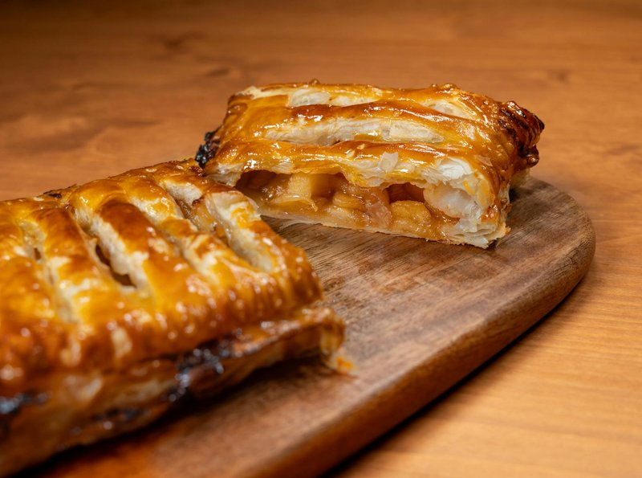

# Apple Strudel

*This classic German dessert works especially well when the pastry is so thin it is nearly transparent.*

**Serves:** 6

**Prep Time:** 10 minutes

**Cook Time:** 30 minutes

## Ingredients
- 1 sheet of [filo](../../../baking/pastry/filo-pastry.md) (55 x 20 cm)
- 100 grams raisins
- 1 tablespoon rum (optional)
- 4 apples
- 1 lemon (juice)
- 60 grams caster sugar
- 1 teaspoon ground cinnamon
- 30 grams icing sugar
- clotted cream (to serve)

## Overview
The Viennese pastry that holds the cafe culture of Habsburg Europe in a single bite, the apfelstrudel that arrives on a small plate next to your melange at every old coffeehouse from Vienna to Prague. You roll cinnamon-spiced apple, raisins, and toasted breadcrumbs in layers of tissue-thin filo until the pastry is nearly transparent (a real Viennese cook will say you should be able to read a newspaper through it before you fill), then bake the whole roll until the outside is shattering golden. A heavy dust of icing sugar at the end, and a warm slice eaten with a quenelle of softly whipped cream or a scoop of vanilla ice cream while the pastry crackles under the spoon. The contrast is everything: the brittle, dry, almost-paper-thin pastry against the tender, juicy spiced apples soft enough to give to a teaspoon. Coffee on the side; an afternoon in front of you.

## Method
### Make the filling
1. Blanch the raisins in boiling water for 2 minutes, drain and refresh in cold water, then drain well.
1. Peel, halve and core the apples, then cut each half into 2 mm thick slices.
1. Place in a bowl with the lemon juice, caster sugar, cinnamon, blanched raisins and rum (if using).
1. Mix gently, cover with cling film and leave to stand for 15 minutes.

### Make the strudel
1. Preheat the oven to 180°C.
1. Lay the filo on a tea towel with one of the short edges facing you.
1. Spread the filling evenly over the whole surface.
1. Starting from the edge closest to you and using the tea towel to help, roll the filo into a sausage shape, enclosing the filling and applying light pressure as you go.
1. Carefully lift the rolled apple strudel onto the baking sheet and bake for 30 minutes until golden and crisp.
1. Using a large palette knife, slide the warm strudel onto a wire rack.
1. Dust the strudel liberally with icing sugar and place on a serving platter.
1. Cut at the table into 2 ½ cm thick slices, served with clotted cream.

## Notes
- The filo must be thin and pliable; work quickly to prevent drying once unrolled, and cover unused sheets with a damp tea towel
- Blanching the raisins briefly hydrates them and improves their flavor; water-fresh raisins would sink during baking rather than distribute throughout
- The filling should release moisture between prep and assembly (standing 15 minutes allows flavors to mingle); drain excess liquid or the bottom will become soggy
-Rolling with the aid of a tea towel ensures an even cylinder and helps apply light pressure without squashing the apples; this technique prevents cracking

## Serving
Slice the warm strudel at the table for presentation impact, dusting each slice with icing sugar. Serve with clotted cream or vanilla ice cream alongside. The warmth of the strudel melting the ice cream creates an elegant contrast.

## Storage
Apple strudel is best served warm but can be held at room temperature for several hours; reheat gently in a 160°C oven for 10 minutes if needed. The unbaked strudel can be prepared several hours ahead and kept refrigerated, then baked when ready. Once baked, it keeps at room temperature for 1 day, covered lightly.
