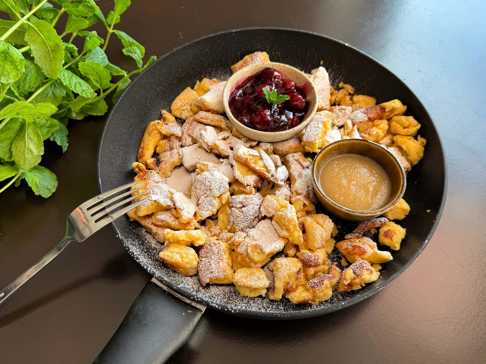

# Kaiserschmarrn

*Vienna's emperor's pancake: a soufflé-light batter cooked in butter, then torn and crisped with two forks into shaggy caramelised pieces, dusted with icing sugar and served hot with plum compote. Named for Emperor Franz Joseph who declared it a favourite in 1850s.*

**Serves:** 4

**Prep Time:** 15 minutes

**Cook Time:** 20 minutes

## Overview
Kaiserschmarrn is Austria's most beloved sweet dish, a soufflé-light pancake batter cooked in plenty of butter then deliberately torn into shaggy caramelised pieces with two forks, dusted heavily with icing sugar and served piping hot with stewed plums (Zwetschkenröster) or apple sauce on the side. The name translates as "emperor's mess" or "emperor's nonsense", and legend has it that the dish was created by accident when a court pastry chef tore his over-handled pancake into pieces before serving Emperor Franz Joseph in the 1850s; the emperor declared it delicious and gave it his name. The technique is what separates a proper Kaiserschmarrn from a fluffy pancake. The batter is built like a soufflé, with the egg whites whipped to stiff peaks and folded into the yolk-milk-flour base just before cooking, which is what gives the dish its characteristic ethereal almost-foamy texture; without that fold, you'd just get a regular pancake. Pour the batter into a wide hot buttered pan, scatter rum-soaked raisins over the top, and let the bottom set into a thick fluffy disc; flip carefully (or finish in the oven). Once both sides are cooked, the moment everyone has been waiting for: take two forks and deliberately tear the cake into shaggy fork-thumb-sized pieces right in the pan. Add another knob of butter and a sprinkle of caster sugar, and let the torn pieces fry for another minute or two so the cut edges caramelise into crisp dark patches. Tip onto plates, dust heavily with icing sugar and serve immediately with a generous spoonful of plum compote or apple sauce alongside.

## Ingredients

### Batter
- 4 large eggs (separated, at room temperature)
- 50 g caster sugar (divided: 20 g for yolks, 30 g for whites)
- 1 teaspoon vanilla extract
- ½ lemon (zest only, finely grated)
- 250 ml whole milk
- 150 g plain flour (sifted)
- 1 pinch fine sea salt

### Add-ins
- 60 g raisins (or sultanas, soaked in 2 tablespoons of dark rum or warm water for 30 minutes, then drained)

### For cooking and finishing
- 60 g butter (clarified butter or regular butter; for cooking)
- 2 tablespoons caster sugar (for caramelising the torn pieces)
- 30 g icing sugar (for heavy dusting at the end)

### To serve
- 400 g stewed plums (Zwetschkenröster, see Variations below; or use a thick apple compote)

## Method

### Stage 1 - Soak the raisins
1. Place the raisins in a small bowl with the rum or warm water and leave to plump up for at least 30 minutes (or up to several hours).
2. Drain just before you need them.

### Stage 2 - Build the yolk base
1. In a wide mixing bowl, whisk the egg yolks with 20 g of the caster sugar, the vanilla and the lemon zest till pale and creamy (about 1 minute).
2. Pour in the milk and whisk to combine.
3. Sift the flour over the top and the pinch of salt, then whisk through till smooth and lump-free. The batter should be the consistency of single cream.

### Stage 3 - Whip the egg whites
1. In a separate scrupulously clean bowl, whisk the egg whites till soft peaks form.
2. Add the remaining 30 g of caster sugar a tablespoon at a time, continuing to whisk till the whites form stiff glossy peaks.

### Stage 4 - Fold whites into batter
1. Fold a third of the whipped whites into the yolk-milk-flour base with a large spoon or balloon whisk to slacken the batter.
2. Add the rest of the whites and fold gently with a large metal spoon till just incorporated, with no white streaks. Don't overwork; you need the air.

### Stage 5 - Cook the cake
1. Heat 40 g of the butter in a wide heavy ovenproof frying pan (24-26 cm) over medium heat till foaming and golden.
2. Pour the batter into the hot butter all at once. It should immediately puff and start setting at the edges.
3. Scatter the drained raisins over the top, pressing them down lightly into the surface so they sink slightly into the batter.
4. Cook on medium-low for 3-4 minutes till the bottom is deep gold and the top is starting to set. The middle will still look wet.

### Stage 6 - Cook the second side
1. **Pan method:** carefully slide the half-set pancake onto a wide plate. Top with another plate and flip the whole thing. Slide back into the pan with the uncooked side down. Cook 3-4 more minutes till the second side is set and gold.
2. **Oven method (easier):** transfer the pan to a preheated 200 C oven and bake 6-8 minutes till the top is set and gold. The oven method is far easier than flipping.

### Stage 7 - Tear it up
1. The defining step. Lift the pan back onto medium heat.
2. Add the remaining 20 g of butter to the pan, letting it melt around the edges of the cake.
3. Now using two forks, tear the cake right in the pan into shaggy thumb-sized pieces, working from the centre outwards.
4. Sprinkle the 2 tablespoons of caster sugar over the torn pieces.
5. Toss and turn the pieces with the forks for another 2-3 minutes; the cut edges of the torn pieces will caramelise into crisp dark patches against the butter and sugar. This is the second crucial moment of the dish.

### Stage 8 - Serve immediately
1. Tip the torn caramelised pieces straight onto warm serving plates.
2. Dust heavily with icing sugar through a fine sieve; really dust, the cake should look like it's wearing a snowfall.
3. Spoon a generous mound of warm plum compote (Zwetschkenröster) or thick apple sauce alongside.
4. Eat immediately; this dish does not wait.

## Notes
- **Egg whites are non-negotiable:** the soufflé-like lightness comes from properly whipped egg whites folded into the batter at the last moment. Skip this and you've made a regular thick pancake.
- **Don't overfold:** the moment the whites are just incorporated, stop. Continued folding deflates the air and you lose the characteristic texture.
- **Use a heavy pan:** thin-bottomed pans give uneven heat and the cake will burn in patches before the centre sets. A heavy cast-iron or aluminium frying pan keeps the heat even.
- **Oven method is your friend:** flipping the half-set pancake is genuinely difficult, and a torn flip means an uneven cook. Just finishing the cake in the oven (after 3-4 minutes in the pan) is what most modern Austrian cooks do and what every cookery school teaches.
- **The tearing matters:** Kaiserschmarrn isn't just torn for show; the torn edges expose more surface area to butter and sugar, and those caramelised edges are what make the dish. Don't tear politely; pull the cake apart roughly.
- **Heavy dusting at the end:** the snow-like top layer of icing sugar isn't garnish, it's part of the dish. Be generous.

## Variations
**Zwetschkenröster (plum compote, the canonical partner):** 500 g of halved stoned plums simmered with 80 g sugar, a stick of cinnamon, a strip of lemon zest and a splash of red wine for 15-20 minutes till soft and saucy. Made fresh while the Kaiserschmarrn rests.
**Apfelmus:** simple apple sauce; the more rustic partner.
**Mit Schokolade:** chopped dark chocolate added with the raisins; melts into pockets as the cake cooks.
**Mit Mandeln:** flaked almonds folded into the batter, then more toasted almonds sprinkled over the finished torn pieces; a Salzburg variation.
**Heidelbeerschmarrn:** with fresh blueberries instead of raisins, in the batter; popular in Tyrolean mountain huts in summer.

## Serving
On warm plates in the centre of the table, the family helping themselves with forks. The plum compote in a small jug or warmed bowl alongside. A cold glass of milk for children, a glass of dessert wine or a coffee for adults. The proper Austrian timing is as the main event of a hut lunch after a long walk, or as the only course of a weekend afternoon when nothing else needs to be eaten.

## Storage
- Eat immediately. Kaiserschmarrn has no shelf-life worth talking about; the soufflé-light texture collapses within 20 minutes.
- Leftovers (if any) can be eaten cold or briefly warmed in a non-stick pan, but the experience is lesser. Better to make a half batch fresh than to keep leftovers.
- Don't freeze.
