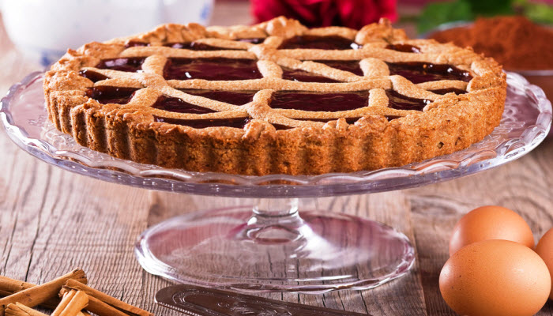

# Linzer Torte

*The world's oldest cake recipe: a nut-and-spice shortbread pastry pressed into a tart tin, filled with redcurrant or raspberry jam, latticed with strips of the same pastry, and baked till deep gold. Recorded in 1653, originally from Linz in Upper Austria.*

**Serves:** 10-12

**Prep Time:** 30 minutes (plus 2 hours chilling)

**Cook Time:** 50 minutes

## Overview
Linzer Torte holds the distinction of being the oldest cake recipe in the world (the first written version dates to 1653, in a cookbook from a Verona monastery), and the dish has been associated with the Austrian city of Linz for so long that it carries the name almost as a brand. The construction is simple but distinctive: a nut-and-spice shortbread pastry (made with ground hazelnuts or almonds, butter, sugar, egg yolks, cinnamon, clove and lemon zest), pressed into a fluted tart tin to form a thick base and walls, filled with a thick layer of redcurrant or raspberry jam, then latticed with thin strips of the same pastry across the top, brushed with egg wash and baked till the pastry is deep gold and the exposed jam between the lattice strips has caramelised into a glossy ruby-red glaze. Two technique points define a proper Linzer. First, the nuts must be ground fine and dry; ground hazelnuts (Haselnussmehl) is the traditional choice in Austria, ground almonds substitute well, but the nuts must be finely ground (not slivered or chopped) so they integrate into the dough into a uniform shortbread texture rather than sitting as coarse chunks. Second, the dough must rest properly cold before rolling; the high butter content makes warm dough impossibly sticky and unworkable. Two hours minimum in the fridge, ideally overnight. After resting, work quickly with cold hands on a cold surface to roll the lattice strips. The torte improves dramatically over a few days as the pastry softens and absorbs jam moisture, so make it at least a day ahead of serving. Eat at room temperature with strong coffee.

## Ingredients

### Pastry
- 200 g ground hazelnuts (or ground almonds; finely ground, not chunky)
- 250 g plain flour
- 200 g unsalted butter (cold, cubed)
- 150 g caster sugar
- 1 teaspoon ground cinnamon
- ¼ teaspoon ground cloves
- 1 lemon (zest only, finely grated)
- 1 pinch fine sea salt
- 2 large egg yolks (cold)
- 1 tablespoon dark rum (or kirsch; optional)

### Filling
- 350 g redcurrant jam (or raspberry jam, smooth or pushed through a sieve)
- 2 tablespoons rum or warm water

### Glaze
- 1 egg yolk (beaten with 1 tablespoon milk)

### For the tin
- 20 g butter (softened, for greasing)

### To serve
- Icing sugar (for dusting)
- Whipped cream (optional, lightly sweetened)

## Method

### Stage 1 - Make the pastry
1. Tip the ground hazelnuts and flour into a wide bowl or food processor.
2. Add the cubed cold butter.
3. If by hand: rub the butter into the flour-nut mixture with your fingertips till the mixture resembles coarse breadcrumbs. Work fast so the butter stays cold. If by processor: pulse till the mixture looks like breadcrumbs (about 10-15 short bursts).
4. Add the caster sugar, cinnamon, ground cloves, lemon zest and salt. Mix briefly to combine.
5. Add the egg yolks and rum (if using).
6. Bring together into a soft dough; if using a processor, pulse just till the dough clumps; by hand, work quickly with cold hands. Don't overwork or the gluten develops and the pastry turns tough.

### Stage 2 - Rest the dough
1. Divide the dough into two portions: two-thirds for the base and one-third for the lattice top.
2. Flatten each into a disc, wrap in cling film and refrigerate for at least 2 hours, ideally overnight. The dough needs to be properly cold and firm before you can roll it.

### Stage 3 - Prepare the tin
1. Butter the inside of a 24 cm fluted tart tin with a removable base, paying attention to the fluted sides.
2. Heat the oven to 180 C.

### Stage 4 - Press the base
1. Take the larger dough portion out of the fridge. Let soften for 5 minutes so it's pliable but still cool.
2. Press the dough into the prepared tart tin with your fingers, building up the sides about 3 cm high and an even 5 mm thickness. Work from the centre outwards. Don't bother trying to roll this part; pressing in with cold fingers gives a more even thick crust than rolling.
3. Press the dough firmly into the fluted sides so the pattern transfers.
4. Trim any excess from the top edge with a knife.

### Stage 5 - Add the filling
1. Warm the jam in a small pan with the rum or water till just liquid. Push through a fine sieve to remove any lumps or seeds.
2. Spoon the warm jam into the pastry case and spread evenly with the back of a spoon, leaving a 5 mm border around the inside edge of the pastry walls so the jam doesn't run over when the lattice goes on.

### Stage 6 - Roll and cut the lattice
1. Take the smaller dough portion out of the fridge.
2. Roll between two sheets of baking parchment to a thickness of 5 mm (the parchment stops the sticky dough sticking to the rolling pin and surface).
3. Cut into 1.5 cm wide strips using a sharp knife and a ruler.

### Stage 7 - Lattice the top
1. Lay strips of dough diagonally across the jam, spacing them about 1.5 cm apart. Press the ends gently onto the pastry walls.
2. Lay another set of strips perpendicular (or crossing diagonally) to make a lattice pattern. The traditional Linzer pattern is a diamond lattice rather than a square one, but either works.
3. Press the lattice ends onto the wall edge of the pastry so they bind during baking.
4. Trim any overhanging ends flush with the tart edge.

### Stage 8 - Egg wash and bake
1. Brush the lattice strips and the top edge of the pastry case with the egg yolk and milk wash. Don't brush over the jam.
2. Bake on the middle shelf of the oven for 45-55 minutes till the pastry is deep gold, the lattice has crisped and the exposed jam between strips has caramelised into a glossy ruby-red glaze.
3. If the lattice browns too quickly before the base is done, drape with foil after 30 minutes.

### Stage 9 - Cool and rest
1. Cool completely in the tin on a wire rack (at least 2 hours; ideally let it sit overnight).
2. The flavour and texture both improve dramatically as the torte rests; the pastry softens and absorbs the jam moisture, and the flavours marry.

### Stage 10 - Serve
1. Remove from the tin. Dust the top lightly with icing sugar through a fine sieve.
2. Cut into wedges with a sharp knife.
3. Serve at room temperature, optionally with a small spoonful of lightly sweetened whipped cream alongside.

## Notes
- **Fine ground nuts only:** the hazelnuts (or almonds) must be ground fine enough to integrate into the pastry as a uniform short-crumb base. Slivered or coarsely chopped nuts give a stodgy uneven texture. Most supermarkets sell ground hazelnuts and ground almonds; if you grind them yourself, blitz with the flour to absorb the oils.
- **Cold cold cold:** the high butter and nut content makes warm Linzer dough almost unworkable. Two hours minimum in the fridge after mixing, work fast with cold hands on a cold surface, and chill the rolled-out lattice strips for another 10 minutes if they're getting sticky.
- **Roll between parchment:** the dough sticks to everything. Rolling between two sheets of baking parchment lets you transfer the lattice strips easily and keeps the rolling pin clean.
- **Smooth jam only:** chunky jam with seeds or fruit pieces gives a lumpy filling that pokes through the lattice. Use a smooth jam, or push chunky jam through a fine sieve to strain.
- **Bake long enough:** Linzer needs proper colour. Pale Linzer is undercooked; the nuts in the dough need their toasted flavour to develop, and the jam between the lattice strips needs to caramelise.
- **The 24-hour rest:** the torte tastes flat the moment it comes out of the oven. After 24 hours the pastry has softened and the flavours have married into the layered nut-spice-jam character that defines a proper Linzer. Bake the day before serving.

## Variations
**With ground almonds:** swap the hazelnuts for the same weight of ground almonds; gives a lighter, slightly less nutty character. Common in Vienna and southern Germany.
**With a layer of marzipan:** brush a thin layer of softened marzipan over the pastry base before adding the jam; intensifies the almond flavour for an indulgent version.
**Linzer Augen (Linzer eyes):** the cookie version, made from the same pastry rolled out, cut into rounds, sandwiched in pairs with jam in the middle, with a cut-out small hole in the top cookie revealing the jam beneath like an eye. The classic Christmas cookie in Austria.
**With chocolate ganache:** a modern Linzer variant replaces the jam with chocolate ganache or pairs jam with a layer of chocolate. Pleasant but unconventional.

## Serving
Sliced thick at room temperature, dusted with icing sugar just before serving. Drink: strong black coffee (a Kleiner Brauner or Wiener Melange), or a dessert wine such as a Burgenland Beerenauslese. Lightly sweetened whipped cream on the side is welcome but optional. Traditional through Advent and Christmas in Austria.

## Storage
- Keeps 7-10 days at room temperature in a tin, tightly covered. The torte actually improves over the first 2-3 days as the flavours marry.
- Don't refrigerate; cold dulls the flavour and dries the pastry.
- Freezes whole or sliced for up to 2 months; wrap well in foil. Defrost slowly at room temperature.
- Travels exceptionally well; this is one of the great cakes for posting to people or taking on long journeys.
