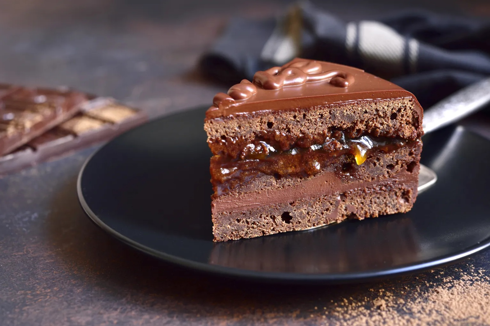

# Sachertorte

*Vienna's most famous cake: a dense chocolate sponge split horizontally and sandwiched with apricot jam, then encased in a glossy mirror-smooth chocolate ganache glaze. Created in 1832 by Franz Sacher, served with unsweetened whipped cream at every Vienna coffeehouse since.*

**Serves:** 10-12

**Prep Time:** 45 minutes

**Cook Time:** 40 minutes

## Overview
Sachertorte is Vienna's most famous cake and the dessert that defined the city's coffeehouse culture: a dense chocolate sponge cake split horizontally and sandwiched with a thin layer of apricot jam, the entire cake coated with a thin layer of apricot glaze, then encased in a glossy mirror-smooth dark chocolate ganache that sets to a clean snap. Created in 1832 by sixteen-year-old apprentice Franz Sacher for Prince Metternich, it's been a Vienna institution ever since (and the subject of a famous seven-year court case between the Sacher Hotel and Demel pastry shop in the 1950s over who got to call their version the "original"). Two technique points define a proper Sachertorte. First, the sponge is dense, not light; this is not a feathery génoise but a properly serious chocolate cake with the texture of a soft fudge brownie thanks to the high ratio of dark chocolate beaten into the butter base. Second, the apricot jam goes both inside and outside the cake. A thin layer between the split sponges, then the whole cake brushed with warmed strained jam before the chocolate glaze goes on; that thin apricot layer underneath is what gives the cake its distinctive tang under the rich chocolate top, and skipping it gives a one-note chocolate cake rather than a proper Sachertorte. Make the cake the day before serving so the crumb settles and the flavours marry. Serve at room temperature with a generous pile of properly unsweetened whipped cream (Schlagobers) on the side; the lack of sugar in the cream is critical because the cake is already plenty sweet, and the unsweetened cream is what cuts through the richness.

## Ingredients

### Sponge
- 150 g dark chocolate (70% cocoa, finely chopped)
- 150 g unsalted butter (softened to room temperature)
- 100 g icing sugar (sifted)
- 1 teaspoon vanilla extract
- 6 large eggs (separated, at room temperature)
- 100 g caster sugar (for the egg whites)
- 150 g plain flour (sifted)

### Apricot glaze layer
- 250 g good-quality apricot jam (smooth, not chunky; or strained chunky jam)
- 2 tablespoons rum (or water)

### Chocolate glaze (the mirror finish)
- 250 g caster sugar
- 175 ml water
- 200 g dark chocolate (70% cocoa, finely chopped)

### For the tin
- 20 g butter (softened, for greasing)
- 1 tablespoon plain flour (for dusting)

### To serve
- 300 ml double cream (whipped to soft peaks, unsweetened; this is the Vienna way)

## Method

### Stage 1 - Prepare the tin
1. Heat the oven to 170 C.
2. Butter the base and sides of a 23 cm springform tin generously.
3. Dust with the tablespoon of flour, tapping out any excess.
4. Cut a circle of baking parchment and lay in the base.

### Stage 2 - Melt the chocolate
1. Place the chopped dark chocolate in a heatproof bowl set over a pan of barely simmering water (don't let the bowl touch the water).
2. Stir gently till just melted and smooth.
3. Lift off the heat and let cool for 5 minutes; the chocolate should still be liquid but no longer hot to the touch.

### Stage 3 - Cream the butter base
1. Beat the softened butter and icing sugar together in a stand mixer (or by hand with a wooden spoon) for 4-5 minutes till pale, light and fluffy.
2. Beat in the vanilla.

### Stage 4 - Add the chocolate and yolks
1. Pour the cooled melted chocolate into the butter mixture and beat for a minute till uniform and glossy.
2. Beat in the egg yolks one at a time, making sure each is fully incorporated before adding the next.

### Stage 5 - Whip the egg whites
1. In a separate scrupulously clean bowl, whisk the egg whites till soft peaks form.
2. Add the caster sugar a tablespoon at a time, continuing to whisk till the whites form stiff glossy peaks (don't go to the dry stage).

### Stage 6 - Fold and bake
1. Sift the flour over the chocolate-butter base.
2. Fold a third of the whipped whites into the chocolate base with a large metal spoon to slacken the mixture.
3. Fold in the rest of the whites and the flour together in a few gentle motions, just till no white streaks remain. Don't overwork; you need to keep the air the whites brought in.
4. Pour the batter into the prepared tin and smooth the top.
5. Bake for 35-40 minutes till a skewer inserted into the centre comes out with just a few moist crumbs (not wet batter). Don't overbake; the cake should stay dense and faintly fudgy at the centre.
6. Cool in the tin for 15 minutes, then turn out onto a wire rack, peel off the parchment and cool completely (at least 2 hours).

### Stage 7 - Split and fill
1. Once completely cool, slice the cake horizontally in half with a long serrated knife. A turntable helps if you have one.
2. Warm the apricot jam in a small pan with the rum till just liquid. Push through a fine sieve to remove any lumps or skin.
3. Spread a generous layer of warm strained jam over the cut face of the bottom half. Set the top half back in place.
4. Brush the entire outside of the cake (top and sides) with another thin layer of warm jam. This thin coat is what the chocolate glaze adheres to.
5. Set the cake on a wire rack over a clean tray (the tray catches the glaze drips). Leave 10-15 minutes for the jam to set tacky.

### Stage 8 - Make the chocolate glaze
1. Combine the caster sugar and water in a heavy saucepan. Bring to a boil over medium heat, stirring once or twice to dissolve the sugar.
2. Boil briskly for exactly 5 minutes; this concentrates the syrup just enough for the proper Sacher glaze.
3. Off the heat, add the chopped chocolate and stir gently with a wooden spoon till the chocolate melts completely and the glaze is uniform.
4. Let cool slightly to thicken to a thick pourable consistency that coats the back of the spoon (about 35-40 C; lukewarm). Don't refrigerate; the glaze needs to be just warm to pour.

### Stage 9 - Glaze the cake
1. Pour the glaze in one steady continuous stream onto the centre of the cake, then quickly with an offset spatula coax it over the edges so the entire top and sides are coated in a single pass. Don't go back over with the spatula; that breaks the mirror finish.
2. Let the glaze drip down the sides and onto the tray. The cake should be entirely coated.
3. Leave the cake on the rack at room temperature for at least 2 hours for the glaze to set firm and glossy.

### Stage 10 - Serve
1. Transfer the set cake to a serving plate with a wide spatula.
2. Slice with a sharp knife dipped in hot water and wiped clean between cuts.
3. Serve each slice with a generous spoonful of unsweetened whipped cream alongside.

## Notes
- **Dense not light:** Sachertorte is meant to be dense, fudgy and serious. If you find your cake feels too light or sponge-like, you've over-whipped the whites or over-folded. The texture should be like a slightly underbaked brownie that's been allowed to set.
- **Apricot jam inside and out:** the thin layer of apricot jam between the cake and the chocolate glaze is what gives Sachertorte its signature character. Don't skip it. Use a smooth jam or push chunky jam through a fine sieve so the layer is even.
- **Vienna ritual: unsweetened cream:** Schlagobers in Vienna means lightly whipped unsweetened cream. The cake is already plenty sweet; the cream provides the contrast in unsweetened richness. Adding sugar to the cream is the most common mistake home cooks make with this cake.
- **The glaze in one pass:** the mirror finish only comes from pouring the glaze in one steady continuous stream and coaxing it over with a single spatula sweep. Going back over breaks the surface tension and gives you a streaky matt finish instead of a glossy mirror.
- **Make it the day before:** the cake genuinely improves overnight as the apricot layer migrates into the sponge and the flavours marry. Day 2 is when Sachertorte is at its best.

## Variations
**Demel's version:** uses a single layer (no horizontal split or filling between layers), with apricot jam coating only the outside before the glaze. The 1960s court case let Sacher claim "Original Sachertorte" with the inner jam layer; Demel can only call theirs "Eduard-Sacher-Torte".
**With ground almonds:** swap 30 g of the flour for ground almonds for a slightly tenderer crumb; non-traditional but works.
**Mini Sachertortes:** bake the batter in small individual tins or muffin moulds (15 minutes baking), split and fill each, glaze individually. Restaurant presentation.

## Serving
At room temperature, sliced thick, with a generous spoonful of unsweetened whipped cream on the side. Drink: strong coffee (a Wiener Melange or an espresso), or a small glass of Sherry or Sweet Wine.

## Storage
- Keeps 5-7 days in a tin at room temperature (don't refrigerate; the glaze loses its shine and the sponge dries out faster in the cold).
- The flavour and texture both improve over the first 2 days as the apricot layer migrates into the sponge.
- Freezes 2 months wrapped well; defrost slowly in the fridge overnight, then bring to room temperature before serving. The mirror finish doesn't fully recover.
