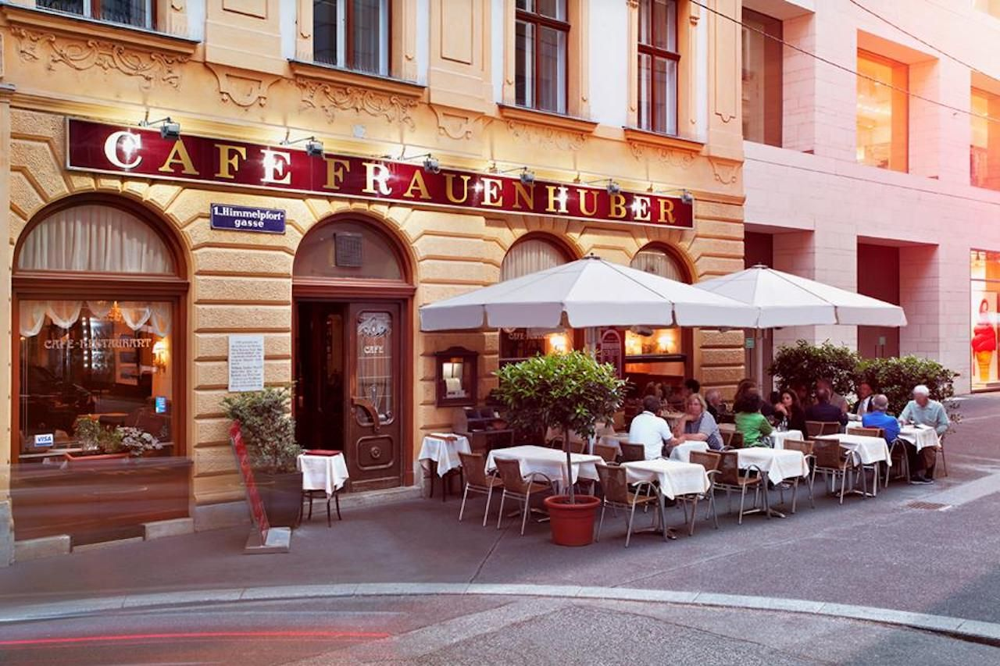

# Austrian Cuisine

Hearty cooking shaped by the reach of the Habsburg Empire. Wiener schnitzel (veal pounded thin, breaded, fried in butter) is the unofficial national dish; tafelspitz (boiled beef with horseradish), gulasch (borrowed from Hungary and refined) and a long catalogue of dumplings, bread, potato, semolina, fill out the savoury table. The pastry tradition is world-class: apfelstrudel layered as thin as parchment, sachertorte with its glossy chocolate glaze, kaiserschmarrn (torn pancake with stewed fruit), linzer torte. Vienna's coffee house culture, introduced after the Turkish siege of 1683 - is UNESCO-listed and still the centre of social life.
