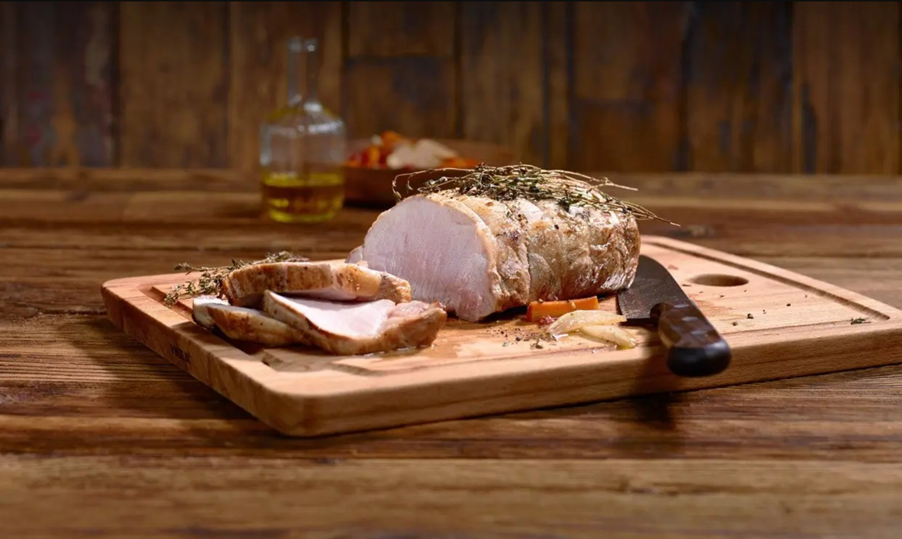

# Schweinsbraten

*Austria's Sunday roast pork: a fat-capped shoulder scored, rubbed with caraway, garlic and salt, then slow-roasted with onion, carrot and beer poured into the tin so the skin crackles into glassy crust and the meat goes spoonable underneath. Served with bread dumplings and braised cabbage.*

**Serves:** 6

**Prep Time:** 30 minutes

**Cook Time:** 3 hours

## Overview
Schweinsbraten is the Austrian Sunday roast: a pork shoulder or belly with its skin scored deep and seasoned hard with crushed caraway, sliced garlic and coarse salt, then slow-roasted in a tin with diced onion, carrot and a bottle of beer poured around the base so the meat braises in the liquid from underneath while the skin dries to a glassy crackling on top. The Gasthaus Sunday dish in Vienna, Salzburg and the Alpine valleys, served sliced thick with bread dumplings (Semmelknödel) to soak up the dark caraway-scented gravy and a mound of sauerkraut or braised red cabbage on the side to cut the richness. The deep diamond-scored skin and the rub of crushed caraway are what mark it out from a generic roast; the gravy that pools at the bottom of the tin from rendered fat, beer and onion is half the joy of the dish.

## Ingredients

### Pork
- 2 kg pork shoulder (with skin and a thick layer of fat; ask the butcher to score the skin in a 1 cm diamond pattern through to the fat but not the meat)
- 2 tablespoons coarse sea salt
- 1 ½ tablespoons caraway seeds (lightly crushed in a mortar)
- 6 garlic cloves (3 thinly sliced, 3 left whole)
- 2 teaspoons freshly ground black pepper

### Roasting base
- 2 large onions (peeled, halved and sliced thick)
- 2 large carrots (cut into 3 cm chunks)
- 1 small celeriac or 2 stalks celery (chopped)
- 4 bay leaves
- 500 ml Austrian lager (Stiegl or any decent pale beer; or German Pils)
- 250 ml water

### To finish the gravy
- 1 tablespoon plain flour (optional, only if the gravy needs thickening)
- 2 teaspoons sweet paprika
- Sea salt and pepper to taste

## Method

### Stage 1 - Score and season
1. If the butcher hasn't scored the skin, do it yourself with a very sharp Stanley blade or a fresh razor: cut a tight diamond pattern across the skin, the cuts going through the skin and into the fat but stopping short of the meat. The scoring is what lifts the crackling.
2. Pat the pork dry with kitchen paper, particularly the skin.
3. Rub the coarse salt into the scored skin, working it into every cut.
4. Mix the crushed caraway, sliced garlic and black pepper in a small bowl, then press the mixture firmly into the skin score lines. Don't worry if some falls off; what matters is that the cuts are full of seasoning.

### Stage 2 - Build the roasting base
1. Heat the oven to 220 C.
2. Scatter the sliced onions, carrots and celeriac into the base of a deep heavy roasting tin. Tuck the whole garlic cloves and bay leaves among the vegetables.
3. Sit the pork on top of the vegetables, skin-side up. The vegetables should form a bed that lifts the meat clear of the liquid below.
4. Pour the beer and water around (not over) the meat, into the vegetable bed.

### Stage 3 - Initial blast
1. Slide the tin into the hot oven and roast for 30 minutes. The skin should start to bubble and lift as the salt draws moisture out and the fat begins to render.

### Stage 4 - Slow roast
1. Drop the oven to 160 C.
2. Continue roasting for around 2 ½ hours, basting every 30 minutes with the liquid in the bottom of the tin (lift the tin out, spoon the juices over the meat and skin, slide it back in). If the liquid evaporates too fast and the vegetables threaten to scorch, top up with another 200 ml of water.
3. The pork is done when a skewer slides into the thickest part with no resistance and the internal temperature reads 88-90 C (yes, well past medium; pork shoulder wants to be cooked till the connective tissue dissolves into the meat).
4. If the crackling needs a final push, ramp the oven to 230 C for the last 10 minutes; watch closely so the cuts don't scorch.

### Stage 5 - Rest the meat
1. Lift the pork carefully out of the tin and onto a board. Tent loosely with foil and rest 20 minutes; the meat needs this to settle and the juices to redistribute.

### Stage 6 - The gravy
1. Strain the tin juices through a fine sieve into a saucepan, pressing the vegetables hard with the back of a ladle to extract every drop (the soft vegetables and their pulp can stay in the sieve; you've already taken the flavour out of them).
2. Skim the fat off the top with a spoon (save it for roast potatoes another day).
3. Bring the gravy to the boil and reduce by a third over high heat till it tightens to a glossy savoury liquid that coats the back of a spoon.
4. Whisk in the sweet paprika. If the gravy needs more body, make a slurry of the tablespoon of flour with two tablespoons of the gravy and whisk that back in, simmering 2-3 minutes more.
5. Taste and adjust salt and pepper.

### Stage 7 - Carve and serve
1. Lift the crackling off the meat in one large piece if you can; lay it crisp-side up on a board.
2. Carve the meat into thick slices across the grain.
3. Snap the crackling into shards with your hands or a sharp knife.
4. Serve the meat with crackling shards on top, bread dumplings alongside, sauerkraut or braised red cabbage at the side, and the gravy in a warm jug.

## Notes
- **Score deep, but not too deep:** the cuts must go through the skin and into the fat layer but stop short of the meat. Too shallow and the crackling won't lift; too deep and the meat dries out as juices escape into the tin.
- **Dry skin:** moisture is the enemy of crackling. Pat the pork bone-dry before salting, and if you have time, leave the seasoned pork uncovered in the fridge overnight; the skin dries out and crackles much more dramatically the next day.
- **Beer in the tin, not on the meat:** the beer goes into the vegetable bed below the pork; it never touches the skin during cooking or the skin softens and the crackling fails.
- **Caraway is essential:** the seed defines Austrian pork roasts. Crush lightly so the oils release but the seeds stay whole-ish; ground caraway tastes harsh and dusty.
- **Pork shoulder over loin:** shoulder has the fat and connective tissue that turns silky over three hours of slow heat. Loin dries out in the same conditions. Belly works too and gives even more crackling, but slice thinner.

## Variations
**Bohemian Schweinsbraten:** the Czech-influenced variant from Lower Austria, served with bread dumplings (knedlíky) and braised red cabbage with apple, the caraway swapped for cumin in places.
**Krustenbraten:** the Bavarian cousin from south of the border, made with pork belly rather than shoulder for maximum crackling, often with dark beer instead of pale.
**Stuffed Schweinsbraten:** a pocket cut into the meat and stuffed with sautéed onion, garlic and bread before roasting; a Vorarlberg variation.

## Serving
Sliced thick with [Semmelknödel](side-dishes/semmelknoedel.md) (bread dumplings) to soak the gravy, braised red cabbage (Blaukraut) or proper sauerkraut, and a small pile of crackling shards on each plate. Drink: Austrian lager, a glass of grüner veltliner, or a rustic red like Zweigelt. Sunday lunch in any Gasthof from Vienna to Innsbruck.

## Storage
- Keeps refrigerated 3 days; the meat is excellent cold in sandwiches with horseradish and pickled gherkins, or sliced into Tiroler Gröstl the next day.
- Crackling loses its crispness after a few hours; don't try to revive it. Slice and add the shards to soup or sprinkle into the next day's hash.
- The meat freezes 3 months in its gravy; thaw overnight in the fridge and reheat gently in a covered pan.
- Don't microwave; the gravy splits and the meat goes leathery.
