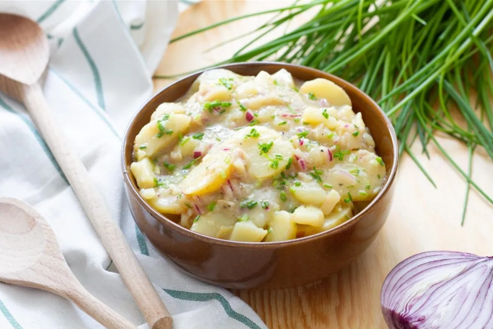

# Erdäpfelsalat

*Vienna's potato salad: warm waxy potatoes sliced thin and dressed while still hot with hot beef stock, cider vinegar, finely diced onion, mustard and pumpkin seed oil. No mayonnaise, ever. The traditional partner to Backhendl and Wiener Schnitzel.*

**Serves:** 4

**Prep Time:** 25 minutes

**Cook Time:** 20 minutes

## Overview
Erdäpfelsalat is Vienna's potato salad, a properly Austrian creation that has nothing to do with the mayonnaise-bound American or German versions: warm thin-sliced waxy potatoes dressed while still hot with hot beef stock, cider vinegar, very finely diced raw onion, a dab of Dijon mustard and a slick of dark pumpkin seed oil. The stock and vinegar soak in as the potatoes sit, and the finished salad is glossy, slightly creamy from the leached starches, sharp from vinegar and onion, and earthy from the oil. The canonical partner for [Backhendl](../backhendl.md), Wiener Schnitzel, fried fish or any roast meat where you want a sharp side rather than a creamy one. Austrian pumpkin seed oil (Steirisches Kürbiskernöl) is non-negotiable: the dark green nutty Styrian oil is what gives the salad its signature flavour, and olive oil makes it taste like a different dish entirely.

## Ingredients

### Potatoes
- 800 g waxy potatoes (Charlotte, Anya or Nicola; medium-sized so they cook evenly)
- 1 tablespoon fine sea salt (for the cooking water)

### Dressing
- 250 ml hot beef stock (or chicken stock; vegetable stock at a push)
- 3 tablespoons cider vinegar (or white wine vinegar)
- 1 small onion (very finely diced, almost minced)
- 1 teaspoon Dijon mustard
- 1 teaspoon caster sugar (optional, to round the vinegar's edge)
- ½ teaspoon fine sea salt
- ¼ teaspoon freshly ground black pepper

### Finish
- 3 tablespoons pumpkin seed oil (Steirisches Kürbiskernöl)
- 2 tablespoons chopped chives (or flat-leaf parsley)
- Extra pumpkin seed oil to drizzle on top

## Method

### Stage 1 - Boil the potatoes whole
1. Place the unpeeled potatoes in a large pan and cover with cold water by 5 cm.
2. Add the tablespoon of salt and bring to the boil.
3. Reduce to a simmer and cook 18-25 minutes (depending on size) till a paring knife slides into the centre with no resistance.
4. Drain in a colander.

### Stage 2 - Peel and slice while warm
1. As soon as the potatoes are cool enough to handle, peel each one with a small sharp knife (a folded clean tea towel held in your other hand helps grip the hot potato). The skin should slip off easily.
2. Slice each peeled potato across into 3 mm rounds. Tip the slices straight into a wide shallow bowl as you go; they should still be properly warm at this point. Working warm matters; cold potatoes won't drink the dressing.

### Stage 3 - Build the warm dressing
1. While the potatoes cool slightly, gently warm the beef stock in a small pan to just steaming (not boiling).
2. Whisk the cider vinegar, finely diced onion, Dijon mustard, sugar (if using), salt and pepper into the hot stock.

### Stage 4 - Dress the potatoes
1. Pour the warm dressing over the warm potato slices. Toss very gently with a spatula or your hands so every slice is coated but the slices don't break.
2. Let stand at room temperature for 15-20 minutes. During this rest, the potatoes absorb the stock and vinegar; the salad goes from looking too wet to looking properly dressed and glossy.

### Stage 5 - Finish with oil
1. Drizzle over the pumpkin seed oil and fold through gently. The oil should slick the potatoes rather than pool.
2. Taste and adjust salt, pepper, vinegar.
3. Scatter the chopped chives over the top and drizzle a final thread of pumpkin seed oil for visual contrast.

### Stage 6 - Serve
1. Best at room temperature or just barely warm. Refrigerator-cold dulls the flavours.
2. Spoon alongside the main, or pile in the centre of a wide platter as a side for the whole table.

## Notes
- **Waxy potatoes only:** floury potatoes fall apart in the dressing and turn the salad into starchy mush. Stick with Charlotte, Anya, Nicola or any salad potato.
- **Boil in skins:** the skin keeps the potato from soaking up water and going waterlogged. The slight extra effort of peeling them warm is worth it for the better texture.
- **Dress them warm:** the heat opens the potato slices and lets them drink the dressing. Cold potatoes give a watery thin salad with the dressing sitting separate at the bottom of the bowl.
- **Steirisches Kürbiskernöl:** Austrian pumpkin seed oil from Styria is the defining ingredient. It's dark green-black, intensely nutty and slightly toasted from the roasted seeds. Don't substitute olive oil; it will taste like a completely different dish. Most good European delis carry it; Steirisches Kürbiskernöl g.g.A. is the protected-origin label.
- **Onion fine, very fine:** the raw onion needs to be almost minced so it disperses through the salad rather than sitting in chunks. Soaking the diced onion in the warm stock for a few minutes also takes the sharp edge off.

## Variations
**With cucumber:** a peeled cucumber, deseeded and finely sliced, added at the same time as the potatoes; Heuriger summer version.
**Speck-Erdäpfelsalat:** 80 g of crisp diced bacon and its rendered fat folded through; turns the salad from side to almost-main.
**Vienna-style with apple:** half a tart eating apple finely diced into the salad with the onion; an old-style refinement that brightens the flavour profile.

## Serving
The canonical partner for [Backhendl](../backhendl.md) and Wiener Schnitzel, but also wonderful alongside roast pork, grilled sausages, smoked fish or any cold cut. Serve at room temperature on the side of the plate; never as a chilled salad.

## Storage
- Keeps 2 days refrigerated, but the flavour and texture are at their best within 4 hours of dressing. The potatoes drink in the dressing as it sits, so by day 2 the salad has gone a bit dry; revive by adding a splash more warm stock and a fresh drizzle of pumpkin seed oil.
- Bring to room temperature before serving any leftovers; chilled, the oil congeals and the flavours flatten.
- Don't freeze; the potatoes turn grainy on thawing.
