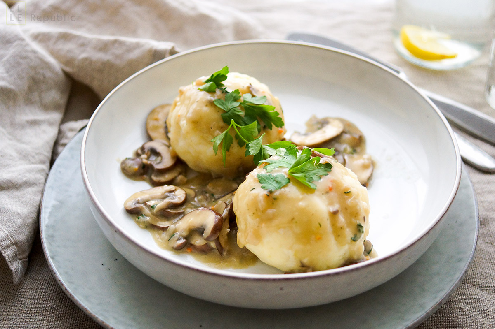

# Kartoffelknödel

*Austria's potato dumplings: floury riced potatoes bound with egg, semolina and flour, often hiding a crisp golden bread-cube heart in the centre, poached till they bob to the surface. The other classic partner to goulash and Schweinsbraten alongside the bread version.*

**Serves:** 4

**Prep Time:** 25 minutes

**Cook Time:** 20 minutes

## Overview
Kartoffelknödel are the potato cousin of [Semmelknödel](semmelknoedel.md), made with floury potatoes riced or pressed through a mouli rather than diced bread, bound with semolina, flour and egg, and often hiding a centre of buttered fried bread cubes for textural contrast against the soft outside. They turn up next to roast pork, goulash, mushroom ragout and any dish with a serious gravy in the Tyrol, Salzburg and Carinthia. The bread-cube heart is the small surprise that makes them more interesting than a plain potato dumpling: bite through the soft potato shell and find the crisp buttery cubes hiding in the middle. Sliced through and served cut-face up so the gravy spooned over can pool into the cross-section.

## Ingredients

### Potato base
- 800 g floury potatoes (King Edward, Maris Piper, or Russet, cooked in their skins the day before, then peeled and riced, kept cool overnight)
- 80 g semolina (fine grain)
- 80 g plain flour (plus extra for shaping)
- 1 large egg (beaten)
- 1 teaspoon fine sea salt
- 1 pinch freshly grated nutmeg

### Bread-cube heart
- 3 slices stale white bread (crusts removed, cut into 1 cm cubes)
- 40 g butter

### For poaching
- 2 litres water
- 1 tablespoon fine sea salt

## Method

### Stage 1 - Cook the potatoes the day before
1. Boil the potatoes in their skins in salted water till a paring knife slides in easily, around 25-30 minutes depending on size.
2. Drain and let cool just enough to handle, then peel and pass through a potato ricer or a mouli into a wide tray.
3. Spread out into a thin layer and cool completely; refrigerate overnight uncovered so the starches firm and the surface dries out. This dry firm base is what holds the dumplings together.

### Stage 2 - Fry the bread cubes
1. Melt the butter in a small frying pan over medium heat.
2. Add the bread cubes and toss to coat in butter.
3. Fry for 3-4 minutes, turning frequently, till deep gold on all sides.
4. Tip onto kitchen paper to drain. Cool completely.

### Stage 3 - Build the dough
1. Tip the cooled riced potato into a wide mixing bowl.
2. Sprinkle in the semolina, plain flour, salt and grated nutmeg.
3. Pour in the beaten egg.
4. Bring together with light hands (a wooden spoon, then your fingertips) into a soft uniform dough. Stop the moment everything is combined; over-working develops gluten and turns the dumplings rubbery.
5. The dough should hold together when you press a piece in your palm but still feel soft and yielding. If it's too sticky, sprinkle in a tablespoon more flour. If it's too crumbly, add a small splash of milk.

### Stage 4 - Shape with bread-cube heart
1. Lightly flour your hands and the work surface.
2. Divide the dough into 8 portions.
3. Take a portion, flatten it in your palm into a disc about 8 cm across.
4. Press 4-5 of the fried bread cubes into the centre.
5. Lift the edges of the dough up around the bread and pinch closed at the top, working the seams smooth.
6. Roll between your palms into a smooth round sphere with no cracks (cracks let water in and the dumpling falls apart).
7. Place on a floured tray. Repeat with remaining portions.

### Stage 5 - Poach
1. Bring the water and salt to a low simmer in a wide saucepan.
2. Lower the dumplings carefully into the water with a slotted spoon. Work in two batches if your pan is small; never crowd the pan.
3. Cook at a gentle simmer (not a rolling boil) for 15 minutes. They'll rise to the surface after about 8 minutes; keep simmering till they feel firm and springy when prodded.

### Stage 6 - Serve
1. Lift out with a slotted spoon, drain briefly on kitchen paper.
2. Slice each dumpling in half with a wet knife to reveal the golden bread-cube centre.
3. Arrange cut-face up on warm plates and spoon goulash gravy, roast pork juices or browned butter and crumbs generously over and around.

## Notes
- **Floury potatoes only:** waxy potatoes don't work here. They hold water and give sticky dumplings that fall apart in the pan. Stick with King Edward, Maris Piper, Russet or any baking potato.
- **Cook potatoes a day ahead:** this is the single most important step. Hot freshly riced potato is too wet and steamy and the dumplings won't bind. Overnight cool drying makes the riced potato dry enough to absorb the flour and semolina properly.
- **Don't overwork the dough:** mix just till combined. Kneading develops gluten through the flour and gives a chewy rubbery dumpling.
- **Shape smooth, no cracks:** any cracks in the surface let simmering water in and the dumpling disintegrates. Roll firmly between your palms till the surface is glassy and smooth.
- **Bread cubes optional but traditional:** the buttered fried bread heart is the surprise inside. Skip it for a plain potato dumpling, but the contrast of textures is the whole charm.

## Variations
- **Halb-und-halb (half-and-half):** a Bohemian-influenced version using half cooked riced potato and half grated raw potato; squeeze the raw potato dry through a clean cloth before mixing. The texture is denser and the dumplings have more bite.
- **Wagging Knödel:** mini bite-sized versions served as soup garnish in clear beef broth.
- **Kasknödel:** swap the bread-cube centre for a small cube of mountain cheese (Bergkäse or Emmentaler) that melts into a pocket as the dumpling cooks; serve in broth or with browned butter.
- **Sweet variant:** Marillenknödel and Zwetschkenknödel use this same potato dough wrapped around whole apricots or plums, poached, then rolled in buttered crumbs and sugar; the dessert version.

## Serving
- Slice through and serve cut-face up under goulash, [Schweinsbraten](../schweinsbraten.md) gravy, Tafelspitz broth, or simply browned butter and toasted breadcrumbs (Brösel) scattered over. Side: braised red cabbage or pickled gherkins. Beer or grüner veltliner.

## Storage
- Best eaten fresh from the pot.
- Cooked dumplings keep refrigerated 2 days; reheat by steaming over simmering water for 8 minutes.
- Sliced and pan-fried in butter the next day, leftover Kartoffelknödel make Geröstete Knödel: a hash of fried dumpling slices with onion and egg, classic Vienna breakfast.
- Freeze cooked dumplings wrapped individually in foil for up to 2 months; defrost in the fridge overnight, steam to reheat.
- Don't microwave; the potato turns gluey.
