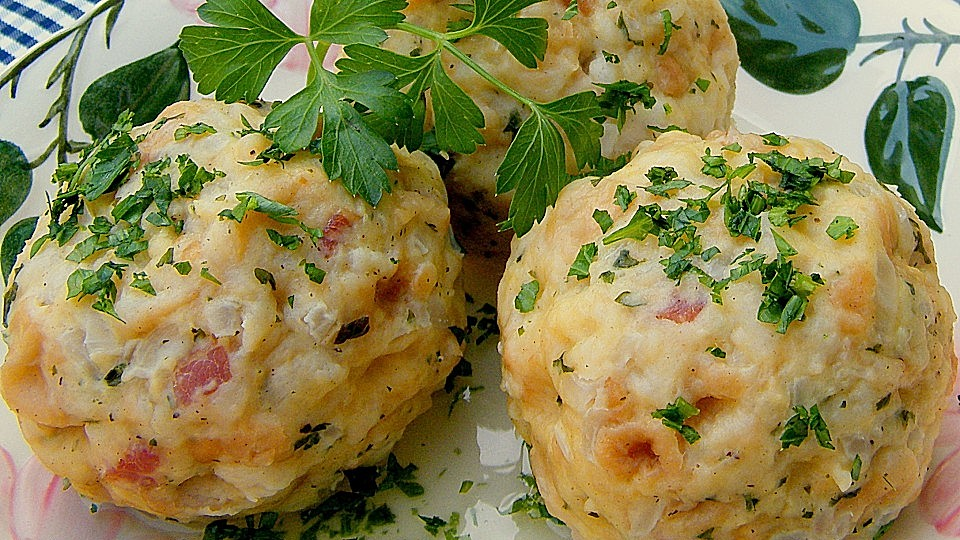

# Semmelknödel

*Austria's bread dumplings: stale white rolls diced and soaked with onion, parsley and milk, bound with egg and flour into soft pale spheres poached in salted water. Served sliced through the middle to mop up goulash gravy.*

**Serves:** 4

**Prep Time:** 20 minutes (plus 30 minutes resting)

**Cook Time:** 15 minutes

## Overview
Semmelknödel are Austria's bread dumplings, the soft pale spheres that turn up next to every gravy-rich dish from Vienna to the Tyrol: poached balls of stale white bread that's been diced, soaked with warm milk, onion, parsley and egg, then bound with just enough flour to hold their shape in simmering water. The traditional partner for [Schweinsbraten](../schweinsbraten.md), [Austrian Goulash](../austrian-goulash.md), Tafelspitz, and any braised-meat dish where you need something to soak up sauce. Properly stale bread is the trick: day-old fresh bread holds too much moisture and gives sticky claggy dumplings, while bread that's been sitting two or three days drinks the milk evenly and gives the right tender bite. Sliced through and served cut-face up so gravy can pool into the cross-section.

## Ingredients

### Bread base
- 300 g stale white rolls (Kaisersemmel ideally; or soft white bread, 2-3 days old, cut into 1 cm cubes)
- 250 ml whole milk (warmed to just under boiling)
- 50 g butter
- 1 onion (peeled, finely chopped)
- 4 tablespoons flat-leaf parsley (finely chopped)
- ½ teaspoon fine sea salt
- ¼ teaspoon white pepper
- 1 pinch freshly grated nutmeg

### Binder
- 2 large eggs (beaten)
- 4-6 tablespoons plain flour (start with 4, add more if the mixture is too wet)

### For poaching
- 2 litres water
- 1 tablespoon fine sea salt

## Method

### Stage 1 - Stale bread
1. The bread must be properly stale. If your bread is fresh, cube it and spread the cubes on a tray to dry in a 100 C oven for 15-20 minutes, then cool. Soft fresh bread cubes will collapse in the soaking step and give claggy dumplings.

### Stage 2 - Soak the bread
1. Tip the stale bread cubes into a wide bowl.
2. Melt the butter in a small pan over low heat, add the chopped onion and sweat for 5-6 minutes till soft and translucent without colouring.
3. Scrape the onion and butter over the bread, add the chopped parsley.
4. Warm the milk just to steaming (not boiling) and pour over the bread.
5. Sprinkle in the salt, white pepper and nutmeg.
6. Toss everything gently with a wooden spoon to coat every cube.
7. Cover with a tea towel and rest 20 minutes at room temperature so the bread fully absorbs the milk and softens through.

### Stage 3 - Bind
1. After resting, beat the eggs into the bread mixture with a wooden spoon, working through the bread till evenly distributed.
2. Sprinkle in 4 tablespoons of the flour and fold through. The mixture should come together as a soft sticky mass that holds its shape when squeezed in your palm.
3. If it's too wet (won't hold shape, runs through your fingers), add another tablespoon of flour. If it's too dry (crumbles apart), add a splash more warm milk.
4. Rest 10 minutes for the gluten to relax and the flour to hydrate.

### Stage 4 - Shape
1. Bring the water and salt to a low simmer in a wide saucepan.
2. Wet your hands with cold water. Scoop a generous handful of the mixture (about the size of a small tennis ball) and shape between your palms by pressing firmly into a smooth sphere. Press hard; loose dumplings fall apart in the water.
3. Lay each finished dumpling on a tray. Re-wet your hands between dumplings.

### Stage 5 - Poach
1. Lower the dumplings carefully into the simmering water with a slotted spoon. Don't crowd the pan; work in two batches if you've made eight or more.
2. Cook at a gentle simmer (never a rolling boil; it will tear them apart) for 12-15 minutes. After about 8 minutes they'll bob to the surface; let them keep simmering till they feel firm and springy when prodded with a finger.

### Stage 6 - Serve
1. Lift out with a slotted spoon, drain briefly.
2. Slice through the middle with a wet bread knife (a dry knife sticks to the dough; wet the blade between cuts).
3. Lay cut-side up on warm plates so the cavity catches the gravy.
4. Spoon the goulash or roast meat gravy over and around. Serve immediately.

## Notes
- **Stale bread is everything:** dry crisp bread cubes drink the milk evenly. Fresh bread compresses into a wet wad and gives sticky dumplings. If you only have fresh, dry it in a low oven first.
- **Shape firm:** when shaping, press the dumpling between your palms with real pressure so the bread cubes lock together. Loose dumplings break apart in the water and you end up with bread soup.
- **Simmer not boil:** the water should barely move. A rolling boil tears the dumplings apart from the outside in.
- **Test one first:** if you're unsure of the binding, drop a small test dumpling first. If it disintegrates, work more flour into the rest of the mixture. If it stays intact and tastes right, proceed with the whole batch.
- **Slice with a wet knife:** a dry blade sticks to the dough and tears it. Wet between cuts and the knife slips through cleanly.

## Variations
**Speckknödel:** mix 100 g of finely diced smoked bacon (rendered) into the bread before binding for the Tyrolean meat version, often served floating in clear beef broth rather than alongside gravy.
**Tiroler Kasknödel:** mix 80 g of grated mountain cheese (Bergkäse) into the bread and serve in broth.
**Spinatknödel:** swap parsley for 100 g of finely chopped wilted spinach, squeezed dry; the green dumplings are a Tyrolean specialty.
**Marillenknödel (sweet cousin):** apricot stuffed into the centre of each dumpling, poached and rolled in buttered breadcrumbs and sugar; pure dessert territory.

## Serving
Slice each dumpling in half and lay cut-face up under a generous ladle of goulash, gravy from Schweinsbraten, mushroom Rahmsauce, or simply browned butter with toasted breadcrumbs. A pickled cucumber on the side cuts through the richness. Beer or grüner veltliner.

## Storage
- Best eaten fresh from the pot.
- Cooked dumplings keep refrigerated 2 days; reheat by steaming over simmering water for 8 minutes (don't microwave or boil; they go gluey or break apart).
- Sliced and pan-fried in butter the next morning, leftover Semmelknödel become Knödel mit Ei: scrambled eggs and dumpling slices, a Vienna breakfast classic.
- Freeze cooked: wrap each in foil and freeze up to 2 months; defrost overnight in the fridge and steam to reheat.
