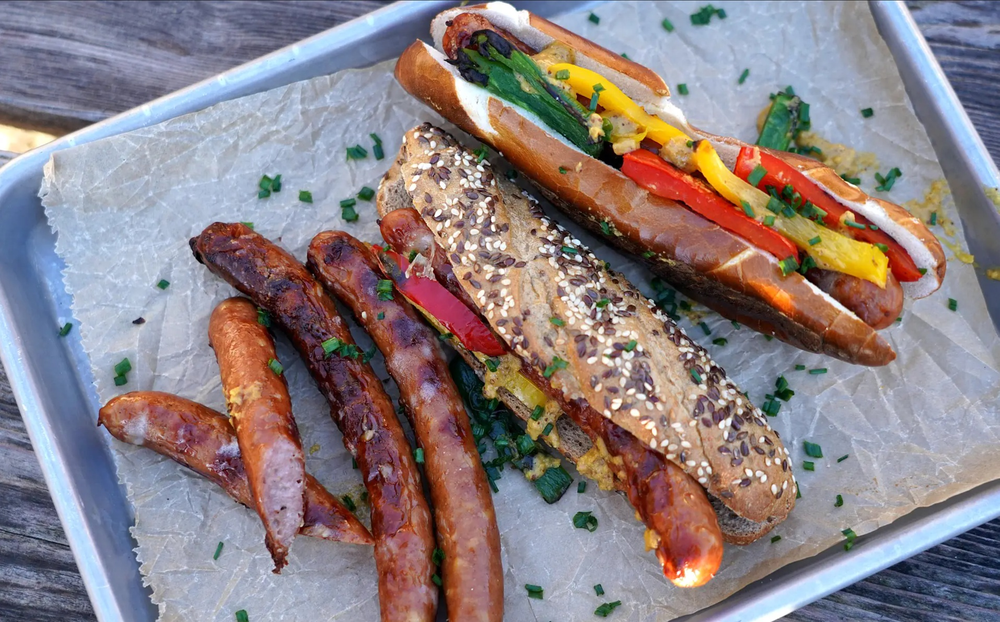

# Käsekrainer

*Vienna's cheese-stuffed sausage: a coarse-ground pork and beef sausage studded with small cubes of Emmentaler that melt into hot lava pockets when grilled. Eat splayed open in a roll with sweet mustard and curry ketchup at every late-night Würstelstand in the city.*

**Serves:** 4

**Prep Time:** 20 minutes (uses pre-made sausages)

**Cook Time:** 15 minutes

## Overview
Käsekrainer is the cheese-stuffed sausage that defines late-night Vienna street food: a coarse-ground pork and beef sausage in a natural casing with small cubes of Emmentaler or Bergkäse worked through the meat so they melt into hot oozing pockets when the sausage hits the grill. Created in Vienna in the 1960s as a variation on the classic Krainer Wurst (a sausage with origins in the Krain region of Slovenia), and now so identified with the city that one is on the menu of every Würstelstand from Albertinaplatz to the Naschmarkt. The traditional service is theatrical: the grilled sausage gets split lengthwise on a wooden board so the cheese-oozing inside faces up, then served splayed open into a halved kaiser roll with sweet mustard, curry ketchup and sliced pickled gherkins.

## Ingredients

### Sausages
- 4 Käsekrainer (about 150 g each; from a Austrian, Bavarian, or Slovenian butcher; or any quality cheese-stuffed pork sausage)
- 1 tablespoon vegetable oil (or lard for the rustic version)

### To serve
- 4 fresh kaiser rolls (or any soft white roll with a crisp top)
- 4 tablespoons Austrian sweet mustard (Estragon-Senf or any sweet Bavarian Süßer Senf)
- 4 tablespoons curry ketchup (a sweet curry-spiced ketchup; or Heinz ketchup mixed with curry powder)
- 2 large pickled gherkins (sliced into long batons)
- 1 small onion (sliced into thin rings, optional)
- Flaky sea salt

## Method

### Stage 1 - Prepare the sausages
1. Take the sausages out of the fridge 15 minutes before cooking. Cold sausages from the fridge will burst as they shock against the hot pan; room temperature sausages cook more evenly and the casings stay intact.
2. Pierce each sausage gently in 3-4 places along its length with the tip of a sharp knife (just through the casing, not deep into the meat). The small holes let steam escape and stop the casing splitting violently when the cheese inside expands.

### Stage 2 - Pan-fry or grill
1. **Pan method:** heat the oil in a heavy frying pan over medium heat till shimmering. Lay the sausages in and cook 10-12 minutes, turning every 2-3 minutes till the casings are deep gold and blistered all over and the sausages have heated through to the centre.
2. **Grill method:** heat a grill or barbecue to medium-high. Brush the sausages with the oil and cook on the rack for 10-12 minutes, turning every couple of minutes. Move to a cooler part of the grill if the casings start blackening before the inside is hot.
3. The sausages are done when they feel firm and resistant when pressed, and when you can hear the cheese sizzling inside.

### Stage 3 - The split
1. Lift the cooked sausages onto a wooden board.
2. Take a sharp knife and slice each sausage lengthwise about three-quarters of the way through (deep but not all the way; the sausage should stay in one piece). The cheese will be visible inside, molten and golden.
3. Press the sausage gently open like a hot dog.

### Stage 4 - Assemble in the roll
1. Cut the kaiser rolls in half horizontally; toast the cut faces briefly on the grill or in the residual heat of the pan if you like a warmer roll.
2. Lay one split sausage cheese-side-up into each bottom half of the roll.
3. Drizzle a generous spoonful of sweet mustard over the cheese.
4. Add a streak of curry ketchup down one side.
5. Lay 4-5 gherkin batons across the top.
6. Scatter a few onion rings if using.
7. Press the roll lid lightly down (not crushing) and eat immediately while the cheese is still molten.

## Notes
- **Prick before cooking:** the cheese inside expands violently as it melts. Without small steam vents, the casing splits and the cheese erupts out of the sausage in geysers. Three or four small pricks along the length prevent this.
- **Room temperature sausages:** cold sausages from the fridge often burst at the ends in the pan; let them sit out for 15 minutes first.
- **Don't over-cook:** the sausage just needs to heat through and the cheese inside to melt. Cooking longer dries out the meat and the cheese starts running out of any small split in the casing.
- **The split is non-negotiable:** the proper Würstelstand presentation is the splayed-open sausage cheese-side-up in the roll. Skip the split and the cheese stays hidden and the experience is half what it should be.
- **Buy quality sausages:** the success of the dish depends entirely on the sausage. Look for Austrian or Bavarian Käsekrainer with visible cheese cubes, natural casings, and a good ratio of meat to cheese. Generic supermarket cheese hot dogs are not the same thing.

## Variations
**With sauerkraut:** lay a small heap of warm sauerkraut alongside the sausage in the roll; the acidity cuts the richness beautifully.
**As main course:** serve two sausages per person, splayed open, on a plate with a mound of mashed potato and braised red cabbage; the Sunday dinner version.
**Käsekrainer mit Senfsosse:** instead of the roll, serve the sliced sausage in a creamy mustard sauce over boiled potatoes; more of a restaurant dish.
**Pizzaiola:** the late-night Vienna excess; the split sausage topped with tomato sauce and mozzarella and grilled briefly till bubbling.

## Serving
The traditional Würstelstand presentation: splayed open in a kaiser roll with sweet mustard, curry ketchup and pickled gherkins. Drink: cold Ottakringer or Stiegl lager. The traditional time is late night; the proper time is anytime.

## Storage
- Best eaten the moment they come off the heat. The cheese starts to firm up within minutes.
- Cooked sausages keep refrigerated 2 days; reheat in a pan or under the grill, never microwave (the cheese turns rubbery).
- Raw uncooked Käsekrainer keep in the fridge per the butcher's packaging, usually 5-7 days; freeze up to 2 months wrapped well.
