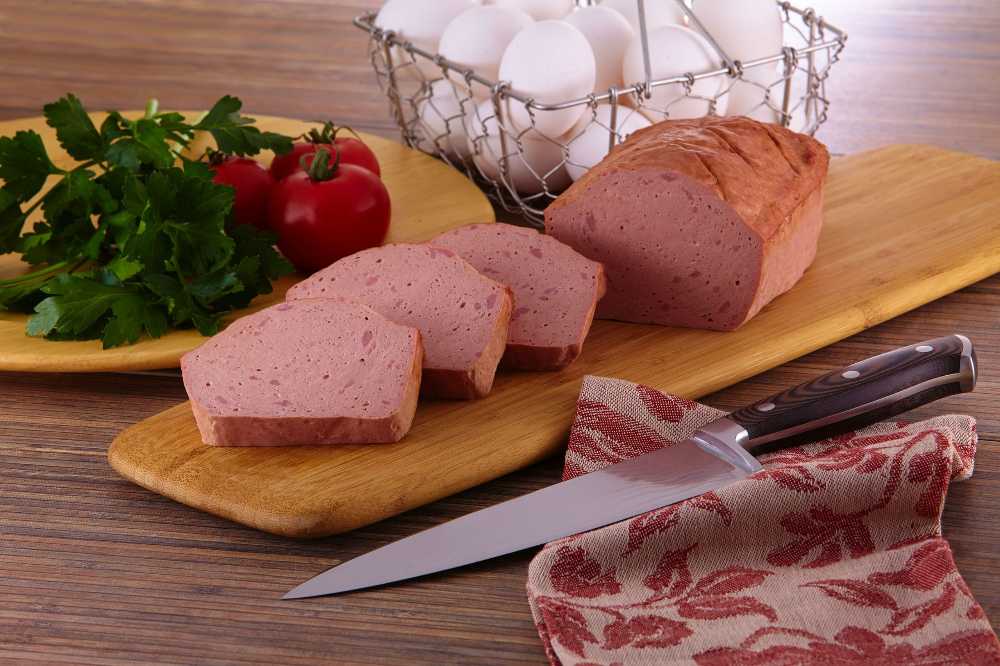

# Leberkäse

*Austria's lunch-counter staple: a flat baked meat loaf made from finely ground beef and pork with onion and warm spices, sliced thick and served hot in a kaiser roll with mustard at every Würstelstand in Vienna.*

**Serves:** 6-8 (or makes 1 loaf for 8 sandwiches)

**Prep Time:** 25 minutes (plus 4 hours chilling)

**Cook Time:** 1 hour

## Overview
Leberkäse is Austria's beloved lunch-counter staple: a flat baked meat loaf made from finely ground beef and pork emulsified with crushed ice into a pale pink mousse-like mass, seasoned with marjoram, mace, white pepper and grated onion, then baked till the top turns deep gold and the inside stays moist and tender. Sliced thick and laid hot into a fresh kaiser roll with a smear of sharp Austrian mustard, it's the canonical food of every Würstelstand in Vienna, the snack you eat standing up between meetings. Despite the name (literally "liver cheese"), most modern versions contain neither liver nor cheese; the words are believed to derive from the German laib (loaf) rather than the ingredients. The smooth pink mousse-like texture, quite different from a regular meatloaf's loose crumb, is the dish's signature.

## Ingredients

### Meat
- 500 g beef (lean shoulder or chuck, very cold, cut into 2 cm cubes and chilled in the freezer for 30 minutes before grinding)
- 500 g pork shoulder (with about 25% fat, very cold, cut into 2 cm cubes and chilled in the freezer for 30 minutes)
- 200 g crushed ice (made by blitzing ice cubes briefly in a food processor; keep frozen till the moment you need it)

### Seasoning
- 1 small onion (peeled, very finely grated through a microplane)
- 2 teaspoons fine sea salt
- 1 ½ teaspoons sweet paprika
- 1 teaspoon dried marjoram
- ½ teaspoon ground mace (or nutmeg)
- ½ teaspoon white pepper
- ¼ teaspoon ground coriander
- 1 teaspoon caster sugar
- 1 ½ teaspoons curing salt (Pökelsalz, optional but traditional; gives the signature pink colour, leave out for a brown unbleached version)

### For the tin
- 20 g butter (softened, for greasing)

### To serve
- 8 fresh kaiser rolls (or any soft white roll)
- Austrian sweet mustard (or Bavarian süßer Senf, or English mustard)
- Pickled gherkins, sliced
- Sliced raw onion (optional)

## Method

### Stage 1 - Chill everything
1. The single most important rule. Both meats need to be very cold (just on the verge of beginning to freeze) before grinding. Cut into cubes and freeze for 30 minutes till firm but not frozen solid.
2. Chill the food processor bowl and blade in the freezer for 15 minutes too. Warm meat or warm equipment will break the emulsion and you'll get a crumbly grey loaf instead of a smooth pink one.

### Stage 2 - First grind
1. Tip the cold beef and pork cubes into the chilled food processor.
2. Process in 10-second bursts till the meat is finely ground (about 1 minute total). Stop and scrape down the bowl as needed.
3. The meat should look like coarse paste, not a mass of small chunks.

### Stage 3 - Emulsify with ice
1. Add half the crushed ice, the salt, paprika, marjoram, mace, white pepper, coriander, sugar and curing salt if using.
2. Process for another minute in bursts, scraping down. The meat will turn pale pink and silky as the ice incorporates and the salt extracts the proteins.
3. Add the remaining ice and the finely grated onion. Process another 30-45 seconds till the mixture looks uniformly smooth and almost mousse-like.
4. Don't overdo it; the moment it goes from chunky-paste to smooth-mousse you stop. Continued processing past this point heats the meat from the friction and breaks the emulsion.

### Stage 4 - Test the seasoning
1. Take a teaspoon of the raw mix, flatten it onto a small plate, and fry it briefly in a non-stick pan till cooked through.
2. Taste; adjust salt, pepper or spices in the bulk if needed.

### Stage 5 - Press into the tin
1. Generously butter a 25 cm rectangular terrine tin (or two smaller loaf tins).
2. Pack the meat mixture into the tin firmly, pressing hard with a spatula to eliminate every air pocket; air bubbles trapped inside will leave grey patches in the cooked loaf.
3. Smooth the top flat, then dip a sharp knife in cold water and score the surface in a tight 1 cm diamond pattern (cuts going about 5 mm deep into the meat).

### Stage 6 - Bake
1. Heat the oven to 180 C.
2. Bake the leberkäse for 50-60 minutes till the surface goes deep mahogany brown and the internal temperature reads 72 C in the centre.
3. If the top browns too quickly, drape with foil after 30 minutes.

### Stage 7 - Rest and slice
1. Lift out of the oven and rest in the tin for 10 minutes.
2. Slide a knife around the edges and turn out onto a board, brown side up.
3. Slice thick (1.5 cm) with a sharp serrated knife.

### Stage 8 - Serve in a roll
1. Split each kaiser roll horizontally and butter both sides lightly.
2. Lay a thick hot slice of leberkäse into each roll.
3. Smear with sweet mustard, add sliced pickled gherkins and a few rings of raw onion if you like.
4. Eat standing up, the proper Würstelstand way.

## Notes
- **Everything ice cold:** the meat, the equipment and the ice all need to be properly cold. Warm meat breaks the emulsion and you'll end up with a grey crumbly meatloaf rather than the silky pink leberkäse you're after. If anything starts feeling warm, stop and chill it for 10 minutes before continuing.
- **Crushed ice not water:** the emulsion needs the ice itself, not water. The ice melts gradually as the meat protein extracts, keeping everything cold while delivering the moisture the mousse needs.
- **Don't over-process:** the moment the mix turns smooth and uniform, stop. Past that point, friction heats the meat and the emulsion breaks.
- **Curing salt (Pökelsalz):** the small amount of nitrite curing salt gives the signature pink colour and the slightly cured flavour. It's optional. Leave it out and the loaf will be brown rather than pink, and the flavour cleaner but less "leberkäse-y".
- **Sharp knife for scoring:** the diamond pattern on top is decorative and also helps the surface crisp evenly. Wet the knife between cuts so it slides through without dragging.

## Variations
**Käseleberkäse:** stir 200 g of small cubes of Emmentaler or mountain cheese into the mixture before pressing into the tin; melts into pockets as the loaf cooks.
**Pferdeleberkäse:** the Bavarian horse-meat version, darker and more strongly flavoured; rare in modern Austria but historically common.
**Pizza Leberkäse:** the Vienna street-food extravagance: slices topped with tomato sauce and mozzarella, grilled till bubbling; you'll find it at every late-night Würstelstand.
**Vegetarian (substitute):** there's no real vegetarian leberkäse; the emulsion technique relies on animal protein. If you need a vegetarian version, point people toward a properly made carrot-and-nut Bavarian pâté instead.

## Serving
Hot from the tin, sliced thick into a buttered kaiser roll (Leberkässemmel) with sweet Austrian mustard, sliced pickled gherkins and raw onion rings. Eat standing at a Würstelstand, train station kiosk, or footpath imbiss. Wash down with a cold weissbier or an Almdudler.

## Storage
- Keeps refrigerated 4 days; reheat slices in a non-stick pan with no oil till the edges crisp.
- Cold leberkäse sliced thin into a kaiser roll with mayonnaise and gherkins is the next day's lunch.
- Freezes whole or in slices for up to 2 months; defrost in the fridge overnight before reheating.
- Don't microwave; the texture goes rubbery.
