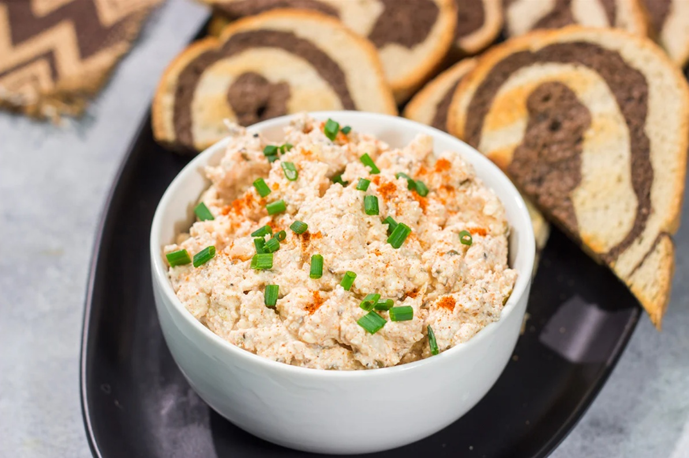

# Liptauer

*Vienna's pink cheese spread: soft sheep's-milk Brimsen cheese (or cream cheese substitute) whipped smooth with butter, sweet paprika, mustard, capers, chopped onion, anchovy and caraway. Smeared thick onto fresh bread at every wine cellar (Beisl) in the city.*

**Serves:** 6-8

**Prep Time:** 15 minutes (plus 2 hours chilling)

**Cook Time:** 0 minutes

## Overview
Liptauer is the pink-orange whipped cheese spread that turns up on every wine cellar and Beisl menu in Vienna as the standard small plate to nibble alongside a glass of grüner veltliner or schilcher: soft sheep's-milk Brimsen cheese (or its supermarket substitute, cream cheese) beaten smooth with softened butter, sweet Hungarian paprika, mustard, finely chopped capers, anchovy, onion and caraway, rested for at least an hour so the flavours marry, then smeared thickly onto slices of fresh rye or pumpernickel. The name comes from the Liptov region of northern Slovakia where the original Brimsen sheep cheese comes from, though the dish itself is so deeply Viennese it's hard to think of it as anything other than Austrian. Two ingredient details matter. The paprika must be proper Hungarian noble-sweet paprika (édesnemes); a fresh-opened tin gives the deep red-orange colour and the gentle fruit-pepper flavour the spread is famous for, while old supermarket paprika that's been sitting in the cupboard for a year has lost its colour and tastes like dust. And the butter and cheese both need to be properly softened at room temperature before whipping; cold ingredients give you a lumpy chunky spread that never comes together as a smooth pink mass. Use a stand mixer with a paddle attachment if you have one, or beat the cheese and butter together with a wooden spoon and a strong arm. Mix in the seasonings, taste and adjust, then press into a serving dish, cover and chill at least two hours for the flavours to marry before serving. The pink-orange colour deepens as it rests.

## Ingredients

### Base
- 250 g Brimsen sheep's milk cheese (or 200 g cream cheese + 50 g feta as a substitute; soft and at room temperature)
- 100 g unsalted butter (softened to room temperature, not melted)

### Seasoning
- 1 ½ tablespoons sweet Hungarian paprika (édesnemes; freshly opened tin for best colour)
- 1 ½ teaspoons Dijon mustard (or English mustard for sharper bite)
- 1 small white onion (peeled and very finely chopped, almost minced)
- 2 tablespoons small capers (drained, very finely chopped)
- 2 anchovy fillets (drained from oil, mashed to a paste)
- 1 teaspoon caraway seeds (lightly crushed in a mortar)
- ½ teaspoon fine sea salt (taste before adding; the cheese and anchovy are already salty)
- ¼ teaspoon freshly ground black pepper
- 1 teaspoon chopped fresh chives (optional, for serving)

### To serve
- 1 loaf fresh dark rye bread (or pumpernickel, sliced)
- Sliced radishes (optional)
- Pickled silverskin onions (optional)

## Method

### Stage 1 - Soften everything
1. Take the cheese and butter out of the fridge at least an hour before you start. They both need to be properly soft (your finger should press into the butter and the cheese easily) for the spread to come together smooth rather than lumpy. Cold ingredients give a chunky spread; warm ingredients give the silky pink mass you want.

### Stage 2 - Whip the base
1. Tip the softened cheese into a wide mixing bowl (or the bowl of a stand mixer with paddle attachment).
2. Add the softened butter.
3. Beat with a wooden spoon or the paddle on medium speed for 2-3 minutes till the mixture turns pale, smooth and uniform with no visible cheese chunks.

### Stage 3 - Build the colour
1. Add the paprika to the cheese-butter base.
2. Beat thoroughly for another minute till the spread turns a deep pink-orange. Watch as the colour develops; this is the moment the spread starts looking like proper Liptauer.

### Stage 4 - Add the seasonings
1. Add the mustard, finely chopped onion, chopped capers, mashed anchovy, crushed caraway seeds, salt and pepper.
2. Beat on low speed (or fold gently with a wooden spoon) till everything is evenly distributed but the capers and onion stay as visible flecks in the spread rather than being beaten into smoothness.
3. Taste; the spread should be savoury, faintly fishy from the anchovy without it announcing itself, sharp from the mustard and onion, with the caraway humming under everything. Adjust salt, paprika or mustard to your preference.

### Stage 5 - Rest
1. Scrape the spread into a small bowl or terrine. Smooth the surface with the back of a spoon.
2. Cover with cling film pressed against the surface and refrigerate for at least 2 hours; ideally overnight. The flavours marry as it rests and the colour deepens.

### Stage 6 - Serve
1. Take the Liptauer out of the fridge 20 minutes before serving so it softens back to a spreadable consistency. Cold straight from the fridge it's too firm to spread without tearing the bread.
2. Scatter chopped chives over the surface for colour.
3. Serve in the dish with a small knife, alongside thick slices of fresh rye or pumpernickel bread, sliced radishes and pickled onions if using.
4. Diners help themselves, smearing a generous layer onto each bread slice.

## Notes
- **Proper paprika is everything:** Hungarian noble-sweet (édesnemes) paprika from a fresh tin is what gives the spread its signature deep red-orange colour and the gentle pepper-fruit flavour. Old supermarket paprika that's been opened for six months has faded to brown and tastes like dust; the spread you'd make with it would be pale and flat.
- **Real Brimsen (Bryndza) if you can find it:** the original sheep's-milk Brimsen cheese from Slovakia is the canonical base. It's a soft fresh sheep cheese with the tang of yogurt and a salty edge. Outside of Austria and Slovakia it's hard to find; the cream cheese plus feta substitute gives a close enough result for the spirit of the dish.
- **Room temperature is non-negotiable:** cold butter and cold cheese give you lumpy spread that never comes smooth. Pull both out at least an hour before you start.
- **Don't over-beat the seasonings in:** the chopped onion and capers should stay as visible flecks. Beating them to invisibility flattens the texture; visible bits give the spread its character.
- **Two hours minimum rest:** the flavours genuinely need time to marry. Made fresh, the spread tastes of each ingredient separately. After two hours in the fridge, it tastes unified.

## Variations
**With ground caraway:** if whole caraway seeds bother you, grind them to a powder; the flavour is the same but the spread is smoother.
**Extra-spicy:** add a teaspoon of hot Hungarian paprika alongside the sweet, or a drop or two of Tabasco; gives the spread a serious kick.
**With cottage cheese:** replace half the cream cheese with drained well-mashed cottage cheese for a less rich version; closer to the textural look of original Bryndza.
**With chives folded through:** instead of just garnishing, fold 2 tablespoons of finely chopped chives into the base for a herb-spread version.

## Serving
Spread thick on thick slices of dark rye, pumpernickel or sourdough, with sliced radishes, pickled onions and pickled gherkins on the side; ideal as an aperitif platter with a glass of grüner veltliner, schilcher, or weissbier. Also wonderful as a small starter in a Heuriger or wine bar, or as part of a Brettljause platter alongside cured meats, hard cheese, hard-boiled eggs and pickles.

## Storage
- Keeps refrigerated 5-7 days in a sealed container; the flavour deepens for the first 2-3 days, then plateaus.
- Bring to room temperature before serving each time; cold from the fridge it's too firm to spread.
- Don't freeze; the cream cheese splits and the spread goes grainy on thawing.
- The spread also makes a fantastic stuffing for bell peppers or hollowed-out cucumber rounds.
