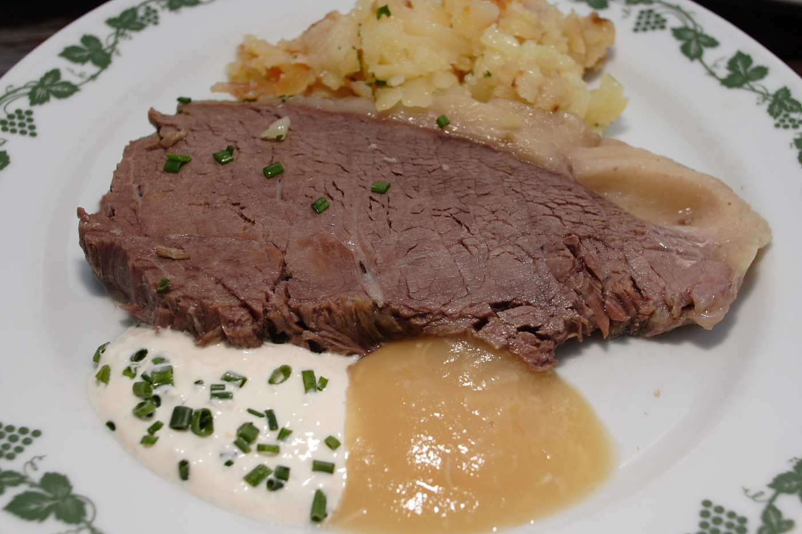

# Tafelspitz

*Vienna's beef rump cap, gently poached in aromatic broth and served with apple-horseradish. The Habsburg Sunday lunch.*

**Serves:** 6

**Prep Time:** 20 minutes

**Cook Time:** 3 hours

## Overview
A whole 1 ½ kg piece of beef rump cap simmers very gently for 2 ½-3 hours with onions, roots and bones until tender but still sliceable. The broth comes to the table first, clarified and served with chives, semolina dumplings or fine pancake strips (Frittaten). The beef is then sliced and presented with apple-horseradish sauce, chive sauce, roast potatoes (Bratkartoffeln) and creamed spinach. Two courses, one pot.

## Ingredients

### Beef and broth
- 1 ½ kg tafelspitz (beef rump cap; topside or top sirloin as substitute)
- 500 g beef marrow bones
- 2 onions (unpeeled, halved)
- 3 carrots (peeled, halved)
- 2 leeks (white parts, halved)
- ¼ celeriac (peeled, in big chunks)
- 1 parsnip (peeled, halved)
- 1 small bunch parsley stalks
- 2 bay leaves
- 1 tablespoon black peppercorns
- 6 allspice berries
- 2 cloves
- 2 teaspoons salt
- 3 litres water

### Apple-horseradish sauce
- 2 sharp apples (Bramley or Granny Smith, peeled and grated)
- 4 tablespoons fresh horseradish (grated; or jarred preserved horseradish)
- 1 tablespoon lemon juice
- 2 teaspoons caster sugar
- Pinch of salt

### Chive sauce
- 2 hard-boiled egg yolks (sieved)
- 1 slice white bread (crusts off, soaked briefly in a little hot beef broth, squeezed dry)
- 4 tablespoons sunflower oil
- 1 teaspoon Dijon mustard
- 1 tablespoon white wine vinegar
- 1 large bunch chives (finely snipped)
- 4 tablespoons soured cream
- salt
- pepper

### To serve
- Roast potatoes (Bratkartoffeln) or buttered new potatoes
- Creamed spinach
- A handful of snipped chives

## Method

### Stage 1 - Start the broth
1. Put the marrow bones in a large stockpot. Cover with cold water; bring to the boil.
1. Skim the grey scum off the top vigorously for 5 minutes. Drain; rinse the bones; rinse the pot.
1. Char the onion halves cut-side down in a dry pan over high heat for 4-5 minutes until blackened. This deepens broth colour.

### Stage 2 - Poach the beef
1. Return the bones to the pot with the charred onions, 3 litres of cold water and the salt.
1. Bring to a bare simmer (small bubbles, never boiling).
1. Slip in the whole tafelspitz; do not let the broth boil. Skim the scum.
1. Simmer uncovered, very gently, for 2 hours.

### Stage 3 - Add vegetables and finish
1. Add the carrots, leeks, celeriac, parsnip, parsley stalks, bay, peppercorns, allspice and cloves.
1. Continue simmering 45-60 minutes more, until the beef is fork-tender but still holding shape and the vegetables are soft.
1. Test the beef with a skewer: it should slide in with light resistance.

### Stage 4 - Apple-horseradish sauce
1. Peel and grate the apples coarsely.
1. Mix immediately with the lemon juice, horseradish, sugar and salt to stop the apple browning.
1. Taste; balance with more horseradish or sugar as needed. Should taste sweet, hot and tart in roughly equal measure.

### Stage 5 - Chive sauce
1. Press the egg yolks through a sieve into a bowl.
1. Squeeze out the soaked bread; mash it into the yolks.
1. Whisk in the mustard, vinegar and oil, drop by drop at first, to make a loose mayonnaise.
1. Fold in the soured cream and chives. Season.

### Stage 6 - Serve
1. Lift the beef out of the broth; keep warm under foil.
1. Strain the broth; skim the fat. Reserve the carrots and a few roots.
1. Serve the broth first in shallow bowls with snipped chives and a few semolina dumplings or pancake strips.
1. Slice the beef across the grain 5 mm thick.
1. Plate the slices over a spoonful of warm broth so the meat does not dry out. Serve with the two sauces, roast potatoes, creamed spinach and the broth vegetables.

## Notes
- **Never let the broth boil:** the gentleness is the technique. A simmer with the surface barely trembling. Boiling toughens the rump cap and clouds the broth.
- **The specific cut:** tafelspitz is the cap of the rump, sometimes called picanha in South America. Topside, top sirloin or sirloin tip will work but each is leaner; reduce poaching time to 2-2 ½ hours and watch for dryness.
- **Two sauces, not one:** apple-horseradish is the hot-sweet partner; chive sauce (Schnittlauchsauce) is the cool herby one. Habsburg tradition serves both.
- **Bratkartoffeln are the right potato:** boil waxy potatoes the day before, slice, then pan-fry in butter with onion. Mash is the wrong texture.

## Variations
**Mit Semmelkren:** the broth course is served with Semmelkren (a horseradish-and-bread sauce thickened like an English bread sauce) instead of the apple version.
**Mit Marknoodel:** the broth is poured over a slice of toast topped with hot bone marrow lifted from the bones - the most decadent Beisl version.

## Serving
Serve with: roast or sautéed potatoes (Bratkartoffeln), creamed spinach, apple-horseradish sauce, chive sauce, the broth vegetables and a generous bowl of the broth itself with chives.

## Storage
- Beef and broth keep 3 days refrigerated; reheat gently in broth, never microwaved (it toughens).
- Broth freezes 3 months. Beef freezes poorly - the texture goes stringy. Use leftover meat cold in salad (Rindfleischsalat) with onion, vinegar and pumpkinseed oil.
