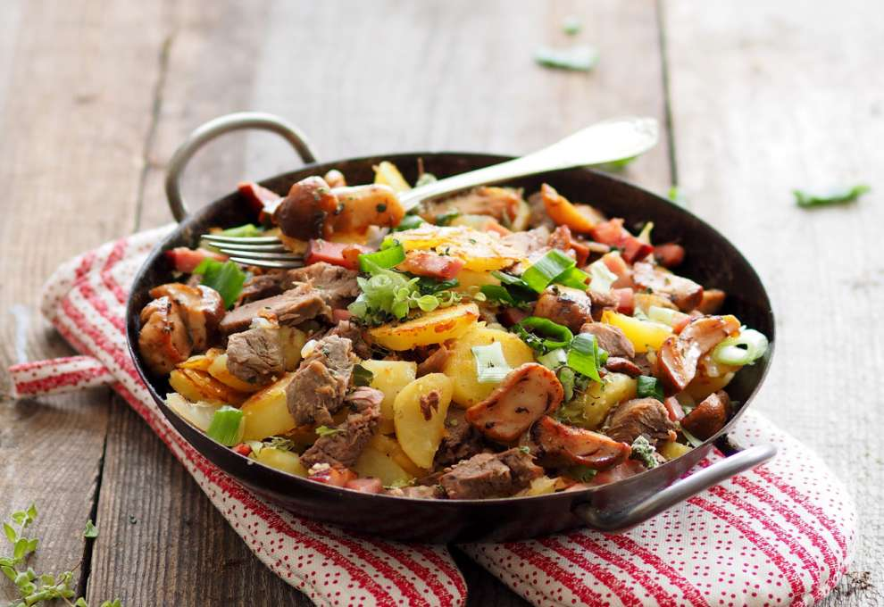

# Tiroler Gröstl

*Tyrol's mountain hash: leftover roast pork or beef diced small and pan-fried with sliced waxy potatoes, onion and caraway, topped with a fried egg and showered with chopped parsley. A skillet supper born of leftovers in the Alpine valleys.*

**Serves:** 4

**Prep Time:** 15 minutes

**Cook Time:** 25 minutes

## Overview
Gröstl is the Tyrolean skillet hash you'd find on every mountain hut menu from Innsbruck to the South Tyrol border: yesterday's roast pork or beef diced small and pan-fried with sliced parboiled waxy potatoes, sweated onion, crushed caraway and a touch of marjoram till the potatoes go crisp and lacquered with meat fat at the edges, then crowned with a fried egg and chopped parsley. Born of valley thrift: what started as a way to stretch the Sunday Schweinsbraten through Monday has become one of Austria's most beloved comfort dishes, and the version in any decent Hütte after a long day on the Stubai or Zillertal trails is genuinely restorative. Served straight from the skillet with soured cucumber pickles on the side.

## Ingredients

### Hash base
- 700 g waxy potatoes (Charlotte or Anya, peeled, parboiled and sliced into 1 cm rounds)
- 100 g smoked streaky bacon (diced 5 mm)
- 1 large onion (peeled and finely diced)
- 500 g cold cooked pork or beef (Schweinsbraten leftovers ideal; or boiled brisket, sliced thin then diced 1 cm)
- 1 teaspoon caraway seeds (lightly crushed in a mortar)
- ½ teaspoon dried marjoram
- 1 tablespoon lard (or sunflower oil)
- Fine sea salt and freshly ground black pepper

### To finish
- 4 eggs
- 25 g butter (for the eggs)
- 3 tablespoons flat-leaf parsley (finely chopped)

### To serve
- Sauerkraut, pickled gherkins, or a green salad with vinegar dressing

## Method

### Stage 1 - Parboil the potatoes
1. Drop the peeled potatoes whole into a pan of salted boiling water. Cook 12-15 minutes (depending on size) till a paring knife slides in with just a touch of resistance.
2. Drain and cool completely (cooking them ahead, then chilling, gives a firmer slice that crisps better in the pan). Slice into 1 cm rounds.

### Stage 2 - Render the bacon
1. Heat the lard in a wide heavy skillet (28-30 cm cast-iron works best) over medium heat.
2. Add the diced bacon and cook 4-5 minutes till the fat runs and the bacon crisps at the edges. Don't let it go too brown; you want the rendered fat as much as the meat.

### Stage 3 - Soften the onion
1. Add the diced onion to the bacon fat and cook 5-6 minutes on medium, stirring occasionally, till soft and pale gold.

### Stage 4 - Crisp the potatoes
1. Add the potato rounds in a single layer (work in two batches if the pan is full). Leave them alone for 3-4 minutes till the underside goes deep gold, then flip and crisp the other side.
2. Sprinkle with the crushed caraway, marjoram and a generous pinch of salt and pepper.

### Stage 5 - Add the meat
1. Tip in the diced cold roast meat and toss through the potatoes and onion.
2. Cook 4-5 minutes till the meat heats through and takes colour at the edges. Taste and adjust salt.

### Stage 6 - Fry the eggs
1. Meanwhile, in a separate non-stick pan, melt the butter over medium heat. Crack in the eggs and cook sunny-side up till the whites set and the yolks stay glossy and runny.

### Stage 7 - Serve
1. Divide the gröstl between four warm plates (or serve straight from the skillet for the Hütte style).
2. Slide an egg onto each portion, scatter generously with chopped parsley, season the egg with a pinch of salt and pepper and bring to the table immediately.

## Notes
- **Cold cooked meat is the point:** this dish lives or dies by what you started with. Sunday Schweinsbraten with crackling chopped fine is the traditional leftover. Boiled brisket, roast beef, even smoked pork chops all work. Raw meat browned in the pan won't give the same depth.
- **Waxy potatoes only:** floury potatoes (Maris Piper, King Edward) fall apart in the pan and give a mushy hash. Charlotte, Anya, Nicola, or any salad potato holds its shape and crisps cleanly.
- **Parboil ahead:** cooling the parboiled potatoes for an hour (or overnight in the fridge) makes them dry on the surface so they crisp properly in the pan rather than steaming.
- **Caraway is non-negotiable:** the seed defines the dish. Crush it lightly in a mortar to release the oils.
- **Egg on top:** the runny yolk is structural, not garnish. As you eat, you break it into the hash and it coats the potatoes and meat. Skip the egg and you lose half the dish.

## Variations
- **Pfandlgröstl:** literally "pan gröstl", the same hash but served in the iron pan it was cooked in, often with a thumb of horseradish on the side.
- **Kaspressknödel-Gröstl:** small Tyrolean cheese dumplings sliced and pan-fried with the potatoes, no meat, a hearty vegetarian variant from Vorarlberg.
- **Vegetarian:** swap the bacon and meat for diced smoked tofu and a handful of mushrooms; less authentic but works for the same hash structure.
- **Sauerkraut topping:** spoon hot sauerkraut over the hash before the egg goes on, common in Innsbruck pubs.

## Serving
- Bring to the table straight from the skillet with chunky pickled gherkins, a small pile of sauerkraut, or a bowl of green salad dressed with cider vinegar and pumpkin seed oil. A glass of Austrian lager or a young schilcher rosé fits the rustic register. This is hut food and should never appear on white china.

## Storage
- Best eaten immediately. The crisp edges go soft as the hash sits.
- Keeps refrigerated 2 days; reheat in a hot dry pan to re-crisp (microwave will give you mush). Fry a fresh egg on top each time.
- Doesn't freeze.
