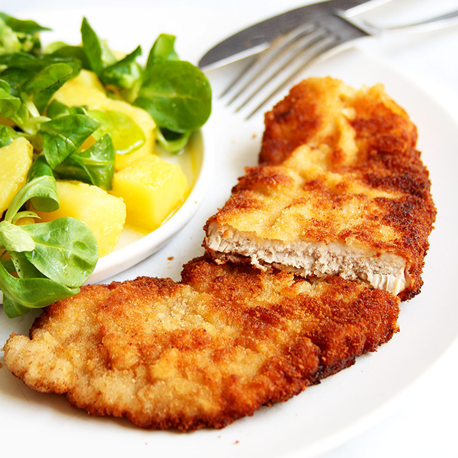

# Wiener Schnitzel

*Vienna's most famous dish: a thin veal cutlet, breaded in flour, egg and dry breadcrumbs, then shallow-fried in clarified butter or lard until the coating puffs into a wrinkled golden crust that stands away from the meat. The name "Wiener Schnitzel" is legally protected in Austria and Germany: by statute, it must be veal. Pork or chicken versions are sold as "Schnitzel Wiener Art" (Vienna-style schnitzel). Served simply with a wedge of lemon, a parsley potato or a cucumber salad on the side. Origin myth links it to Milanese cotoletta brought back by Field Marshal Radetzky in the 1850s; food historians find the timeline shaky, but the technique came from somewhere south of the Alps and was perfected in Habsburg kitchens.*

**Serves:** 4

**Prep Time:** 20 minutes

**Cook Time:** 15 minutes

## Overview
Four thin veal cutlets are pounded to 4 mm, breaded in the classic three-stage flour-egg-crumb sequence, and shallow-fried in plenty of hot fat. The critical Viennese trick is the "souffléed" coat: enough fat in the pan that the schnitzel floats and the breadcrumbs puff up off the meat in soft folds, rather than sticking flat. Finished with nothing but lemon and parsley. The dish lives and dies on three things - thin meat, dry crumbs, hot fat.

## Ingredients

### Veal
- 4 veal cutlets (each ~150 g, from the leg or loin)
- 100 g plain flour
- 3 large eggs
- 200 g dry white breadcrumbs (semmelbrösel; not panko)
- 1 teaspoon salt
- Pinch of white pepper

### For frying
- 300 g clarified butter (ghee works) OR a mix of lard and butter
- 1 lemon (cut into wedges)
- 2 tablespoons chopped flat-leaf parsley

### To serve
- Parsley potatoes, cucumber salad or potato salad

## Method

### Stage 1 - Pound the cutlets
1. Place each cutlet between two sheets of cling film or in a freezer bag.
1. Pound with the flat side of a meat mallet (or the bottom of a heavy pan) from the centre outwards, until each cutlet is an even 4 mm thick. The meat should roughly double in size.
1. Pat dry. Season lightly with salt on both sides.

### Stage 2 - Set up the breading station
1. Beat the eggs in a wide shallow bowl with a pinch of salt and white pepper.
1. Put the flour in a second wide bowl.
1. Put the breadcrumbs in a third wide bowl.
1. Arrange the bowls in order: flour, egg, crumbs.

### Stage 3 - Bread the schnitzels
1. Dredge a cutlet in flour; shake off the excess thoroughly. Floury patches stop the egg sticking evenly.
1. Drag it through the egg, letting excess drip back.
1. Lay it in the crumbs; spoon crumbs over the top and press very lightly. Do not pack the crumbs down - they need to stay loose to puff.
1. Lift onto a tray. Repeat with the others. Fry within 5 minutes; the coating goes soggy if it sits.

### Stage 4 - Fry
1. Heat the clarified butter in a wide heavy frying pan to 170°C / 340°F. There should be at least 1 cm of fat - the schnitzel should float, not lie flat on the pan.
1. Lower a schnitzel in away from you. The fat should bubble vigorously around the edges.
1. Spoon hot fat over the top of the schnitzel as it cooks. This is what makes the crumbs puff and wrinkle.
1. Cook 60-90 seconds per side until deep golden. Turn once only.
1. Lift onto kitchen paper to drain briefly. Cook the rest, one or two at a time, keeping the fat at 170°C.

### Stage 5 - Serve
1. Plate immediately with a lemon wedge and a sprinkle of parsley.
1. Serve with parsley potatoes or a cucumber salad. Do not stack schnitzels - the crust softens.

## Notes
- **Veal is the legal definition:** in Austria, Wiener Schnitzel from any meat other than veal is a labelling offence. Pork versions go by Schnitzel Wiener Art or simply Schweinsschnitzel.
- **The puffed crust:** the wrinkled, blistered coating that lifts off the meat is the mark of a properly fried schnitzel. It comes from three things - dry crumbs (not panko), enough hot fat to make the schnitzel float, and basting hot fat over the top as it cooks.
- **Semmelbrösel:** Austrian breadcrumbs are finer and drier than Japanese panko. Pulse stale white rolls in a food processor, then dry the crumbs in a low oven. Shop-bought dried breadcrumbs work; panko gives the wrong texture entirely.
- **Clarified butter or lard:** ordinary butter burns at frying temperature. Clarified butter has the right flavour and high smoke point; lard is traditional in older Viennese kitchens.

## Variations
**Schnitzel Wiener Art:** the pork version, made the same way with pork loin. Cheaper, more common at home.
**Cordon bleu:** two cutlets sandwich a slice of ham and Emmental before breading. A 20th-century Swiss-Austrian hybrid.

## Serving
Serve with: parsley potatoes, potato salad (Erdäpfelsalat) or a vinegar cucumber salad (Gurkensalat). A wedge of lemon on every plate is non-negotiable.

## Storage
- Best eaten straight from the pan; the crust softens within minutes.
- Leftovers keep 1 day refrigerated; reheat in a hot oven (200°C) on a wire rack for 6-8 minutes to re-crisp.
- Do not freeze.
