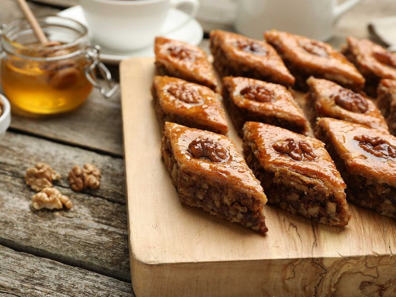

# Pakhlava (Azerbaijani)

*Azerbaijan's pakhlava: butter-laminated layers packed with cardamom-and-saffron walnuts, glazed with saffron honey and cut into diamonds.*

**Serves:** Makes 20-24 diamonds

**Prep Time:** 1 hour (plus 1 hour resting)

**Cook Time:** 50 minutes

## Overview
The Azerbaijani take on the pan-Caucasus pastry that goes by half a dozen names across the region. You make an enriched dough from flour, butter, milk, egg yolks and yeast, then roll it into eight layers stacked with a heavy filling of crushed walnuts spiced with cardamom and saffron between each one. The top gets scored in the traditional diamond pattern, brushed with saffron-tinted egg yolk so it bakes to a deep amber, and a single walnut pressed into the centre of each diamond as a marker. Forty-five minutes at 180°C, then a saffron-honey syrup poured generously over while it's still hot from the oven. The trick the recipe insists on is the overnight rest before slicing; that's when the syrup absorbs fully and the layers set so the diamonds cut cleanly. Eaten at Novruz, weddings and feast days, with strong black tea on the side.

## Ingredients

### Dough
- 500 g plain flour
- 7 g instant yeast
- 1 teaspoon salt
- 50 g caster sugar
- 200 ml warm milk
- 3 egg yolks (large)
- 150 g unsalted butter (melted, cooled)

### Layer butter
- 200 g unsalted butter (melted, kept warm)

### Filling
- 500 g walnuts (medium-ground)
- 250 g caster sugar
- 2 teaspoons ground cardamom
- 1 pinch saffron threads (ground, steeped in 1 tablespoon hot water)

### Glaze and toppers
- 1 egg yolk (large)
- 1 pinch saffron threads (steeped in 1 tablespoon hot water)
- 24 whole almonds

### Syrup
- 200 g caster sugar
- 200 ml water
- 100 g clear honey
- 1 small pinch saffron threads
- 1 tablespoon lemon juice

## Method

### Stage 1 - Dough
1. In a wide bowl, whisk flour, yeast, salt and sugar.
1. Combine warm milk, egg yolks and 150 g melted butter in a jug.
1. Pour wet into dry; knead 8 minutes to a smooth elastic dough.
1. Rest in a covered bowl 1 hour.

### Stage 2 - Filling
1. Grind walnuts to medium-fine in a food processor (not paste).
1. Stir in caster sugar, cardamom and saffron infusion.

### Stage 3 - Build the layers
1. Heat the oven to 180°C (160°C fan).
1. Butter a 28 × 22 cm baking tin.
1. Knock back the dough; divide into 8 equal portions.
1. Roll the first portion to fit the tin; lay it in; brush generously with melted butter.
1. Sprinkle a generous handful of walnut filling evenly.
1. Roll the next portion; lay on top; brush with butter; sprinkle filling.
1. Repeat for layers 3 through 7.
1. Roll the eighth and final portion; lay on top; brush with butter.

### Stage 4 - Score, glaze, top
1. With a sharp thin knife, score the top layer (cutting through ONLY the top layer, not all the way down) in a diamond pattern: parallel diagonal lines 4 cm apart, then crossing diagonal lines 4 cm apart.
1. Whisk the saffron infusion into the egg yolk; brush over the top.
1. Press a whole almond into the centre of each diamond.

### Stage 5 - Bake
1. Bake 45-50 minutes until deeply golden on top and the layers separate cleanly when you tap the side.
1. Remove from oven.

### Stage 6 - Syrup
1. While the pakhlava bakes, combine sugar, water, honey and saffron in a small pan.
1. Bring to a simmer; cook 10 minutes until lightly thickened.
1. Stir in the lemon juice; remove from heat.

### Stage 7 - Pour and rest
1. While the pakhlava is still hot, slowly pour the warm syrup evenly over the entire surface - about ½ small ladle per diamond.
1. The syrup will hiss, foam briefly and absorb.
1. Cool fully in the tin.
1. Rest overnight at room temperature, uncovered.

### Stage 8 - Slice and serve
1. Re-trace the scored diamond lines with a sharp knife, cutting all the way down through the layers.
1. Lift each diamond out with a small palette knife.
1. Serve with strong tea.

## Notes
- **Score only the top layer before baking:** cutting all the way down separates the layers and the syrup runs out during the bake.
- **Hot pakhlava, warm syrup:** the temperature difference drives absorption. Cold syrup on hot pakhlava is fine; cold syrup on cold pakhlava sits on top.
- **Overnight rest is mandatory:** cutting too early means crumbly diamonds and uneven syrup distribution.
- **8 layers is the Azeri count:** Turkish baklava uses 30+ paper-thin filo sheets; Azeri pakhlava uses fewer, thicker, butter-laminated layers. Each layer is its own piece of dough, not a sheet of filo.

## Storage
- Keeps 2 weeks in an airtight tin at room temperature.
- Freezes 3 months pre-cut, separated by parchment; thaw at room temperature 2 hours.
- Don't refrigerate - moisture turns the layers soggy.
