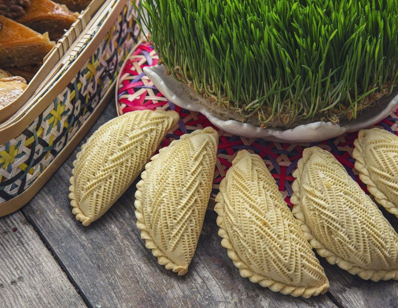

# Sheker Chorek

*Azerbaijan's everyday tea cookie: a soft melt-in-the-mouth sugar shortbread brushed with egg yolk and scattered with sesame or nigella.*

**Serves:** Makes about 20 cookies

**Prep Time:** 25 minutes (plus 30 minutes resting)

**Cook Time:** 20 minutes

## Overview
Butter creams with icing sugar 4 minutes until pale. Egg yolks beat in one at a time, vanilla extract last. Flour folds in gently, overworking makes them tough. Dough chills for 30 minutes for handling. Pinches off into walnut-sized balls; presses gently flat with a thumb. Brushes with egg-yolk glaze; sprinkles with sesame or nigella seeds. Bakes for 20 minutes at 170°C. Eats slightly warm with strong tea.

## Ingredients

### Cookies
- 250 g unsalted butter (softened, not melted)
- 100 g icing sugar
- 2 egg yolks (large)
- 1 teaspoon vanilla extract
- ½ teaspoon ground cardamom
- 400 g plain flour
- ¼ teaspoon salt

### Glaze
- 1 egg yolk (large)
- 1 tablespoon milk
- 2 teaspoons sesame seeds
- 1 teaspoon nigella (kalonji) seeds

## Method

### Stage 1 - Cream
1. In a wide bowl, beat the softened butter with the icing sugar for 4-5 minutes with an electric whisk until pale and fluffy.
1. Beat in the egg yolks one at a time, then the vanilla extract.

### Stage 2 - Mix
1. Sift the flour, salt and cardamom into the bowl.
1. Fold gently with a spatula until just combined (don't beat - overworking develops gluten and the cookies go tough).
1. The dough should be soft and slightly sticky.

### Stage 3 - Rest
1. Cover the bowl; chill 30 minutes (the butter firms up, makes the dough easier to portion).

### Stage 4 - Shape
1. Heat the oven to 170°C (150°C fan).
1. Line two baking trays with parchment.
1. Pinch off walnut-sized pieces of dough (~25 g each); roll between your palms into balls.
1. Place on the trays, spaced 4 cm apart.
1. Press each ball gently with the pad of your thumb to flatten slightly (don't squash flat - they should still be domed).

### Stage 5 - Glaze and bake
1. Whisk the egg yolk with milk for the glaze.
1. Brush each cookie generously.
1. Sprinkle a mix of sesame and nigella seeds on top.
1. Bake 18-22 minutes until the tops are deep gold and a faint crack appears on the surface.

### Stage 6 - Cool
1. Rest on the tray 5 minutes (they're fragile straight from the oven).
1. Transfer to a wire rack to cool fully.

## Notes
- **Soft butter, not melted:** sheker chorek depends on creaming for its tender texture. Melted butter gives a dense, oily cookie.
- **Don't overmix the flour:** stop folding the moment the flour disappears. Overworked dough makes for tough, dry biscuits.
- **Brush the glaze evenly:** the egg-yolk wash is what gives the iconic golden tone. Patchy glaze means patchy colour.

## Storage
- Keeps 1 week in an airtight tin at room temperature.
- Freezes baked, 2 months; thaw at room temperature 30 minutes.
- Raw dough balls freeze on a tray, then bag; bake from frozen, adding 4 minutes.
