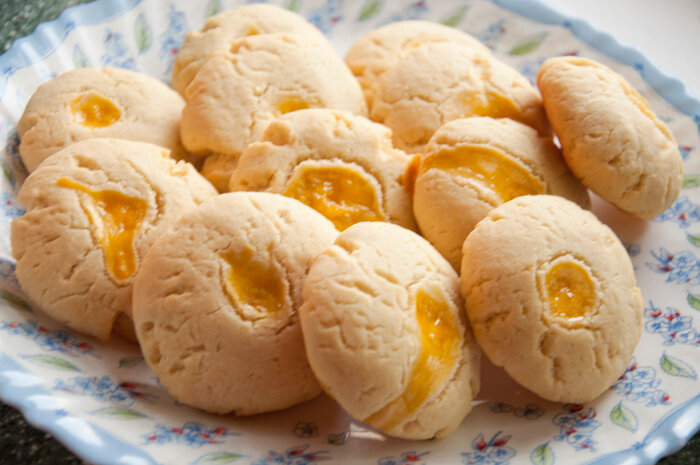

# Shekerbura

*Novruz pastry from Azerbaijan: crescent pies of milk-and-egg dough wrapped around ground walnuts, sugar and cardamom. With strong tea.*

**Serves:** Makes about 24 pieces

**Prep Time:** 1 hour (plus 1 hour resting)

**Cook Time:** 25 minutes

## Overview
A short milk-and-egg dough rests 1 hour. Walnuts grind fine (not powdered - texture matters), mix with caster sugar and ground cardamom. Dough rolls to 2 mm thick, cuts into 9 cm circles. Filling mounds on half, the other half folds over to make a half-moon, the edge crimps with a fork or with the traditional maqqaş pinches. Bakes at 180°C 25 minutes until pale gold. Dusts with icing sugar warm.

## Ingredients

### Dough
- 400 g plain flour
- 200 g unsalted butter (cold, cubed)
- 100 ml whole milk (cold)
- 2 large egg yolks
- 1 tablespoon caster sugar
- ½ teaspoon salt

### Filling
- 300 g walnuts (or hazelnuts), ground medium-fine
- 150 g caster sugar
- 1 teaspoon ground cardamom
- 1 large egg white (lightly beaten)

### To finish
- Icing sugar (for dusting)

## Method

### Stage 1 - Dough
1. In a wide bowl, rub the cold butter into the flour, salt and 1 tablespoon sugar until it resembles breadcrumbs.
1. In a jug, whisk the milk and egg yolks.
1. Pour into the flour; mix with a knife until just coming together.
1. Tip onto a lightly floured surface; bring together as a smooth disc without overworking.
1. Wrap; chill 1 hour.

### Stage 2 - Filling
1. Pulse the walnuts in a food processor to a medium-fine grind - finer than chopped, coarser than ground almonds.
1. Stir in the caster sugar and ground cardamom.
1. Drizzle in the lightly beaten egg white; mix until just clumpable (not wet, not crumbly).

### Stage 3 - Cut and fill
1. Heat the oven to 180°C (160°C fan).
1. Line two baking trays with parchment.
1. Roll the chilled dough on a lightly floured surface to 2 mm thick.
1. Cut out 9 cm circles with a glass or cutter.
1. Place a heaped tablespoon of filling on one half of each circle (leave a 1 cm clear border).
1. Fold the other half over to enclose; press the edges to seal.

### Stage 4 - Crimp
1. With the tines of a fork or a flat pair of crimping tweezers, pinch a delicate pattern along the curved edge.
1. Traditional patterns are dots, leaves or zigzag lines.
1. Don't pinch through the dough - the goal is a decorative impression.

### Stage 5 - Bake
1. Arrange on the trays, 3 cm apart.
1. Bake 22-25 minutes until the dough is pale gold (not browned - shekerbura should look creamy, almost ivory).
1. Cool 5 minutes on the tray.

### Stage 6 - Finish
1. Dust generously with icing sugar while still warm.
1. Cool fully on the rack before storing.

## Notes
- **Pale gold, not amber:** shekerbura colour is the visual marker - over-browned and they read as a generic cookie. The low temperature and short bake protects this.
- **Egg white binds the filling:** without it the filling crumbles when the pastry is cut. Don't use a whole egg - the yolk muddies the flavour.
- **Crimping is the signature:** even simple fork tines transform shekerbura from a generic crescent into something recognisable. Press evenly.

## Storage
- Keeps 1 week in an airtight tin at room temperature; the dough firms slightly over the first day and stays good.
- Freezes baked, 2 months. Re-dust with icing sugar after thawing.
- Don't refrigerate - the dough goes from delicately short to dense.
