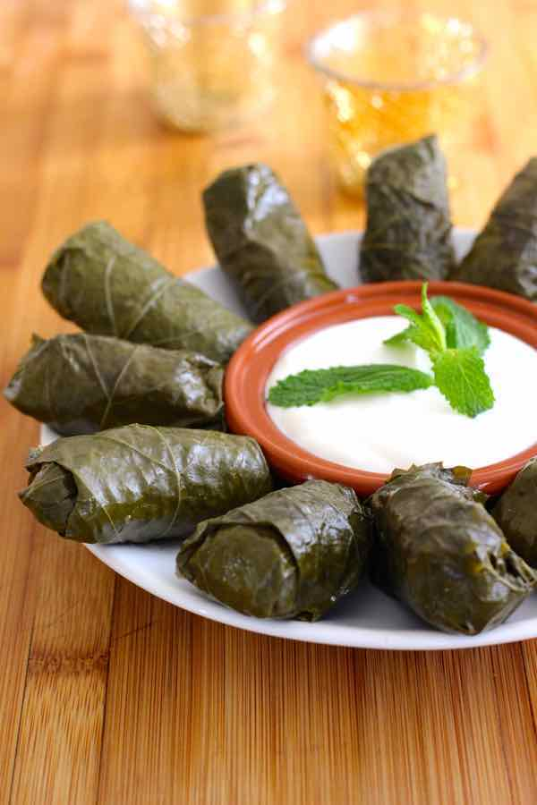

# Dolma (Azerbaijani Stuffed Vine Leaves)

*Azerbaijan's stuffed vine leaves: leaves rolled around lamb mince, rice, mint and dill, simmered slow in lamb stock under a weighted plate.*

**Serves:** 6 (makes about 40 rolls)

**Prep Time:** 1 hour

**Cook Time:** 1 hour

## Overview
Brined vine leaves soak in warm water 20 minutes to remove the brine. Filling mixes raw lamb mince with rinsed short-grain rice, finely chopped onion, fresh mint and dill, butter, salt, pepper. Each leaf gets a teaspoon of filling, rolls into a tight cigar. Rolls pack in a single layer in a heavy pot, then a second and third layer perpendicular. Stock + sumac water pours in to barely cover. An inverted plate weighs everything down. Slow simmer 50 minutes. Service: rolls on a platter, garlic yogurt alongside.

## Ingredients

### Vine leaves
- 60 brined vine leaves (about 250 g)

### Filling
- 500 g lamb mince (20% fat ideal)
- 100 g short-grain rice
- 1 large onion (very finely diced)
- 30 g fresh mint (leaves only, chopped)
- 30 g fresh dill (chopped)
- 50 g unsalted butter (softened)
- 1 ½ teaspoons salt
- 1 teaspoon ground black pepper
- ½ teaspoon ground cinnamon

### Cooking liquid
- 600 ml lamb stock (or water + 1 stock cube)
- 2 tablespoons sumac
- 2 tablespoons lemon juice
- 30 g butter

### Garlic yogurt (sürmek)
- 400 g Greek yogurt
- 3 garlic cloves (crushed)
- 1 teaspoon salt
- 1 tablespoon dried mint

## Method

### Stage 1 - Prep the leaves
1. Soak the vine leaves in warm water for 20 minutes to leach out brine.
1. Drain and pat dry.
1. Trim any tough stems; lay flat shiny-side down on the work surface.

### Stage 2 - Filling
1. Rinse the rice in 3-4 changes of cold water until the water runs clear.
1. In a wide bowl, combine the rice, lamb mince, finely diced onion, chopped mint and dill, softened butter, salt, pepper and cinnamon.
1. Knead with your hands for 2 minutes until the filling is uniform and slightly tacky.

### Stage 3 - Roll
1. Place a heaped teaspoon of filling near the stem end of each leaf.
1. Fold the stem flap up over the filling.
1. Fold the two side flaps in.
1. Roll tightly into a cigar 6-7 cm long.

### Stage 4 - Pack and cook
1. Line the bottom of a heavy-based pot with any torn or imperfect leaves (this is sacrificial padding).
1. Pack the rolls seam-down in a single tight layer.
1. Add a second layer perpendicular to the first, and a third if needed.
1. Whisk the sumac and lemon juice into the lamb stock; pour over the rolls until barely covered.
1. Dot with 30 g butter.
1. Invert a small heatproof plate directly on top of the rolls to weigh them down.
1. Bring to a gentle simmer; cover; cook on low 50 minutes.

### Stage 5 - Yogurt and serve
1. Stir the crushed garlic, salt and dried mint into the yogurt.
1. Lift the rolls onto a warm platter.
1. Spoon a little of the cooking liquid over.
1. Serve with the garlic yogurt and warm bread.

## Notes
- **Raw rice, not pre-cooked:** the rice cooks inside the leaf, absorbing the lamb juices. Pre-cooked rice gives a stodgy filling.
- **Weight the pot:** without an inverted plate the top rolls float and unravel. Use a heatproof saucer or a small plate.
- **20% fat mince:** lean lamb dries out; ask the butcher for shoulder-cut mince.

## Storage
- Refrigerate 3 days in their cooking liquid. Eat cold or gently reheat in a 160°C oven, covered, 15 minutes.
- Freezes 2 months packed in their liquid; thaw overnight in the fridge before reheating.
