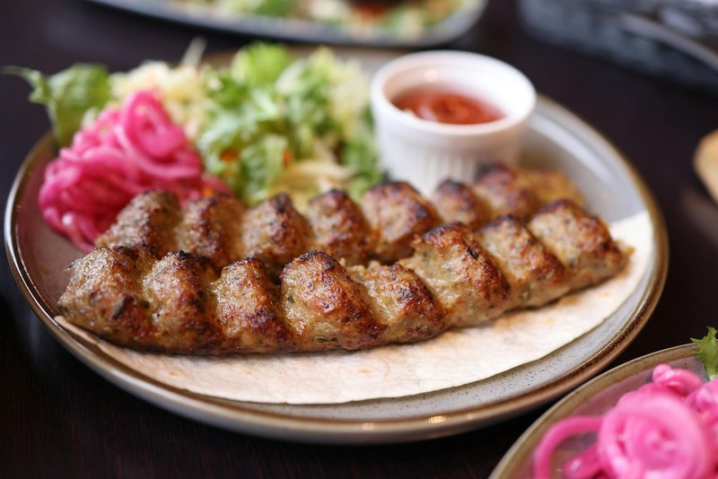

# Lyulya-Kebab

*The Azeri grill par excellence: minced lamb pounded with grated onion until tacky, pressed onto flat skewers and charred over hot coals.*

**Serves:** 4

**Prep Time:** 30 minutes (plus 2 hours chilling)

**Cook Time:** 12 minutes

## Overview
Fatty lamb shoulder gets minced twice or pulsed in a food processor until smooth. A large onion grates fine, the juice squeezed out (excess water makes the meat slip off skewers). Onion and lamb knead together with salt, pepper and ground sumac for 5 minutes until the mixture goes from loose to tacky - this is the windowpane stage equivalent for meat, and the trick to skewer adhesion. Mixture chills for 2 hours. Pat onto flat skewers in a 15 cm × 3 cm sausage shape. Grill over charcoal 5-6 minutes per side. Rest for 2 minutes. Serve.

## Ingredients

### Meat
- 800 g lamb shoulder mince (20-25% fat is essential)
- 1 large onion (about 200 g)
- 2 teaspoons salt
- 1 teaspoon ground black pepper
- 1 teaspoon ground sumac
- ½ teaspoon ground cumin
- 30 g lamb tail fat or extra fatty mince (optional, adds richness)

### To serve
- 4 sheets fresh lavash (or thin flatbread)
- 2 red onions (very thinly sliced)
- 2 tablespoons sumac (for the onion)
- 1 tablespoon lemon juice (for the onion)
- A generous bunch of fresh tarragon, dill, basil, spring onion
- Lemon wedges

### Equipment
- 4-8 flat metal skewers (wide and flat, not round; the meat grips the flat side)

## Method

### Stage 1 - Prep the onion
1. Grate the large onion on the fine side of a box grater into a bowl.
1. Tip the gratings into a clean tea towel; squeeze hard over the sink to drain all the juice.
1. You should have a soft puffy onion pulp.

### Stage 2 - Knead the meat
1. In a wide bowl, combine the lamb mince, drained grated onion, salt, pepper, sumac and cumin.
1. With clean wet hands, knead and slap the mixture for 5-7 minutes.
1. The meat will transform: loose and pasty at first, then increasingly tacky and elastic. You're looking for it to grab the side of the bowl when you push it.
1. Cover; chill 2 hours minimum (the cold + the kneading is what stops the meat slipping off the skewers).

### Stage 3 - Pickled onion
1. Toss the thinly sliced red onion with 2 tablespoons sumac, 1 tablespoon lemon juice and a pinch of salt.
1. Set aside to soften for 20 minutes.

### Stage 4 - Skewer
1. Take a handful of the chilled meat (about 150 g) and shape into a sausage 15 cm long.
1. Press a flat skewer down through the centre.
1. Squeeze the meat firmly around the skewer with wet hands; the meat should be 2.5-3 cm thick, evenly distributed along the centre 15 cm.
1. Repeat for the remaining skewers; rest on a tray.

### Stage 5 - Grill
1. Heat charcoal until covered in white ash (or a gas grill to maximum).
1. Lay the skewers across the grill bars (not on a grate) so the meat dangles in the heat.
1. Cook 5-6 minutes; turn once and cook 4-5 minutes on the second side.
1. The exterior should be deeply charred in spots; the interior just-cooked through.

### Stage 6 - Serve
1. Lay a sheet of lavash on each plate.
1. Slide the meat off the skewer onto the lavash (the bread soaks up the juices).
1. Top with a heap of sumac onion.
1. Pile fresh herbs alongside.
1. Lemon wedges; eat by wrapping a tear of lavash around meat, herbs and onion.

## Notes
- **Fat is non-negotiable:** lean lamb makes for dry, tough lyulya. 20-25% fat is the minimum. If your butcher's mince is lean, ask for extra tail fat or shoulder trim.
- **Knead until tacky:** 5-7 minutes of slapping the meat develops the myosin and is what makes it cling to flat skewers. Skip this step and the meat falls into the coals.
- **Flat skewers only:** round skewers won't grip the meat; the kebabs spin as you turn them and the cooked side ends up at the bottom.

## Storage
- Best straight from the grill.
- Raw kneaded meat keeps 2 days refrigerated; skewer just before grilling.
- Cooked kebabs reheat poorly; if you must, wrap in foil with a splash of stock and warm gently in a 160°C oven.
