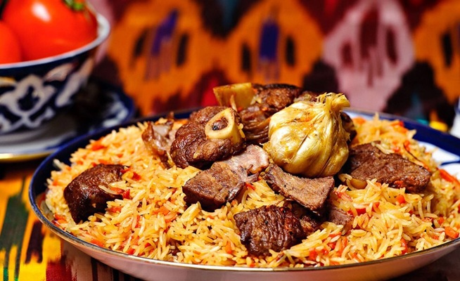

# Plov

*Azerbaijan's wedding rice: basmati steamed under a buttery saffron crust, served with slow-stewed lamb, dried apricots and chestnuts.*

**Serves:** 6

**Prep Time:** 45 minutes (plus 1 hour soaking)

**Cook Time:** 2 hours

## Overview
Azerbaijan's wedding rice, the centrepiece of any celebration worth the name, and a dish that takes most of a day to do properly. You soak basmati for an hour in salted water, drain it, par-boil for five minutes in heavily salted water, drain again. A wide heavy pot is buttered, and a sheet of lavash (or a saffron-soaked rice base) lines the bottom to form the qazmaq crust that's the prize at the end of the meal. The par-boiled rice piles on top, butter melts down through it, the pot covers and steams for forty minutes to an hour on low heat. Meanwhile you cook the qara separately: lamb shoulder cubes browned, onions softened slowly, dried apricots and chestnuts added with a splash of water, the whole stew simmering for ninety minutes until the lamb is meltingly tender. The plov comes to the table with the rice mounded on a platter, the qazmaq crust broken and shared at the table, and the qara spooned alongside. A meal that announces itself.

## Ingredients

### Rice
- 500 g basmati rice
- 2 tablespoons salt (for the par-boil)
- 100 g unsalted butter
- 1 large pinch saffron threads (about 20 strands)
- 2 tablespoons boiling water
- 2 sheets lavash flatbread (for the crust)

### Lamb topping (qara)
- 800 g boneless lamb shoulder (cut into 4 cm cubes)
- 3 onions (medium, finely sliced)
- 50 g butter
- 100 g dried apricots
- 100 g prunes (stoned)
- 80 g pre-cooked chestnuts (peeled)
- 1 teaspoon ground cinnamon
- ½ teaspoon ground turmeric
- 1 teaspoon salt
- ½ teaspoon ground black pepper
- 200 ml water

### To serve
- Sumac
- Fresh tarragon, dill, watercress, spring onion

## Method

### Stage 1 - Soak and par-boil rice
1. Rinse the basmati under cold water until the water runs clear.
1. Soak in cold salted water for 1 hour.
1. Bring a large pot of water to a rolling boil with 2 tablespoons salt.
1. Drain the rice and tip into the boiling water; par-boil 5 minutes (the grains should bend but still have a hard core).
1. Drain in a colander; rinse briefly with warm water.

### Stage 2 - Saffron infusion
1. Grind the saffron threads with a tiny pinch of sugar in a mortar.
1. Pour over 2 tablespoons of boiling water; let steep 5 minutes.

### Stage 3 - Build the qazmaq
1. Melt half the butter (50 g) in a wide heavy-based pot over medium heat.
1. Line the bottom with lavash sheets, pressing them down into the butter.
1. Spoon the rice on top in a pyramid (don't press it down - air gives the qazmaq its lift).
1. Drizzle the saffron infusion over the rice peak.
1. Drop the remaining 50 g butter in small cubes over the top.

### Stage 4 - Steam
1. Wrap the pot lid in a clean tea towel (catches condensation, stops it dripping back onto the rice).
1. Cover tightly; reduce heat to low.
1. Steam 45 minutes - do not lift the lid.

### Stage 5 - Lamb qara
1. While the rice steams, brown the lamb cubes in butter over medium-high heat in a separate heavy pan; remove.
1. Soften the onions in the same pan 10 minutes until pale gold.
1. Return the lamb; add cinnamon, turmeric, salt, pepper.
1. Add the dried apricots, prunes and chestnuts.
1. Pour in 200 ml water; bring to a simmer.
1. Cover; cook on low 75-90 minutes until the lamb is tender.

### Stage 6 - Plate
1. Spoon the saffron-stained top layer of rice onto a warm platter first.
1. Heap the rest of the rice around it.
1. Lift the qazmaq crust out (it should be amber-golden and crisp) and break into shards on a separate plate.
1. Serve the qara in a deep bowl alongside.

## Notes
- **Qazmaq is the soul of plov:** the crisp lavash-and-rice crust is what diners fight over. Lining with lavash gives a more even, snappable crust than the alternative saffron-rice base.
- **Don't lift the lid during steaming:** every peek loses steam and you risk a wet, uneven rice.
- **Two pots, not one:** the lamb stew never goes into the rice pot. Azerbaijani plov is plated, not mixed, unlike Uzbek osh.

## Storage
- Rice and qara keep 3 days refrigerated. Reheat the rice covered with a splash of water in a 160°C oven 15 minutes; the qara in a small pot on low.
- The qazmaq crust loses its shatter after the first day; eat it the day of cooking.
