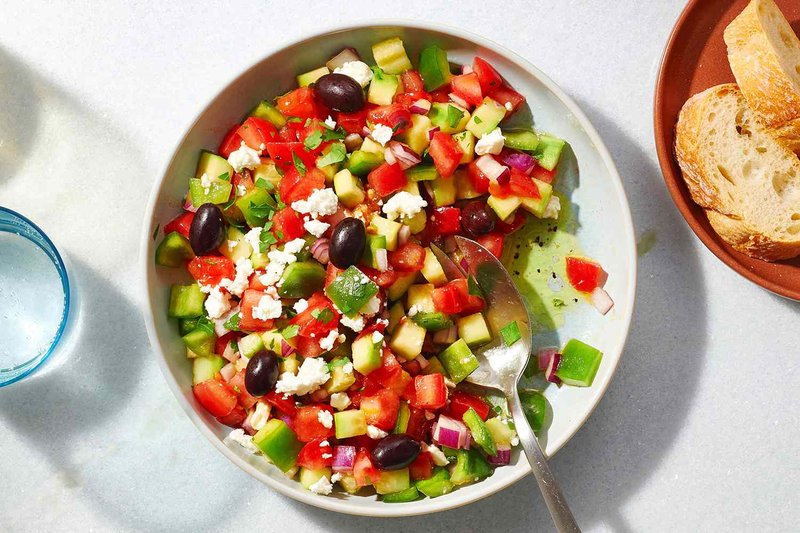

# Choban Salata (Azerbaijani Shepherd's Salad)

*Azerbaijan's shepherd's salad: tomato, cucumber and red onion diced fine, tossed with dill, mint and tarragon, dressed with olive oil and lemon.*

**Serves:** 4

**Prep Time:** 15 minutes

**Cook Time:** 0 minutes

## Overview
Tomatoes, cucumber and red onion dice to 5 mm cubes. Herbs chop fine. Everything tosses together with olive oil, lemon juice and salt 15 minutes before serving so the salt draws juice and the tomatoes start to relax. Best the same day, the salad weeps if held overnight.

## Ingredients
- 4 ripe medium tomatoes (about 500 g, ideally a mix of red and yellow)
- 2 short cucumbers (about 300 g, ridge cucumbers or Lebanese)
- 1 small red onion (about 80 g)
- 15 g fresh dill (leaves and tender stems)
- 15 g fresh mint (leaves only)
- 5 g fresh tarragon (leaves only)
- 4 tablespoons extra virgin olive oil
- 2 tablespoons lemon juice
- ¾ teaspoon salt
- ½ teaspoon ground black pepper
- ½ teaspoon ground sumac (optional, for tartness)

## Method

### Stage 1 - Dice
1. Core the tomatoes and dice to 5 mm cubes.
1. Peel the cucumbers if the skin is tough (Lebanese cucumbers can keep their skin); halve lengthways, scoop the seeds with a teaspoon, dice to 5 mm.
1. Peel and dice the red onion to 3 mm.
1. Chop the dill, mint and tarragon fine.

### Stage 2 - Dress
1. In a wide bowl, combine the tomato, cucumber, onion and herbs.
1. Drizzle the olive oil; squeeze the lemon juice over.
1. Sprinkle salt, pepper and sumac.
1. Toss gently with a wooden spoon.
1. Rest 15 minutes (salt draws the tomato juice and softens the onion).

### Stage 3 - Serve
1. Toss once more.
1. Spoon into a shallow bowl; pour any plate juices back over.

## Notes
- **Salt 15 minutes ahead, not earlier:** longer and the cucumbers go limp and the salad swims in water.
- **Skin-on cucumber for crunch:** ridge cucumbers stay crisp longer than the long English variety.
- **The herb trinity is non-negotiable:** dill + mint + tarragon is what makes this Azeri rather than generic. Skip the tarragon and it's a Turkish salata.

## Storage
- Best within 1 hour of dressing.
- The undressed vegetables and herbs hold 4 hours refrigerated; dress at the last minute.
