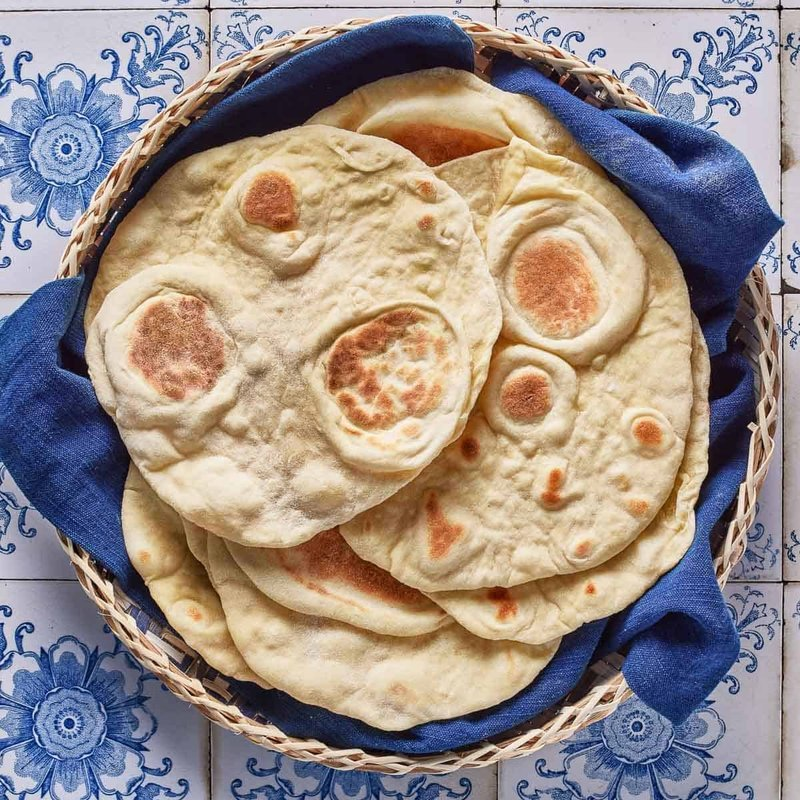

# Lavash

*The Caucasus' paper-thin flatbread: just flour, water and salt rolled obsessively thin and cooked seconds on a hot stone. Wraps grilled meat.*

**Serves:** Makes 8 sheets (each about 35 × 25 cm)

**Prep Time:** 30 minutes (plus 30 minutes resting)

**Cook Time:** 24 minutes (3 minutes per sheet)

## Overview
Flour, water and salt knead to a firm but pliable dough, drier than a pasta dough, smoother than a bread dough. 30 minutes rest under a damp cloth lets the gluten relax. Divides into 8 balls; each rolls out paper-thin (you should be able to read newsprint through it). Cooks on a heavy dry skillet over high heat, 60-90 seconds per side, just long enough to puff and blister.

## Ingredients
- 500 g plain flour (plus extra for dusting)
- 280 ml warm water
- 1 teaspoon salt

## Method

### Stage 1 - Dough
1. In a wide bowl, whisk the flour and salt.
1. Pour in the warm water all at once.
1. Mix with a wooden spoon until shaggy, then turn out onto a lightly floured surface.
1. Knead 8-10 minutes until smooth and elastic; the dough should be firm (not sticky) but still pliable.
1. Form into a ball, place in a lightly oiled bowl, cover with a damp tea towel.
1. Rest 30 minutes.

### Stage 2 - Divide
1. Tip the rested dough onto the work surface.
1. Divide into 8 equal portions (about 95 g each).
1. Roll each into a smooth ball; cover with the damp cloth so they don't dry out.

### Stage 3 - Roll
1. Heat a heavy dry skillet or cast-iron pan over medium-high heat (no oil, no butter).
1. Take one ball at a time; press flat with the heel of your hand.
1. Roll on a floured surface to a rectangle about 35 × 25 cm. The dough should be so thin you can see the work surface through it (1 mm or less).

### Stage 4 - Cook
1. Lift the rolled sheet carefully (a long rolling pin helps; drape the dough over it).
1. Lay onto the hot dry pan.
1. Cook 45-60 seconds: the dough bubbles, pale gold patches appear on the underside.
1. Flip with tongs; cook 30-45 seconds on the second side.
1. Lift onto a clean tea towel; cover.
1. Repeat for the remaining balls.

### Stage 5 - Stack and serve
1. Stack the cooked sheets under the tea towel; the residual steam keeps them flexible.
1. Serve warm, or at room temperature.

## Notes
- **Roll thinner than you think:** lavash should be almost translucent. Thicker dough cooks unevenly and goes leathery.
- **Dry pan, high heat:** no oil. The bread needs to puff from steam, not fry.
- **Cover the cooked stack:** lavash dries within minutes if left uncovered. The tea towel traps just enough steam.
- **Reviving stale lavash:** mist with water from a spray bottle, wrap in foil, warm in a 150°C oven 5 minutes.

## Storage
- Keeps 2 days in a sealed bag at room temperature.
- Freezes well: stack with parchment between sheets, double-bag, freeze 2 months. Thaw 10 minutes at room temperature.
- Dried-out sheets can be crisped further in the oven and crumbled over salads as a substitute for croutons.
