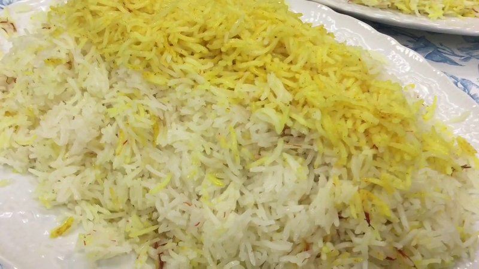

# Saffron Rice (Azerbaijani Style)

*The everyday cousin of plov: basmati steamed under a butter-and-saffron crust until the top is stained amber-gold.*

**Serves:** 6

**Prep Time:** 20 minutes (plus 1 hour soaking)

**Cook Time:** 50 minutes

## Overview
Basmati soaks 1 hour, par-boils in heavily salted water 5 minutes, drains. The empty pot films with butter, the rice mounds in, more butter dots on top, saffron-infused water drizzles over the peak. Tea-towel-wrapped lid traps steam. 40 minutes on low heat. Done.

## Ingredients
- 500 g basmati rice
- 2 tablespoons salt (for the par-boil)
- 80 g unsalted butter
- 1 large pinch saffron threads (~15 strands)
- 3 tablespoons boiling water

## Method

### Stage 1 - Soak and par-boil
1. Rinse the basmati under cold water until the runoff is clear.
1. Soak in cold salted water 1 hour.
1. Bring 3 L water to a rolling boil with 2 tablespoons salt.
1. Drain the rice; tip into the boiling water.
1. Par-boil 5 minutes - grains should bend but still have a hard core.
1. Drain in a colander; rinse briefly with warm water.

### Stage 2 - Saffron infusion
1. Grind the saffron threads with a tiny pinch of sugar in a mortar.
1. Pour over 3 tablespoons boiling water; rest 5 minutes.

### Stage 3 - Steam
1. Melt half the butter (40 g) in a heavy pot over medium heat until just foaming.
1. Tip the par-boiled rice on top, mounding into a loose pyramid.
1. Drizzle the saffron infusion over the peak (it'll stain the top layer amber).
1. Dot the remaining 40 g butter in cubes on top.
1. Wrap the pot lid in a clean tea towel (catches condensation).
1. Cover tight; reduce heat to low.
1. Steam 40 minutes - do not lift the lid.

### Stage 4 - Plate
1. Lift the saffron-stained top layer onto a warm platter first.
1. Heap the remaining rice around it.
1. The bottom of the pot will have a thin crisp golden crust - break this into shards and serve alongside.

## Notes
- **Tea-towel wrap is the trick:** the cloth absorbs the rising steam so condensation doesn't drip back onto the rice and make it stodgy.
- **Don't stir during steaming:** the rice cooks evenly on its own. Stirring crushes grains and releases starch.
- **Two-stage cooking:** the par-boil sets the grain length; the steam finishes it dry and separate.

## Storage
- Refrigerate 3 days; reheat covered with a tablespoon of water in a 160°C oven 15 minutes.
- Freezes 2 months in portion-sized bags; thaw 4 hours in the fridge before reheating.
