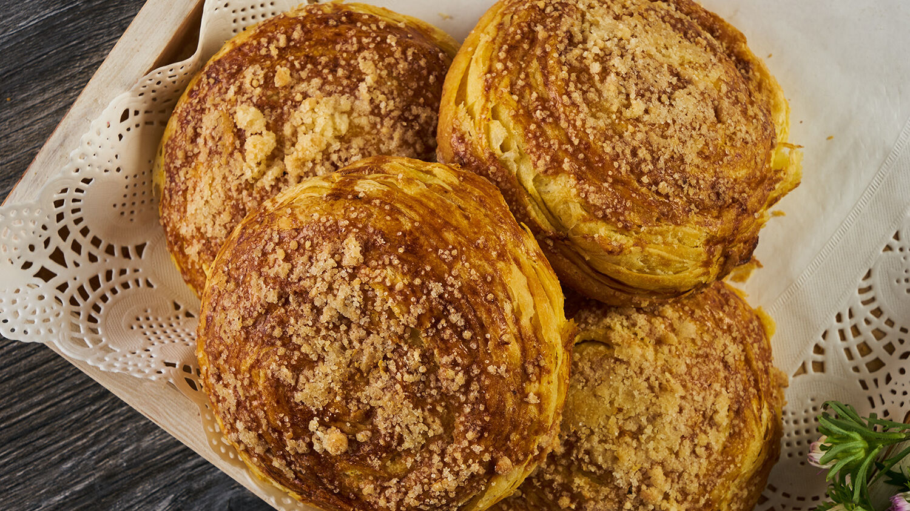

# Goghal

*Azerbaijan's spiced flaky pastry: laminated dough layered with butter and a heady mix of black pepper, caraway and saffron. Eaten with sweet tea.*

**Serves:** Makes 12 goghal

**Prep Time:** 1 hour (plus 1 hour resting)

**Cook Time:** 25 minutes

## Overview
A yeasted milk-and-egg dough rests for 1 hour. Spice mix combines black pepper, caraway, fennel, saffron and a hard cheese-like crumble (Azerbaijani gurut or a substitute). Dough rolls thin, brushes with butter, sprinkles with spice; folds, rolls, sprinkles again, repeated 3 times. Final dough rolls 1 cm thick; cuts with a glass into 12 rounds; eggwashes; bakes for 25 minutes at 180°C.

## Ingredients

### Dough
- 500 g plain flour
- 7 g instant yeast (1 sachet)
- 1 teaspoon salt
- 1 teaspoon caster sugar
- 250 ml warm milk
- 2 eggs (large)
- 50 g unsalted butter (melted, plus extra for laminating)

### Spice paste
- 80 g unsalted butter (softened)
- 1 tablespoon coarse-ground black pepper
- 1 teaspoon caraway seeds (lightly crushed)
- 1 teaspoon fennel seeds (lightly crushed)
- 1 teaspoon ground turmeric
- 1 pinch saffron threads (steeped in 1 tablespoon hot water)
- 50 g aged sheep's cheese, grated (or pecorino as a substitute)

### Glaze
- 1 egg yolk
- 1 tablespoon milk
- 1 teaspoon black caraway (or nigella seeds, kalonji)
- 1 teaspoon sesame seeds

## Method

### Stage 1 - Dough
1. In a wide bowl, whisk the flour, yeast, salt and sugar.
1. In a jug, combine warm milk, eggs and melted butter.
1. Pour wet into dry; mix to a shaggy mass.
1. Knead 8-10 minutes (or 6 in a stand mixer) until smooth and elastic.
1. Rest in a lightly oiled bowl, covered, 1 hour or until doubled.

### Stage 2 - Spice paste
1. Mash the softened butter with the black pepper, caraway, fennel, turmeric, saffron infusion and grated cheese.
1. The paste should be spreadable.

### Stage 3 - Laminate
1. Punch the dough down; turn onto a lightly floured surface.
1. Roll to a rectangle 40 × 30 cm, 5 mm thick.
1. Spread a third of the spice paste over the rectangle.
1. Fold into thirds like a letter (long-side fold).
1. Roll out again to 40 × 30 cm; spread another third; fold.
1. Repeat once more with the last of the paste.

### Stage 4 - Cut and shape
1. Roll the final folded dough to a rectangle 1 cm thick.
1. Cut into 12 rounds with a 7 cm glass or cutter.
1. Place on a parchment-lined baking tray, spaced 3 cm apart.
1. Rest 15 minutes (the layers relax).

### Stage 5 - Bake
1. Heat the oven to 180°C (160°C fan).
1. Whisk the egg yolk with milk; brush the tops.
1. Scatter nigella and sesame seeds.
1. Bake 25 minutes until deep gold; the layers should visibly puff and separate at the edges.

### Stage 6 - Serve
1. Cool 10 minutes on the tray.
1. Serve warm with strong sweet tea.

## Notes
- **Cold butter for lamination:** if the butter softens too much during folding, chill the dough 15 minutes between turns.
- **Crushed pepper, not ground:** the cracked pepper gives little nuggets of heat that ground pepper lacks. Use a mortar.
- **Aged sheep's cheese gives goghal its bite:** pecorino romano works well as a substitute for Azeri gurut.

## Storage
- Keep 3 days at room temperature in an airtight container.
- Warm briefly in a 150°C oven 5 minutes before serving to revive the flaky layers.
- Freezes 2 months in a sealed bag; thaw at room temperature, then warm as above.
