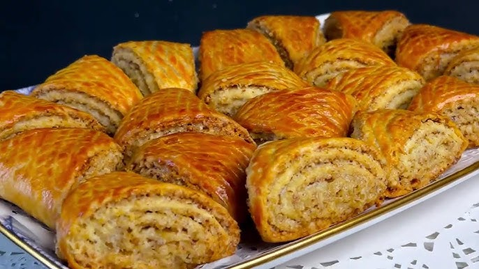

# Kete (Azerbaijani Herb-Stuffed Flatbread)

*A bread of Azerbaijan's mountains: enriched dough wrapped around a buttery filling of fresh coriander, dill, mint and spring onion.*

**Serves:** Makes 6 kete (serves 6 as a snack)

**Prep Time:** 30 minutes (plus 1 hour rising)

**Cook Time:** 20 minutes

## Overview
A bread from the mountain villages of Azerbaijan and the wider Caucasus, the kind of thing a family bakes on a Saturday morning and eats through the week with cheese, with stew, on its own with tea. You make a simple yeasted milk-and-egg dough and let it rise for an hour, while you slowly soften onions in butter until they're pale gold and sweet. The onions cool and mix with chopped fresh coriander, dill, mint, spring onion and a knob more butter for the filling. The dough divides into six balls, each rolls flat, gets a heap of filling, gathers up into a purse, presses flat to a twelve-centimetre disc, then rolls under a pin to a centimetre thick. Pan-fry on a dry hot skillet for four minutes per side, or bake at 200°C for fifteen minutes if you'd rather a more even browning. Eaten hot, torn and shared, with a glass of buttermilk or strong tea.

## Ingredients

### Dough
- 400 g plain flour
- 5 g instant yeast
- 1 teaspoon salt
- 1 teaspoon sugar
- 200 ml warm milk
- 1 egg (large)
- 30 g unsalted butter (melted)

### Filling
- 80 g unsalted butter
- 2 onions (medium, finely diced)
- 40 g fresh coriander (leaves and tender stems, chopped)
- 30 g fresh dill (chopped)
- 30 g fresh mint (leaves, chopped)
- 30 g spring onion (green parts, finely sliced)
- ½ teaspoon salt
- ¼ teaspoon ground black pepper

### Glaze
- 1 egg yolk (beaten with 1 tablespoon milk)

## Method

### Stage 1 - Dough
1. In a wide bowl, whisk flour, yeast, salt and sugar.
1. In a jug, combine warm milk, egg and melted butter.
1. Pour wet into dry; mix and knead 8 minutes until smooth and supple.
1. Rest in a covered bowl 1 hour until doubled.

### Stage 2 - Filling
1. Melt 50 g of the butter in a wide pan over medium-low heat.
1. Add the diced onions; cook 12-15 minutes, stirring often, until soft and pale gold (not browned).
1. Tip onto a plate; cool 15 minutes.
1. In a bowl, combine the cool onions with the remaining 30 g softened butter and all the chopped herbs.
1. Season with salt and pepper.

### Stage 3 - Shape
1. Knock the risen dough back; divide into 6 balls (~110 g each).
1. Roll each ball to a 15 cm disc on a lightly floured surface.
1. Spoon 3 heaped tablespoons of filling into the centre.
1. Gather the edges up over the filling, pinching to seal at the top like a money-purse.
1. Flip seal-side down; press gently with the heel of the hand to flatten.
1. Roll lightly with a pin to a 12 cm disc, 1 cm thick (don't press so hard the filling bursts).

### Stage 4 - Cook
1. **Pan method:** heat a heavy dry skillet over medium heat. Cook 4 minutes per side until deeply blistered and the dough sounds hollow when tapped.
1. **Oven method:** heat the oven to 200°C (180°C fan). Place the kete on a parchment-lined tray; brush with the egg-yolk glaze. Bake 15 minutes until amber.

### Stage 5 - Serve
1. Stack on a plate under a tea towel for 2-3 minutes (rests the layers).
1. Cut each into quarters; serve warm.

## Notes
- **Cool the onions before mixing herbs:** hot onions wilt the fresh herbs and the filling goes grey-green and limp.
- **Don't over-fill:** more than 3 tablespoons and the kete bursts when rolled flat.
- **Pan-fry vs bake:** pan gives a charred, more rustic crust; oven gives an even glaze and is easier in batch. Both work.

## Storage
- Best within an hour of cooking.
- Keeps 1 day at room temperature in a sealed bag.
- Reheats well in a dry pan 1 minute per side.
- Raw shaped kete freeze on a tray, then bag; cook from frozen, adding 2 minutes per side.
