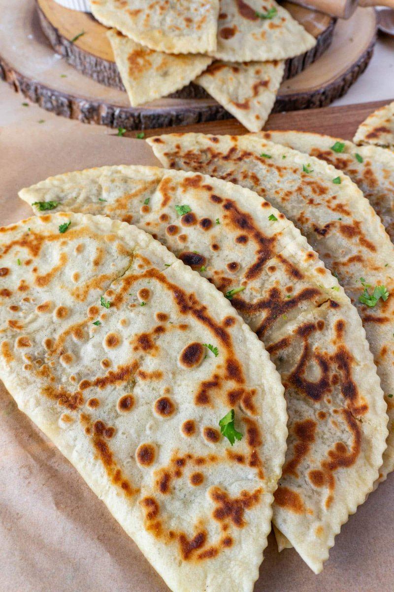

# Qutab

*Azerbaijan's folded flatbread: a herb-and-pomegranate filling sealed in paper-thin dough and pan-fried dry. Brushed with butter and sumac.*

**Serves:** 4 (makes 8 qutab)

**Prep Time:** 30 minutes (plus 30 minutes resting)

**Cook Time:** 24 minutes

## Overview
Azerbaijan's folded flatbread, the proper name for what the diaspora sometimes labels kutab or gözleme depending on where they learned to make it. You knead a dough from flour, warm water and salt to a smooth firm ball, rest for thirty minutes, then build a filling: half a kilo of mixed greens (chard, spinach, sorrel, whatever is around) wilts briefly with onion in a pan, drains hard, then mixes with pomegranate seeds and fresh herbs for the classic herb-and-pomegranate combination. Each ball of dough rolls into a twenty-five-centimetre circle so thin it's translucent. The filling spreads over one half, the other half folds over, edges press to seal. Onto a dry skillet for ninety seconds per side until the dough is blistered and the filling is steaming. Brush with melted butter while hot, sprinkle with sumac. Eat folded in half, the sumac sharp against the herby green inside.

## Ingredients

### Dough
- 400 g plain flour
- 220 ml warm water
- 1 teaspoon salt

### Greens filling
- 250 g spinach
- 100 g sorrel (or extra spinach if unavailable)
- 50 g spring onions (white and green, finely sliced)
- 20 g fresh dill (chopped)
- 20 g fresh coriander (chopped)
- 80 g pomegranate seeds
- 1 teaspoon salt
- ½ teaspoon ground black pepper
- 1 tablespoon olive oil

### To finish
- 60 g butter (melted)
- 2 tablespoons sumac
- 200 g Greek yogurt
- 2 garlic cloves (crushed)
- A pinch of salt

## Method

### Stage 1 - Dough
1. In a wide bowl, whisk the flour and salt.
1. Pour in the warm water; stir to a shaggy mass.
1. Turn onto a lightly floured surface; knead 6-8 minutes until smooth and firm.
1. Rest 30 minutes under a damp tea towel.

### Stage 2 - Filling
1. Heat the olive oil in a wide pan over medium-high heat.
1. Wilt the spinach and sorrel 2 minutes; tip into a colander.
1. Press hard with the back of a wooden spoon to squeeze out every drop of liquid.
1. Chop the wilted greens fine.
1. In a bowl, combine the chopped greens, sliced spring onion, dill, coriander, pomegranate seeds, salt and pepper.
1. Cool to room temperature.

### Stage 3 - Roll and fill
1. Divide the rested dough into 8 balls (about 75 g each).
1. Cover all but one with the damp tea towel.
1. On a lightly floured surface, roll each ball to a circle 25 cm across and 1 mm thick (almost translucent).
1. Spread 3 tablespoons of filling over half the circle, leaving a 1 cm border.
1. Fold the other half over; press the edges firmly to seal (use a fork if the dough is slippery).

### Stage 4 - Cook
1. Heat a heavy dry skillet over medium heat (no oil).
1. Lay one qutab in the pan; cook 90 seconds - the surface should blister and brown in patches.
1. Flip; cook another 60-90 seconds.
1. Lift onto a warm plate; brush both sides with melted butter; dust with sumac.
1. Repeat for the rest.

### Stage 5 - Yogurt and serve
1. Stir the crushed garlic and salt into the Greek yogurt.
1. Cut each qutab into thirds; serve hot with the garlic yogurt on the side.

## Notes
- **Roll thin or fail:** thick qutab dough turns leathery and the filling doesn't get the chance to steam through. Aim for translucent.
- **Drain the greens hard:** wet filling makes the dough fall apart on the pan.
- **Dry pan, no oil:** qutab is dry-cooked. Brushing butter on after gives the richness without making the bread soggy.
- **Lamb variant:** swap the greens filling for 300 g lamb mince + 1 finely chopped onion + 1 tsp salt + 1 tsp ground sumac + ½ tsp cinnamon, cooked 10 minutes till just done, cooled.

## Storage
- Best straight from the pan.
- Cooked qutab keep 1 day refrigerated; reheat in a dry pan over medium heat 1 minute per side.
- Raw assembled qutab freeze on a parchment-lined tray, then bag; cook from frozen, adding 1 minute per side.
