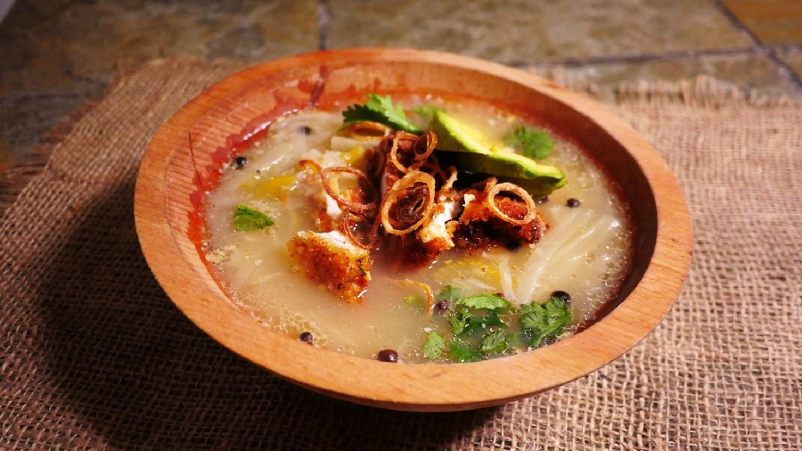

# Bahamian Souse

*The Bahamas' Saturday-morning hangover cure: a clear, citrus-bright broth of poached chicken with onion, celery, potato and a fierce squeeze of lime.*

**Serves:** 4-6

**Prep Time:** 15 minutes

**Cook Time:** 1 ¼ hours

## Overview
The Bahamas' Saturday-morning hangover cure, the breakfast bowl that arrives steaming in fish shacks and family kitchens across the islands the morning after a wedding or a heavy Friday. You poach bone-in chicken pieces (legs or wings) in lightly salted water with onion, celery, allspice, bay and a whole goat pepper for an hour or so, until the meat falls easily from the bone and the broth has taken on the perfume of the spice. Potatoes go in for the last fifteen minutes so they cook through but hold their shape. Off the heat, you acidify the souse hard with the juice of four or five limes (the souse is meant to taste sharply citric, not gently lemony) and a final tweak of salt. Ladle into deep bowls with the goat pepper floated on top for whoever's brave, and serve with johnnycake or grits on the side to soak.

## Ingredients

### Chicken and broth
- 1.2 kg bone-in chicken pieces (a mix of thighs, drumsticks and wings)
- 2 litres cold water
- 1 onion (large, sliced)
- 2 celery stalks (sliced; reserve the leafy tops)
- 4 garlic cloves (smashed)
- 4 spring onions (whole)
- 1 carrot (sliced)
- 1 tablespoon allspice berries (or 1 teaspoon ground)
- 2 bay leaves
- 1 whole scotch bonnet (or goat pepper, left whole, pierced once with a knife)
- 1 ½ teaspoons salt (plus more to taste)
- 1 teaspoon freshly ground black pepper

### Vegetables (added later)
- 500 g waxy potatoes (peeled, cut into 3 cm chunks)

### To finish
- 4-5 limes (juice; about 120 ml)
- A small bunch of flat-leaf parsley (chopped)
- Bahamian hot sauce (to serve)
- Extra lime wedges

### Optional accompaniment
- Johnnycake, grits, or thick slices of buttered white bread

## Method

### Stage 1 - Wash the chicken (traditional)
1. Rinse the chicken pieces under cold water; rub with the juice of ½ lime and a generous pinch of salt. Rinse again and pat dry. This step is universal in Bahamian kitchens; it's about flavour as much as cleaning.

### Stage 2 - Build the pot
1. Place the chicken in a large heavy pot. Cover with the cold water.
2. Bring to the boil over high heat. As it heats, skim off any grey scum that rises.
3. Reduce the heat to medium-low; add the onion, celery, garlic, spring onions, carrot, allspice, bay leaves, salt and pepper.
4. Drop in the whole pierced scotch bonnet - whole means flavour without overwhelming heat. If anyone bites it, that's their problem.

### Stage 3 - Simmer
1. Cover the pot loosely and simmer gently for 50 minutes, until the chicken is tender and the broth is fragrant.
2. Skim any further scum or excess fat from the surface.

### Stage 4 - Potatoes
1. Add the chunks of potato to the pot.
2. Cover and simmer another 15-18 minutes, until the potatoes are just tender to a knife.

### Stage 5 - Acidify
1. Off the heat, fish out the whole scotch bonnet (leave it in if you like real fire) and the bay leaves.
2. Pour in the lime juice (start with 4 limes' worth, taste, add more). The broth should taste assertively citric - that's the defining note.
3. Taste and adjust salt. A souse should be clear, bright, clean and a bit fiery.
4. Stir in the chopped parsley.

### Stage 6 - Serve
1. Ladle into deep bowls, making sure each bowl gets chicken, broth, potato and a bit of onion.
2. Pass lime wedges and hot sauce at the table.
3. Serve johnnycake, grits or buttered white bread on the side.

## Notes
- **Lime juice goes in off the heat:** Cooking lime juice dulls it. The bright acidic finish is the whole character of the dish.
- **Whole scotch bonnet:** Pierced once, left whole, fished out at the end. This way the broth gets perfume and warmth without the brutal heat of a chopped pepper. If you like it hot, leave it in or break it apart with a spoon.
- **Allspice (pimento) is essential:** The warm fragrance of allspice is what makes souse taste Bahamian. Don't substitute.
- **Other meats:** Traditional souses use pig's feet, sheep tongue, oxtail or shrimp. Chicken is the most home-friendly version and the easiest to find. If using pig's feet, simmer 2-2 ½ hours; sheep tongue, 2 hours; oxtail, 3 hours.
- **Don't overthink the broth:** Souse is meant to be clear and brothy, not a thick stew. Avoid thickening; the body comes from the lime and the marrow of the bones.

## Variations
**Sheep tongue souse:** Simmer 2 sheep tongues whole until tender (about 2 hours). Peel and slice; return to the broth. Add potatoes for the last 15 minutes.
**Conch souse:** Use 600 g cleaned, thinly sliced conch (raw); skip the long simmer and just warm the conch through in the bright broth at the end. Add lime generously.
**Pig-foot souse:** Use 1.2 kg trimmed pig's feet; simmer 2 ½ hours until the skin and meat are tender.

## Serving
Serve with: johnnycake, grits, or thick buttered white bread.
Garnish with: chopped parsley, hot sauce, lime wedges.

## Storage
- Keeps 3 days refrigerated. The flavour improves overnight; the citric edge softens slightly but stays bright.
- Reheat gently; a fresh squeeze of lime brightens the broth at the table.
- Freezes 2 months; the potatoes get a little softer on thaw.
