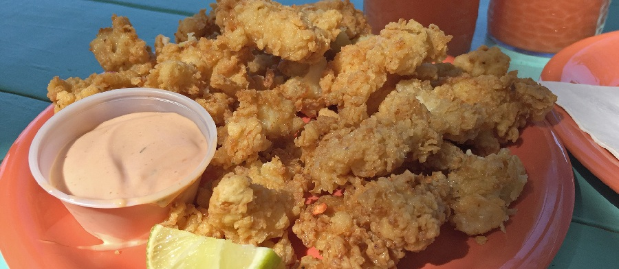

# Cracked Conch

*The Bahamas' fried-fish answer: conch pounded thin, dipped in seasoned batter and fried golden. Served with lime and a tart cabbage slaw.*

**Serves:** 4

**Prep Time:** 25 minutes

**Cook Time:** 15 minutes

## Overview
The Bahamas' fried-fish answer to the seafood basket, the dish you'll find on every island fish-fry menu from Arawak Cay to Spanish Wells. You pound cleaned conch between sheets of cling film with a meat mallet until it's thin and tender (the cracking is literal - the muscle fibres have to break before the conch is anything you'd want to eat), then season it well, dip in seasoned flour and a beaten-egg batter, and shallow- or deep-fry until golden and crisp at the edges. The flesh inside stays sweet and just-tender, with the same chew that prawns have at their best. Served with fat lime wedges to squeeze over, a citrus-cabbage slaw to cut the richness, and whatever peppered hot sauce the cook keeps on the shelf for it. Cold beer alongside; an afternoon at the beach already half over.

## Ingredients

### Conch
- 600 g cleaned conch meat (about 4-6 conch, available frozen at Caribbean and Asian grocers)
- 1 lime (juice)
- 1 teaspoon salt
- 1 teaspoon freshly ground black pepper

### Coating
- 200 g plain flour
- 1 teaspoon paprika
- 1 teaspoon garlic powder
- 1 teaspoon onion powder
- ½ teaspoon cayenne
- ½ teaspoon salt
- ½ teaspoon black pepper
- 2 eggs (large)
- 80 ml milk

### Slaw
- ¼ small white cabbage (finely shredded)
- 1 carrot (grated)
- 2 spring onions (sliced)
- 2 tablespoons mayonnaise
- 1 tablespoon white wine vinegar
- 1 lime (juice)
- ½ teaspoon caster sugar
- salt
- pepper

### To fry and serve
- 500 ml vegetable oil (for shallow-frying)
- 2 limes (cut into wedges)
- Bahamian-style hot sauce (or pepper sauce)

## Method

### Stage 1 - Pound the conch
1. Pat the conch dry. Place each piece between two sheets of cling film or in a sturdy zip-lock bag.
2. Pound with a meat mallet (flat side, not toothed) until each piece is about 5 mm thick and almost translucent at the edges. Don't tear holes; if a piece resists, give it a minute and pound again.
3. Place the pounded pieces in a bowl, douse with lime juice, salt and pepper. Toss; leave 10 minutes.

### Stage 2 - Slaw
1. Combine cabbage, carrot and spring onions in a bowl.
2. Whisk mayonnaise, vinegar, lime juice, sugar, salt and pepper in a small bowl.
3. Toss the dressing through; refrigerate while you fry.

### Stage 3 - Set up the coating
1. Combine the flour, paprika, garlic powder, onion powder, cayenne, salt and pepper in a shallow bowl.
2. Beat the eggs and milk together in a second shallow bowl.

### Stage 4 - Fry
1. Heat the oil in a deep heavy frying pan or saucepan to 180°C (a cube of bread browns in 30 seconds).
2. Pat the conch dry on kitchen paper.
3. Dredge each piece in the seasoned flour, shake off excess, dip into the egg wash, then back into the flour for a second coating. Press the flour on firmly.
4. Slide 3-4 pieces at a time into the hot oil. Fry 2-3 minutes per side until deep golden and crisp. Don't crowd the pan or the temperature drops.
5. Lift onto kitchen paper and season lightly with salt while still hot. Keep warm while you fry the rest.

### Stage 5 - Serve
1. Pile the conch onto a warm platter.
2. Spoon the slaw alongside.
3. Scatter with lime wedges; serve hot sauce on the side.

## Notes
- **Conch sourcing:** Cleaned, frozen conch meat is the realistic option in the UK or Western markets - look at Caribbean grocers, Chinese supermarkets or specialist fishmongers. Defrost in the fridge overnight before pounding.
- **Squid as a substitute:** If conch is impossible to find, use cleaned squid tubes scored on the inside and cut into rough rectangles, pounded the same way. The texture is close enough.
- **Pound, don't dice:** The whole point of "cracked" is the tenderising. Skip the pounding and you have rubber.
- **Double coat:** Dipping flour-egg-flour gives the crispy, craggy crust that holds the seasoning.
- **Oil temperature:** 180°C is the sweet spot. Too cool and the conch goes greasy; too hot and the crust burns before the inside is hot.

## Variations
**Cracked conch sandwich:** Stack 2 pieces in a soft white roll with slaw, hot sauce and a slice of tomato. A Bahamian fish-fry classic.
**Bake-and-fry batter:** Some cooks use a beer batter instead of the egg-and-flour double coat. Whisk 200 g flour, 1 teaspoon baking powder and 250 ml cold lager; dip and fry.

## Serving
Serve with: peas and rice, fries, slaw, or a soft white roll for sandwiches.
Garnish with: lime wedges, fresh hot sauce.

## Storage
- Best eaten immediately; the crust softens fast.
- Leftover conch keeps a day in the fridge; reheat on a wire rack in a 200°C oven for 5-6 minutes to re-crisp. Don't microwave.
