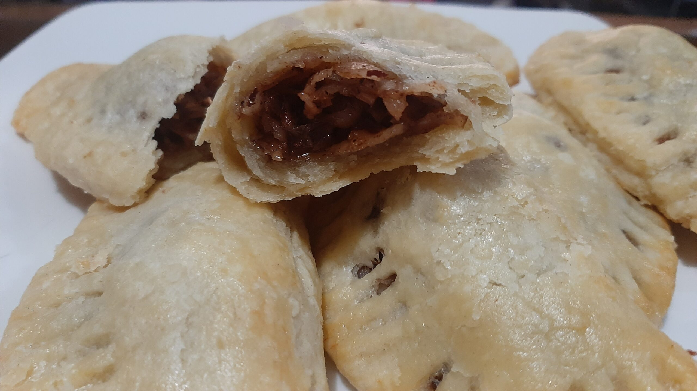

# Bahamian Coconut Tart

*The Bahamas' Sunday afternoon sweet: a buttery shortcrust pastry filled with sweetened grated coconut bound with eggs, condensed milk, lime zest and a splash of rum, baked till the filling sets to a chewy golden custard. The simple coconut sweet that every Bahamian grandmother makes.*

**Serves:** 8

**Prep Time:** 30 minutes (plus 30 minutes pastry resting)

**Cook Time:** 45 minutes

## Overview
The Bahamian coconut tart is the country's everyday family-Sunday dessert: a buttery shortcrust pastry case filled with sweetened coconut that bakes to a chewy golden custard. Grated coconut bound with eggs, sweetened condensed milk, a splash of rum, lime zest, vanilla and nutmeg. The tart sits in the Caribbean coconut-dessert family alongside Trinidadian coconut bake, Jamaican coconut drops and the wider tradition of taking ripe coconut and turning it into something memorable. The Bahamian version distinguishes itself with the rum-and-lime profile and the chewy-set filling rather than the cake-like coconut breads of other islands. Fresh grated coconut is traditional; full-fat desiccated soaked briefly in warm milk is the closest substitute. Sweetened coconut flakes go too sweet. The condensed milk does double duty: sweetness and dairy that sets the filling chewy rather than dry. The rum and lime are not optional; they lift the sweetness and give the tart its proper Bahamian profile.

## Ingredients

### Pastry
- 250 g plain flour
- 50 g caster sugar
- ¼ teaspoon fine sea salt
- 150 g cold butter (cubed)
- 1 large egg yolk
- 2-3 tablespoons ice-cold water

### Filling
- 200 g fresh grated coconut (or 150 g full-fat desiccated coconut soaked in 200 ml warm milk for 20 minutes, then drained)
- 1 tin (397 g) sweetened condensed milk
- 2 large eggs
- 1 large egg yolk
- 1 tablespoon dark rum (Bahamian or Caribbean)
- 1 teaspoon vanilla extract
- Zest of 1 lime
- ½ teaspoon ground nutmeg
- ¼ teaspoon fine sea salt

### To finish
- 1 tablespoon caster sugar (for sprinkling)
- A pinch of nutmeg

## Method

### Stage 1 - Make the pastry
1. Combine the flour, sugar and salt in a wide bowl; whisk to distribute.
2. Add the cold cubed butter; rub in with your fingertips till the mixture looks like coarse breadcrumbs with some pea-sized lumps of butter.
3. In a small bowl, whisk together the egg yolk and 2 tablespoons of ice water.
4. Pour into the flour mixture; stir gently with a fork till the dough just comes together. Add the third tablespoon of water if needed.
5. Tip onto a lightly floured surface; press into a flat disc.
6. Wrap in cling film and refrigerate 30 minutes.

### Stage 2 - Roll and line the tart tin
1. Preheat the oven to 180°C (350°F).
2. Lightly grease a 24 cm fluted tart tin (with removable base if possible).
3. On a lightly floured surface, roll the chilled pastry to a circle about 30 cm wide and 4 mm thick.
4. Lift the pastry on the rolling pin and drape over the tart tin.
5. Press into the corners and up the sides; trim the overhanging edges flush with the rim of the tin.
6. Prick the base all over with a fork.
7. Chill for 15 minutes while you make the filling.

### Stage 3 - Blind-bake the pastry
1. Line the chilled pastry with parchment paper; fill with baking beans (or dried rice or beans).
2. Bake for 15 minutes till the edges are pale gold.
3. Lift out the parchment and beans; return to the oven for another 5 minutes till the base is just starting to colour.
4. Take out; let cool while you make the filling.

### Stage 4 - Make the filling
1. If using soaked desiccated coconut: drain thoroughly, pressing out excess milk; keep the drained coconut.
2. In a wide bowl, whisk together the condensed milk, eggs, egg yolk, rum, vanilla, lime zest, nutmeg and salt till smooth.
3. Stir in the grated (or soaked-and-drained) coconut.
4. The filling should be thick enough to hold soft mounds but pourable.

### Stage 5 - Fill and bake
1. Pour (or scoop) the filling into the par-baked tart shell.
2. Smooth the top with a spatula.
3. Sprinkle the tablespoon of sugar and a pinch of nutmeg over the top.
4. Bake for 25-30 minutes till the top is golden-brown and the filling is set (a slight wobble in the centre is fine; it firms up as it cools).

### Stage 6 - Cool and serve
1. Take out of the oven; let cool in the tin for 20 minutes.
2. Lift out (if using a removable-base tin); cool another 20 minutes on a wire rack.
3. Cut into wedges with a sharp serrated knife.
4. Serve at room temperature or slightly warm.

## Notes
- **Fresh coconut if you can:** fresh grated coconut gives the best texture and flavour. Pre-grated frozen coconut (sold at Asian and Caribbean markets) is the next best; desiccated soaked in warm milk is the workable substitute.
- **Soak desiccated coconut first:** dry desiccated coconut goes through the filling without rehydrating and gives a dry chewy tart with a slightly crystalline texture. The 20-minute warm-milk soak rehydrates it and gives a closer-to-fresh result.
- **Don't skip the rum and lime:** these are what make the tart Bahamian rather than generic. Both are small quantities; both are essential.
- **Blind-bake the pastry:** the wet coconut filling can give a soggy base if the pastry isn't pre-baked. The blind-bake step takes 20 minutes total and prevents this.
- **Wobble is normal:** the filling should be just set when you take it out (a slight wobble in the centre is fine). It firms up considerably as it cools. Overbaking gives a dry tart.

## Variations
- **Coconut tart with guava:** spread 2 tablespoons of guava jam over the par-baked pastry before pouring in the coconut filling; gives a pink-and-white layered tart that's properly Bahamian.
- **Toasted coconut version:** toast the grated coconut in a dry pan over medium heat for 3-4 minutes till golden before adding to the filling; gives a deeper nutty flavour.
- **Lime curd coconut tart:** spread 100 g of lime curd over the par-baked pastry; pour the coconut filling over; gives a lime-coconut combination that's properly tropical.
- **Spiced rum tart:** double the nutmeg, add ½ teaspoon of cinnamon and use spiced rum instead of plain; gives a festive Bahamian version for the holidays.

## Serving
- Wedges at room temperature or slightly warm, often with a scoop of vanilla ice cream or a dollop of whipped cream. A small glass of dark rum or a Bahamian coffee alongside. Properly part of a Sunday afternoon family gathering.

## Storage
- Keeps in a sealed container at room temperature 2 days; or refrigerated 5 days.
- Best eaten at room temperature; let chilled slices come to room temp 30 minutes before serving.
- Freezes 2 months wrapped tightly; defrost overnight in the fridge.
- Don't microwave; the pastry goes soggy and the coconut filling turns rubbery.
