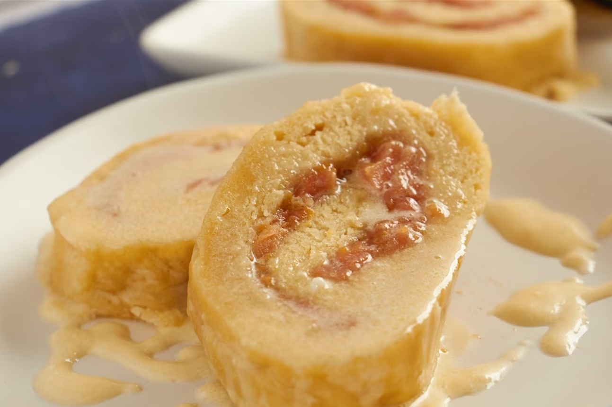

# Guava Duff

*The Bahamas' iconic dessert: a sweet rolled pastry filled with stewed guava, steamed (not baked) till the dough is tender and the filling oozes, served sliced with a warm butter-rum sauce. The Sunday afternoon dessert of every Bahamian island.*

**Serves:** 8

**Prep Time:** 35 minutes

**Cook Time:** 1 hour 15 minutes

## Overview
Guava duff is the Bahamas' iconic Sunday dessert and one of the more unusual confections in the wider Caribbean: a sweet enriched dough rolled flat, spread with stewed guava, rolled into a long sausage like a Swiss roll, wrapped in muslin (or foil these days) and steamed (not baked) over simmering water for an hour or more till the dough is tender and the guava filling oozes into the cake. Sliced and served warm with the signature Bahamian rum-butter sauce poured over (butter, sugar, condensed milk and dark rum cooked till glossy). The "duff" comes from the British steamed-pudding tradition (spotted dick, jam roly-poly); the guava is the Bahamian twist. Rarely seen outside the Bahamas. The steaming is non-negotiable; baking gives a dry cake-like texture. Fresh pink-fleshed guava is canonical; canned guava drained, or guava paste from a Latin American market, are the substitutes. The rum sauce is what takes the dessert from interesting to memorable; it is not a garnish.

## Ingredients

### Dough
- 400 g plain flour
- 100 g caster sugar
- 2 teaspoons baking powder
- ½ teaspoon fine sea salt
- 100 g cold butter (cubed)
- 1 large egg
- 150 ml whole milk (cold)
- 1 teaspoon vanilla extract
- Zest of 1 lime

### Guava filling
- 600 g fresh ripe guava (or 300 g canned guava drained, or 250 g guava paste cubed)
- 150 g caster sugar (less if using sweetened guava paste)
- 2 tablespoons fresh lime juice
- ½ teaspoon ground cinnamon
- ¼ teaspoon ground nutmeg
- Pinch of fine sea salt

### Rum-butter sauce
- 100 g unsalted butter
- 100 g caster sugar
- 150 ml sweetened condensed milk
- 50 ml dark rum (Caribbean dark rum; or Bahamian; or use light rum if dark isn't available)
- 1 teaspoon vanilla extract
- Pinch of nutmeg

### Equipment
- A 30 cm × 25 cm sheet of clean cotton muslin (or 2 layers of aluminium foil; or a heatproof plastic wrap suitable for steaming)
- Kitchen string
- A large lidded pot or steamer big enough to fit the rolled duff (40 cm wide is ideal)

## Method

### Stage 1 - Make the guava filling
1. If using fresh guavas: peel them, halve them, scoop out the seeds (the small hard seeds; not the soft flesh). Chop the flesh roughly. If using canned guava, drain and chop. If using guava paste, cube into 5 mm pieces.
2. Place the prepared guava in a saucepan with the sugar, lime juice, cinnamon, nutmeg and salt.
3. Cook over medium heat for 10-12 minutes, stirring frequently, till the guava breaks down and the mixture thickens to a jam-like consistency.
4. Take off the heat; transfer to a wide plate to cool to room temperature (you can speed this up by placing in the fridge).
5. The filling should be thick enough to hold its shape on a spoon; if it's runny, return to the pan and cook a few more minutes.

### Stage 2 - Make the dough
1. Combine the flour, sugar, baking powder, salt and lime zest in a wide bowl; whisk to distribute.
2. Add the cold cubed butter; rub in with your fingertips till the mixture looks like coarse breadcrumbs.
3. In a separate small bowl, whisk together the egg, milk and vanilla.
4. Pour into the butter-flour mixture.
5. Stir gently with a wooden spoon till the dough just comes together.
6. Turn onto a lightly floured surface; knead briefly (10-15 seconds) till smooth.
7. Don't overwork; you want a tender dough.

### Stage 3 - Roll out the dough
1. On a lightly floured surface, roll the dough into a rectangle about 35 cm × 25 cm and 5-6 mm thick.
2. Spread the cooled guava filling evenly over the rolled dough, leaving a 2 cm border on all sides.

### Stage 4 - Roll and wrap
1. Starting from one long edge, roll the dough into a long sausage like a Swiss roll, keeping the filling inside.
2. Pinch the seam and ends to seal.
3. Transfer the rolled duff (seam-side down) onto your sheet of muslin.
4. Wrap the muslin around the duff; the muslin should be loose enough to allow the duff to expand by about 50% during steaming (don't wrap tightly).
5. Tie the ends with kitchen string. If using foil, wrap loosely in 2 layers; if using heatproof plastic wrap, wrap and seal the ends.

### Stage 5 - Steam
1. Bring a large pot of water to a boil; you need at least 5 cm of water in the bottom.
2. Place a rack or steaming basket in the pot, above the water level.
3. Place the wrapped duff on the rack.
4. Cover the pot tightly with the lid.
5. Reduce heat to maintain a steady simmer; steam for 1 hour 15 minutes.
6. Check the water level every 20 minutes; top up with boiling water if needed (never with cold water; it interrupts the cooking).

### Stage 6 - Make the rum sauce (last 15 minutes of steaming)
1. Melt the butter in a saucepan over medium heat.
2. Add the sugar; stir till dissolved.
3. Add the condensed milk; stir till combined.
4. Cook 2-3 minutes till the sauce comes together to a glossy consistency.
5. Take off the heat; stir in the rum, vanilla and nutmeg.
6. Keep warm.

### Stage 7 - Unwrap and slice
1. Lift the duff out of the pot.
2. Let cool 5 minutes before unwrapping.
3. Unwrap carefully; the duff will be a soft hot rolled cake with the guava filling visible at the ends.
4. Transfer to a serving plate.
5. Slice into 8 thick pieces with a sharp serrated knife.

### Stage 8 - Serve
1. Place each slice on a warm dessert plate.
2. Pour generous rum-butter sauce over each slice; the sauce should soak in slightly.
3. Serve immediately while warm.
4. A scoop of vanilla ice cream is non-traditional but welcome.

## Notes
- **Steam, don't bake:** the canonical Bahamian guava duff is steamed, not baked. Steaming gives the soft pudding-like texture that defines the dessert. Baked versions are drier and more cake-like; lovely but not duff.
- **Don't wrap tightly:** the duff expands during steaming. A tight wrap will burst or give a misshapen cake; a loose wrap (with about 50% expansion room) gives the proper shape.
- **The rum sauce is essential:** plain duff is fine but unmemorable; the rum-butter sauce is what makes it special. Don't skip.
- **Use fresh guavas if you can:** fresh pink-fleshed guavas are increasingly available; the flavour is brighter than canned or paste. If you can only find one, use the order of preference: fresh > canned > guava paste.
- **Lime is the bridge:** the lime zest in the dough and the lime juice in the filling cut through the sweetness and give the duff its proper Bahamian profile. Don't skip.

## Variations
**Pineapple duff:** swap the guava filling for chopped fresh pineapple cooked the same way; the pineapple version is common in the south Bahamas.
**Coconut duff:** add 50 g of desiccated coconut to the dough; the coconut adds texture and bridges with other Bahamian sweet things.
**Banana duff:** swap the guava for mashed ripe banana cooked with sugar and rum; a homely variation common at family Sunday lunches.
**Spiced rum duff:** double the cinnamon and add ½ teaspoon of allspice to the filling; uses spiced rum in the sauce. Properly festive Bahamian.

## Serving
Slices on warm dessert plates with the rum-butter sauce poured generously over. Vanilla ice cream on the side is non-traditional but excellent. A small glass of dark rum or a Bahamian coffee alongside. Properly served warm; reheat slices in a low oven if needed.

## Storage
- The cooked duff (without sauce) keeps refrigerated 4 days. Slice cold; reheat slices wrapped in foil in a low oven (150°C / 300°F) for 10 minutes till warmed through.
- The rum sauce keeps refrigerated 1 week; reheat gently in a small pan over low heat.
- Freezes 2 months wrapped tightly; defrost in the fridge, slice cold, reheat as above.
- Don't microwave whole pieces; the dough goes rubbery. Slice first, then microwave individual pieces briefly if you must.
