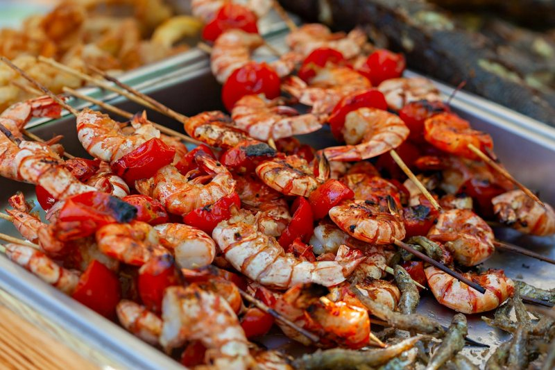

# Fire-Roasted Jerk Shrimp

*Bahamian jerk scampi: shrimp roasted in a screaming oven in a beer-and-butter bath with Scotch bonnet, allspice, thyme and scallion.*

**Serves:** 2

**Prep Time:** 15 minutes

**Cook Time:** 5 minutes

## Overview
A fast, fragrant, hands-on dish: medium shrimp roasted hard in a beer-and-butter pool, with the jerk flavours (Scotch bonnet, allspice, thyme, garlic, scallion) bloomed into the fat at 260°C. The shrimp themselves are quick-cooked and sweet; the real treasure is what's at the bottom of the dish, a spiced, foaming butter that gets sopped up with hot toasted Cuban bread or baguette. Allspice (called pimento across the Caribbean) is the herbal warmth, Scotch bonnet brings the fruity-fierce heat, and beer adds a yeasty undertone that lifts the butter. Smell hits the kitchen the moment the dish leaves the oven and is genuinely the best part of dinner. Absurdly easy, everything goes cold into one dish, into the oven, 5 minutes, done. The dish is adapted from the Bahama Breeze restaurant chain, where it's a long-running menu staple, but the core technique (shrimp roasted in spiced butter, dipped with bread) is shared across the Bahamas as a casual party-snack format.

## Ingredients

- 120 ml beer (any pale or lager)
- ¼ teaspoon ground allspice (also called pimento)
- ½ teaspoon Scotch bonnet (minced; **wear gloves**)
- 1 teaspoon garlic (chopped)
- 1 teaspoon fresh thyme leaves
- 1 tablespoon spring onion (sliced)
- 340 g medium shrimp (peeled, deveined; tail-on for presentation)
- 4 tablespoons butter (melted)
- 1 loaf Cuban bread (or French baguette)

## Method

### Stage 1 - Heat the oven
1. Preheat the oven to 260°C / 500°F (or as hot as it goes).
1. Set the rack in the middle.

### Stage 2 - Build the dish
1. In a 1-quart (~1 litre) oven-safe baking dish, combine the beer, allspice, minced Scotch bonnet, garlic, thyme and spring onion. Stir.
1. Add the shrimp in a single layer.
1. Drizzle the melted butter over the top so every shrimp gets a swipe.

### Stage 3 - Bread
1. Slice the bread into 2 ½ cm-thick slices.
1. Lay the slices on a baking tray.

### Stage 4 - Roast
1. Slide the dish and the tray of bread into the oven side-by-side.
1. Roast 4-5 minutes. The shrimp should be bubbling and just-opaque; the bread should be golden.
1. Lift both out.

### Stage 5 - Serve
1. Bring the hot dish straight to the table.
1. Pile the bread alongside.
1. Eat with the fingers; dunk the bread into the spiced butter.

## Notes
- **Don't overcook the shrimp:** five minutes at 260°C is plenty. Anything longer and the shrimp go rubbery. Check at 4 minutes if your oven runs hot.
- **Scotch bonnet gloves:** the oils transfer to skin and stay there for hours. Always wear gloves when prepping; wash your hands twice afterwards regardless.
- **Beer choice:** a light lager or pilsner works. Avoid stout or heavy IPA - too dominant against the shrimp.
- **The bread is non-negotiable:** the spiced butter at the bottom of the dish is the second half of the meal. Bread to mop. Don't skip it.

## Storage
- Best eaten immediately.
- Leftover shrimp can be chopped through pasta or rice the next day.
- Don't refrigerate the dish with the butter still in - it congeals and reheats poorly.
