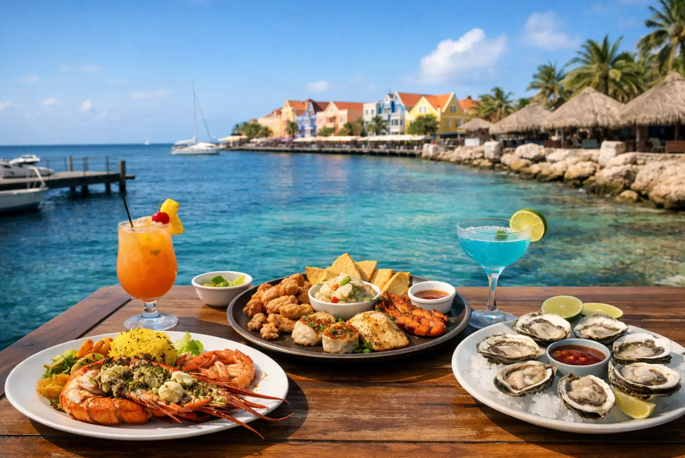

# Bahamian Cuisine

Caribbean cuisine of the Bahamian archipelago, shaped by West African heritage, English colonial influence, and the surrounding sea. Conch (cracked, in fritters, in salad) is the national ingredient; rock lobster, grouper and snapper define seafood plates. Stews and pots (peas and rice, stew chicken, souse) run alongside johnny cake (Bahamian cornbread). Allspice, scotch bonnet, thyme and lime drive the seasoning; jerk preparations cross over from Jamaica; rum cake closes meals.
