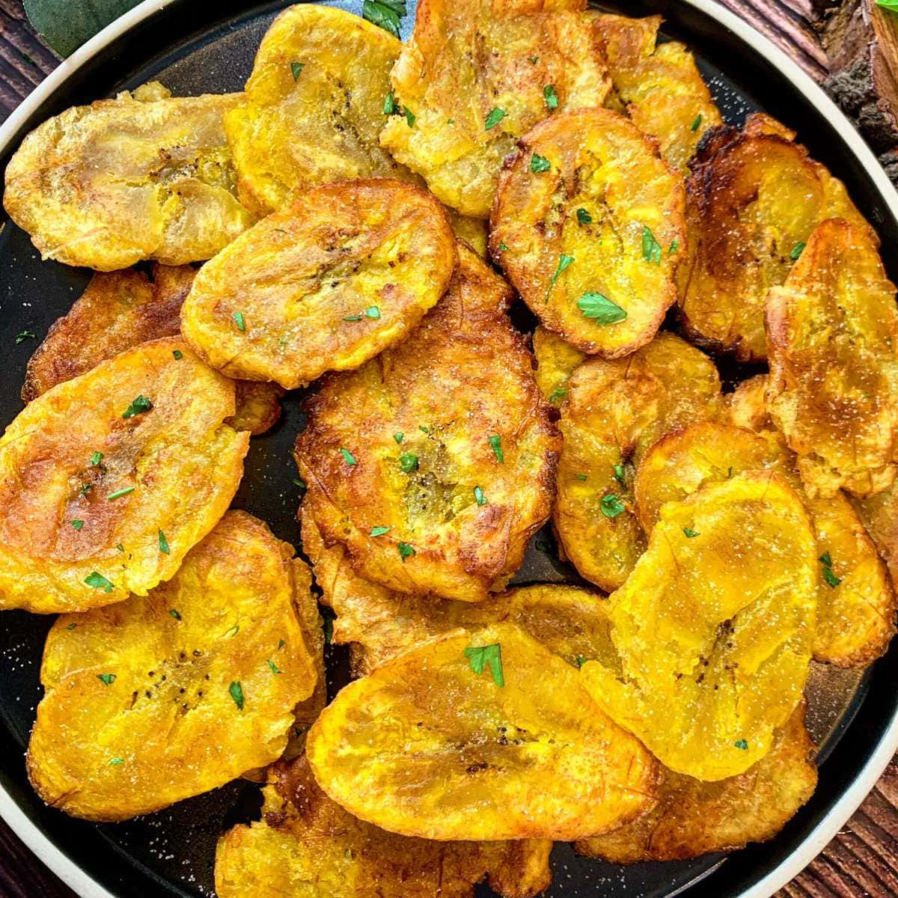

# Bahamian Fried Plantains

*The Bahamian sweet side: ripe yellow-black plantains sliced on the bias and pan-fried in butter or oil till the cut edges caramelise to deep mahogany and the interior turns soft, sweet and slightly creamy. The sweet contrast to peas and rice, stewed chicken and cracked conch.*

**Serves:** 4

**Prep Time:** 10 minutes

**Cook Time:** 15 minutes

## Overview
Fried plantains turn up on tables across the Bahamas and the wider Caribbean as the sweet counterpoint to savoury mains: ripe plantains (the canonical version uses yellow-black plantains, where the skin has gone from green through yellow with dark spots and is starting to blacken; this is when the fruit is properly sweet and tender), peeled, sliced on the bias into 1 cm thick ovals, and pan-fried in butter or vegetable oil over medium heat till the cut surfaces caramelise to deep mahogany and the inside turns soft, sweet and almost creamy. The dish takes 10 minutes once the plantains are ripe and is the easiest of all Caribbean sides. The ripeness of the plantain is everything. Green plantains give you tostones (twice-fried savoury patties) or fufu (boiled and mashed); yellow plantains give you something in between; properly black-spotted yellow-going-black plantains give you sweet fried plantains with the right caramelised character. If your plantains are too green when you buy them (which is common at most supermarkets), leave them on the counter for 5-10 days till the skin goes properly black-spotted. Underripe plantains taste starchy and bland fried; properly ripe ones go almost dessert-sweet. Two technique points. Slice on the bias (a 45-degree angle) for the longest cooking surface and the most caramelisation per piece. And cook in batches so the pan stays hot; overcrowding gives steamed, soggy plantains rather than properly caramelised ones.

## Ingredients

- 3 large ripe plantains (yellow-black, with significant black spotting; about 600 g total)
- 60 g unsalted butter (or 4 tablespoons vegetable oil; or a 50/50 mix for the best of both)
- A pinch of fine sea salt (optional)
- A pinch of ground cinnamon (optional, for a sweeter dessert-leaning version)

### To finish
- Flaky sea salt (optional)

## Method

### Stage 1 - Choose and ripen the plantains
1. Look at the skin: it should be deep yellow with significant black spotting and possibly some all-black patches. The plantain should feel slightly soft when pressed (like a ripe banana), not rock-hard.
2. If your plantains are still green or yellow without spots, leave on the counter for 3-7 days till they go black-spotted.

### Stage 2 - Peel and slice
1. Cut off the ends of each plantain.
2. Make a shallow cut along the length of each plantain, just through the skin (not into the flesh).
3. Peel back the skin from the cut; it should come off in big strips. If the plantain is properly ripe, this should be easy.
4. Slice each plantain on a 45-degree bias into 1 cm thick ovals; each piece should be about 4-5 cm long.

### Stage 3 - Heat the pan
1. Heat the butter (or oil, or the mix) in a wide heavy frying pan over medium heat till the butter is melted and just foaming (not browning yet).

### Stage 4 - Pan-fry in batches
1. Add the plantain slices to the pan in a single layer, leaving space between them so they don't crowd. Work in 2 batches if needed.
2. Cook 3-4 minutes per side without moving them so the cut surface caramelises to deep mahogany.
3. Flip with a thin spatula; cook the second side 3-4 minutes till also deeply caramelised.
4. The plantains should be properly soft when pressed (a wooden skewer should slide in easily); the cut surfaces should be properly browned.
5. Transfer to a warm plate lined with kitchen paper.
6. Add a fresh tablespoon of butter to the pan if needed; cook the second batch.

### Stage 5 - Finish and serve
1. Sprinkle with a tiny pinch of sea salt (optional; brings out the sweetness).
2. Dust with a pinch of cinnamon for a dessert-leaning version (optional).
3. Serve immediately while warm and the caramelisation is at its peak.

## Notes
- **Ripeness is everything:** the canonical Bahamian fried plantain is made with yellow-black or black plantains, when the fruit is properly sweet and tender. Underripe (yellow-only or green-yellow) plantains will be bland and starchy; properly ripe ones go sweetly caramelised.
- **Buy ahead:** plantains at most supermarkets are sold green or yellow; plan 3-7 days ahead so they ripen at home. They keep ripening on the counter; you can speed it up by leaving them in a paper bag with a banana.
- **Butter, oil or both:** butter gives the best caramelised flavour but can burn at higher heats; vegetable oil takes higher heat without burning but lacks the flavour. A 50/50 mix is the best compromise. Coconut oil is also lovely and very Bahamian.
- **Medium heat, not high:** plantains are sugary when ripe; high heat burns the sugars before the interior softens. Medium heat (or even just below medium) gives properly caramelised plantains with soft interiors.
- **Cook in batches:** an overcrowded pan steams instead of frying. Better to do two batches with proper caramelisation than one batch with steam-soggy plantains.

## Variations
**Plantanos maduros (caramelised dessert version):** sprinkle 1 tablespoon of brown sugar over the plantains in the pan halfway through cooking the second side; the sugar caramelises into a sticky glaze. Sweet enough to be dessert.
**Tostones (green plantain version):** use green plantains; slice into 2 cm rounds; fry for 4 minutes per side, flatten each piece with the back of a flat-bottomed glass or a tostonera, and fry again for 2 minutes per side. Crisp savoury patties; common Bahamian appetiser.
**Plantain-and-bacon:** wrap each plantain slice in half a strip of streaky bacon; secure with a toothpick and pan-fry till the bacon is crisp. A Caribbean dinner-party version.
**Spiced fried plantains:** add a pinch of allspice and a small pinch of cayenne to the cooking butter; gives a Bahamian-style spiced sweet plantain.

## Serving
Alongside peas and rice and any savoury main: cracked conch, fried grouper, stewed chicken. The sweet caramelised plantain is the contrast to the savoury rice and protein. Also good at breakfast alongside scrambled eggs and bacon. Or as a dessert with vanilla ice cream and a drizzle of rum and cream.

## Storage
- Best eaten immediately while warm and the caramelisation is at its peak; they go off-texture once cooled.
- Keep refrigerated 2 days in a sealed container; reheat in a hot dry pan for 1-2 minutes per side, or briefly under a grill (broiler).
- Don't microwave; the plantains turn rubbery.
- Don't freeze; the texture suffers completely.
