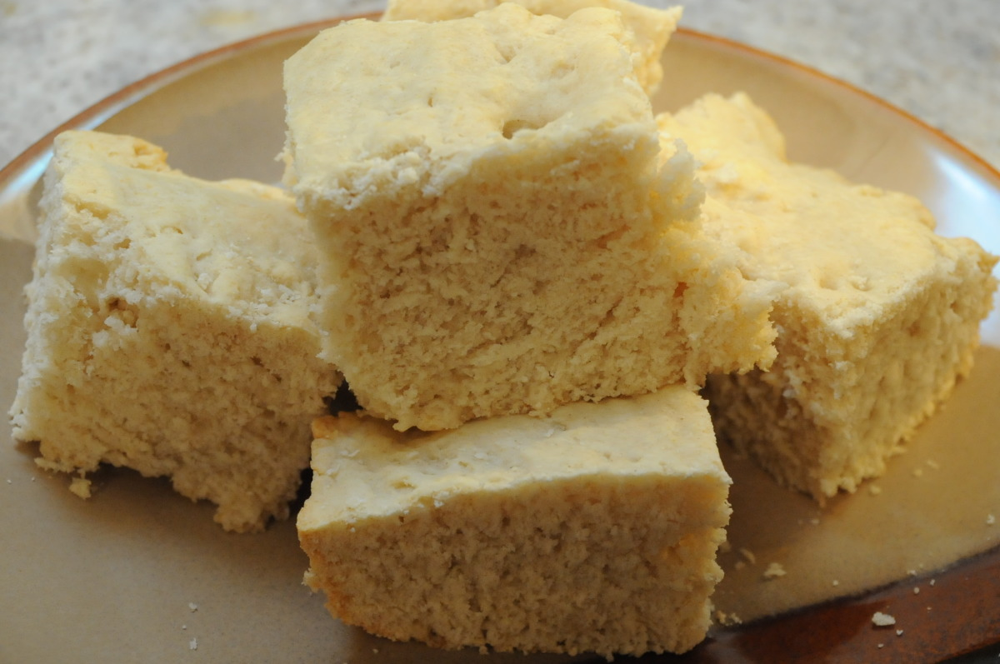

# Bahamian Johnny Cake

*The Bahamas' everyday quick bread: a slightly sweet, slightly cakey, slightly biscuit-like loaf of flour, sugar, butter and milk baked in a square pan and sliced into thick squares. The Bahamian bread that turns up at breakfast with conch chowder and coffee, and at dinner alongside peas and rice.*

**Serves:** 8 squares

**Prep Time:** 15 minutes

**Cook Time:** 30 minutes

## Overview
Johnny cake is the Bahamas' everyday quick bread, sitting somewhere between cornbread, biscuit and cake: a slightly sweet white-flour bread leavened with baking powder, enriched with butter and milk and just enough sugar to take it out of plain-biscuit territory, baked in a square pan till the top goes golden-brown and the inside stays soft and slightly cakey. The Bahamian version is canonically wheat-flour (no cornmeal, despite the name), which distinguishes it from the cornmeal "journey cake" of the American South. Three details define proper Bahamian johnny cake. First, the texture is slightly cakey rather than dense biscuit. The leavening (baking powder) and the moderate butter-to-flour ratio give the bread a lift that thicker biscuit doughs lack. It should be tender, not crumbly; sliceable without breaking. Second, just enough sugar to feel slightly sweet but not enough to be a cake. The sugar quantity matters; too little and it tastes like plain biscuit; too much and it tastes like cake. The 2 tablespoons in this recipe is the sweet spot. Third, baked in a square pan rather than rolled-and-cut. Some recipes call for rolling out a dough and cutting circles; the proper Bahamian johnny cake is a single square loaf baked together, then cut into squares once cool. This gives the proper soft interior; rolled-and-cut versions go drier.

## Ingredients

- 400 g plain (all-purpose) flour
- 2 tablespoons caster sugar
- 4 teaspoons baking powder
- 1 teaspoon fine sea salt
- 80 g cold unsalted butter (cubed; or use cold lard for traditional texture)
- 250 ml whole milk (cold)
- 1 large egg
- 2 tablespoons melted butter (for brushing on top)

## Method

### Stage 1 - Prepare the pan and oven
1. Preheat the oven to 190°C (375°F).
2. Line a 22 cm square baking tin with parchment paper, letting the paper overhang two sides for easy lifting later.
3. Lightly grease the parchment with melted butter.

### Stage 2 - Mix the dry ingredients
1. Tip the flour, sugar, baking powder and salt into a wide bowl.
2. Whisk together to distribute evenly.

### Stage 3 - Cut in the butter
1. Add the cubed cold butter to the dry mixture.
2. Use a pastry cutter, two knives, or your fingertips to work the butter into the flour till the mixture resembles coarse breadcrumbs with some pea-sized lumps of butter still visible. Don't go to a smooth paste; the visible butter lumps give the bread its proper texture.
3. Keep the butter cold throughout; if your hands warm it up, pop the bowl in the fridge for 5 minutes.

### Stage 4 - Add the wet ingredients
1. In a separate small bowl, whisk together the milk and the egg.
2. Pour into the butter-flour mixture.
3. Stir gently with a wooden spoon till just combined; the mixture should form a soft sticky dough.
4. Don't overmix; lumps and patches of butter are fine.

### Stage 5 - Press into the pan
1. Tip the dough into the prepared baking tin.
2. Press gently with your hands (or the back of a spoon) to spread evenly to the edges and corners. The dough should fill the pan in a roughly 3 cm thick layer.
3. Smooth the top with a knife or offset spatula.

### Stage 6 - Bake
1. Bake on the middle shelf of the oven for 25-30 minutes till the top is golden-brown and a skewer inserted into the centre comes out clean (or with just a few crumbs clinging).
2. The top should have a slight crackle and a deep golden colour.

### Stage 7 - Brush and cool
1. Take out of the oven.
2. Immediately brush the top with the 2 tablespoons of melted butter; the heat helps it absorb.
3. Let cool in the tin for 10 minutes.
4. Lift out using the overhanging parchment.
5. Cool 10 more minutes on a wire rack before cutting.

### Stage 8 - Cut and serve
1. Cut into 8 even squares with a sharp serrated knife.
2. Serve warm, with butter or guava jam, or alongside the main dish.

## Notes
- **Wheat flour, not cornmeal:** Bahamian johnny cake is wheat-based, unlike its Southern US cousin which is cornmeal-based. Don't confuse the two; the textures and flavours are completely different.
- **Cold butter is essential:** the butter should be properly cold (straight from the fridge) when cut into the flour. Warm butter melts into the dough and gives a dense bread instead of a tender one. Keep everything cold; pop the bowl in the fridge between steps if your kitchen is warm.
- **Don't overmix:** mix only till the dough just comes together; visible patches of butter and small lumps are fine. Overmixing develops the gluten and gives a tough chewy bread instead of a tender cakey one.
- **Just enough sugar:** 2 tablespoons of sugar is the canonical amount; some recipes go to 4 tablespoons (more cake-like), some go to 1 tablespoon (more biscuit-like). 2 is the proper middle.
- **22 cm square pan:** the size matters; a smaller pan gives a thicker bread that takes longer to bake through and goes dry on top; a larger pan gives a thinner bread that goes from underdone to overdone in seconds. Use what's specified.

## Variations
**Coconut johnny cake:** add 50 g of desiccated coconut to the dry ingredients; gives a tropical note that's common in the southern Bahamas (Acklins, Crooked Island).
**Cornmeal johnny cake (American Southern style):** swap 100 g of the flour for fine cornmeal; gives the more crumbly textured version familiar in the American South. Less traditional Bahamian but a valid variant.
**Cheese johnny cake:** add 100 g of grated sharp cheddar to the dry mixture; great as a savoury side. Common Bahamian variation.
**Sweeter Sunday johnny cake:** double the sugar to 4 tablespoons and brush with honey instead of butter at the end; sweeter Sunday breakfast version.

## Serving
At breakfast with conch chowder, scrambled eggs, or just butter and guava jam. At dinner as the bread alongside peas and rice, stewed chicken, or fish. Properly served warm; reheat slightly if it's cooled (a few seconds in a low oven or microwave).

## Storage
- Keeps in a sealed container at room temperature 2 days; the bread firms up but stays tasty.
- Refrigerated 4 days; reheat in a low oven (150°C / 300°F) for 5 minutes to refresh.
- Freezes 2 months wrapped tightly; defrost at room temperature and warm in the oven.
- Day-old johnny cake makes excellent French toast (Bahamian style: dipped in egg-and-milk, fried in butter, topped with guava jam).
