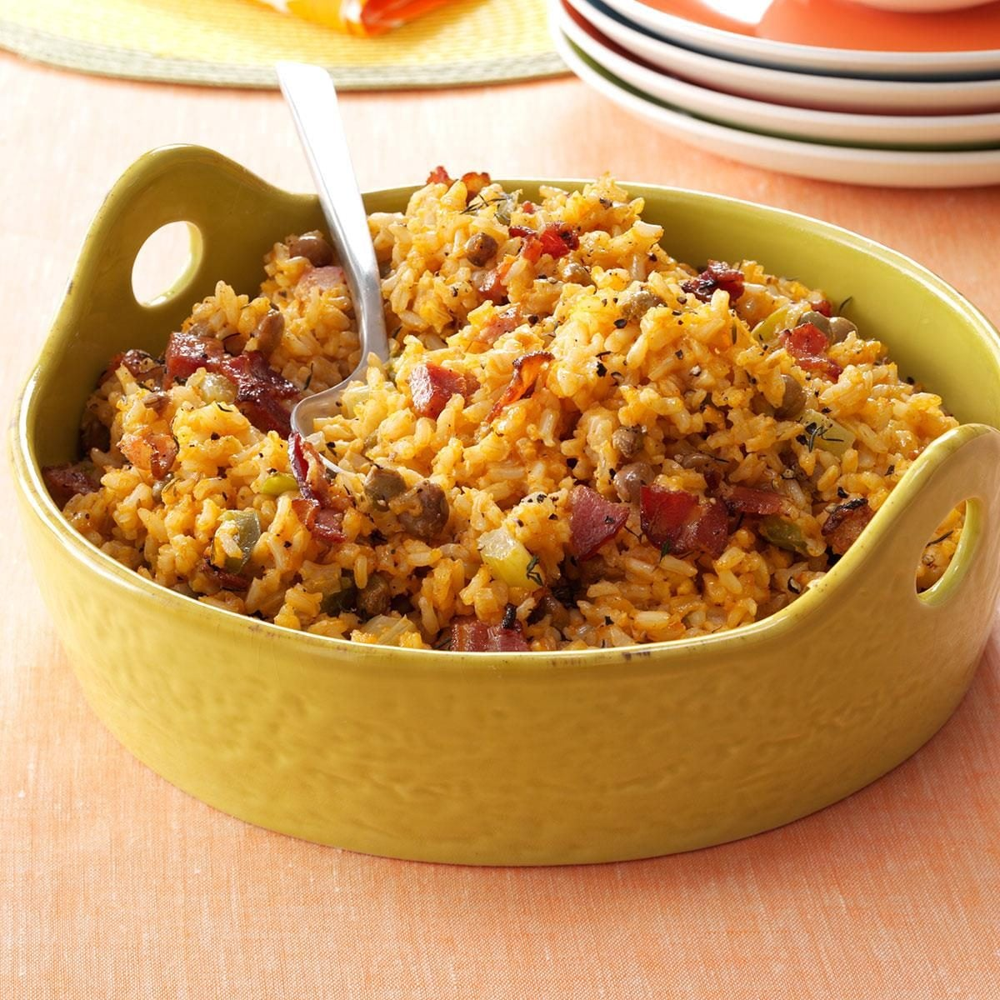

# Bahamian Peas and Rice

*The Bahamas' national side: long-grain rice cooked together with pigeon peas, salt pork or bacon, tomato, onion, sweet pepper and a kick of fresh thyme and bird pepper. The fragrant orange-red rice that turns up alongside cracked conch, stew chicken and every Bahamian fish dish.*

**Serves:** 6

**Prep Time:** 20 minutes

**Cook Time:** 50 minutes

## Overview
Peas and rice is the Bahamas' most beloved side and one of the most recognisable dishes of the country: long-grain rice cooked through with pigeon peas (the small reddish-brown beans grown across the Caribbean), salt pork or smoked bacon for richness, tomato paste and chopped fresh tomato for body, sweet pepper, onion and garlic for the aromatic base, fresh thyme, and a single bird pepper (Scotch bonnet or habanero) for the traditional Bahamian heat. What every Bahamian cook makes alongside cracked conch, stewed chicken, grouper or any other main; the rice catches the cooking juices and ties the meal together. The salt pork renders first to give the fat base; the aromatics sweat in the pork fat. The whole bird pepper floats unpierced in the pot, infusing heat and aroma, then comes out before serving. Result wants to be slightly orange-red from the tomato, fragrant from thyme and pork fat, with the peas distributed evenly through.

## Ingredients

- 100 g salt pork (rind removed; diced into 5 mm pieces; or substitute with 100 g smoked bacon, diced)
- 2 tablespoons vegetable oil (if needed; salt pork usually renders enough fat)
- 1 medium onion (finely diced)
- 1 medium green bell pepper (finely diced)
- 4 garlic cloves (crushed)
- 1 medium tomato (chopped)
- 2 tablespoons tomato paste
- 1 tablespoon fresh thyme leaves (or 1 teaspoon dried)
- 1 whole bird pepper (Scotch bonnet or habanero; not chopped, left whole)
- 400 g pigeon peas (1 large can drained and rinsed; or 200 g dried pigeon peas pre-soaked overnight and pre-cooked till just tender, then drained)
- 400 g long-grain rice (rinsed in cold water 2-3 times till the water runs mostly clear, drained)
- 800 ml chicken stock (hot)
- 1 ½ teaspoons fine sea salt
- ½ teaspoon ground black pepper

### To serve
- Lemon or lime wedges
- Hot sauce (Bahamian hot sauce if you have it; otherwise any Caribbean hot sauce)

## Method

### Stage 1 - Render the salt pork
1. Heat a wide heavy saucepan (with a tight-fitting lid) over medium heat.
2. Add the diced salt pork (or bacon).
3. Cook 5-7 minutes, stirring occasionally, till the fat renders out and the pork pieces are golden and crisp at the edges.
4. The pan should have a generous layer of fat at the bottom; if it looks dry, add 1-2 tablespoons of oil.

### Stage 2 - Sweat the aromatics
1. Add the diced onion and green pepper to the pan; stir into the pork fat.
2. Sweat 5-6 minutes till both have softened and the onion is translucent.
3. Add the crushed garlic; cook 30 seconds.

### Stage 3 - Build the tomato base
1. Add the tomato paste; stir into the aromatics and cook 1-2 minutes till the paste deepens in colour from bright red to brick-red.
2. Add the chopped fresh tomato; cook 2-3 minutes till the tomato breaks down and the mixture is jammy.
3. Stir in the thyme and the black pepper.

### Stage 4 - Add the peas
1. Add the drained pigeon peas; stir to coat in the tomato mixture.
2. Cook 1 minute.

### Stage 5 - Add rice and stock
1. Add the rinsed-and-drained rice; stir for 30 seconds to coat in the seasoning.
2. Pour in the hot chicken stock.
3. Add the salt and the whole bird pepper (not pierced; just floating).
4. Stir once to distribute everything; taste the liquid (the rice will absorb this exact seasoning, so adjust salt now).
5. Bring to a boil.

### Stage 6 - Cook covered
1. Reduce heat to lowest.
2. Cover with the lid tightly.
3. Cook 20 minutes without lifting the lid.

### Stage 7 - Rest and fluff
1. Take off the heat (still covered).
2. Let rest 10 minutes; the rice finishes steaming.
3. Lift the lid; the rice should look properly cooked: distinct grains, the water absorbed, the peas distributed throughout.
4. Lift out the whole bird pepper (and the salt pork rind if you used a piece); discard.
5. Fluff with a fork.

### Stage 8 - Serve
1. Transfer to a serving bowl.
2. Serve immediately as the side to cracked conch, stew chicken, grouper or any Bahamian main.
3. Lemon wedges and hot sauce on the table.

## Notes
- **Pigeon peas are the traditional bean:** small reddish-brown beans, sometimes labelled "gandules" at Latin American markets or "Congo peas" at Caribbean ones. Canned pigeon peas are widely available and work fine; if you can only find dried, soak overnight and pre-cook till just tender before adding to the recipe. Don't substitute red kidney beans or black beans; the flavour is different.
- **Salt pork or smoked bacon:** salt pork is the traditional Bahamian choice; smoked bacon is the easy substitute. Both give the rendered fat and savoury salty character that anchors the dish.
- **Whole bird pepper, not chopped:** keeping the Scotch bonnet (or habanero) whole means the rice gets the floral chilli flavour without the punishing heat that chopped pepper would give. Lift out before serving. If you want more heat, pierce the pepper with a knife before adding.
- **Tomato paste cooked first:** the brief cook of the tomato paste (1-2 minutes) is what deepens the colour and rounds the flavour; skipping it gives a flatter raw-tomato note.
- **Don't lift the lid during cooking:** the rice cooks by absorption-and-steam under the lid; every glance lets steam escape and gives uneven cooking. 20 minutes covered, then 10 minutes resting off-heat, is the proper timing.

## Variations
**Peas and rice with coconut milk:** swap half the chicken stock for coconut milk for a richer creamier version; common variation across the southern Bahamas.
**Black-eyed pea version:** swap the pigeon peas for black-eyed peas; common substitute when pigeon peas aren't available. The colour goes slightly browner and the flavour shifts but the dish works.
**Vegetarian peas and rice:** skip the salt pork; cook the aromatics in 3 tablespoons of vegetable oil with 1 teaspoon of smoked paprika to mimic the smoky note. Use vegetable stock.
**With diced ham:** add 200 g of diced cooked ham along with the peas; common Sunday dinner version.

## Serving
The side to every Bahamian main course. Alongside cracked conch, stewed chicken, fried grouper, conch fritters or any seafood. A sprinkle of Bahamian hot sauce or a squeeze of lime over each portion. Drink: cold Kalik beer (the Bahamian lager); or sky juice (gin and coconut water).

## Storage
- Keeps refrigerated 4 days; the flavour deepens overnight.
- Reheat in a covered pan with a splash of water (or stock) over low heat, or microwave with a splash of water and a damp cloth over.
- Freezes 2 months in portioned containers; defrost in the fridge and reheat.
- Day-old peas and rice fries beautifully into a Bahamian fried-rice with a beaten egg and any leftover meat.
