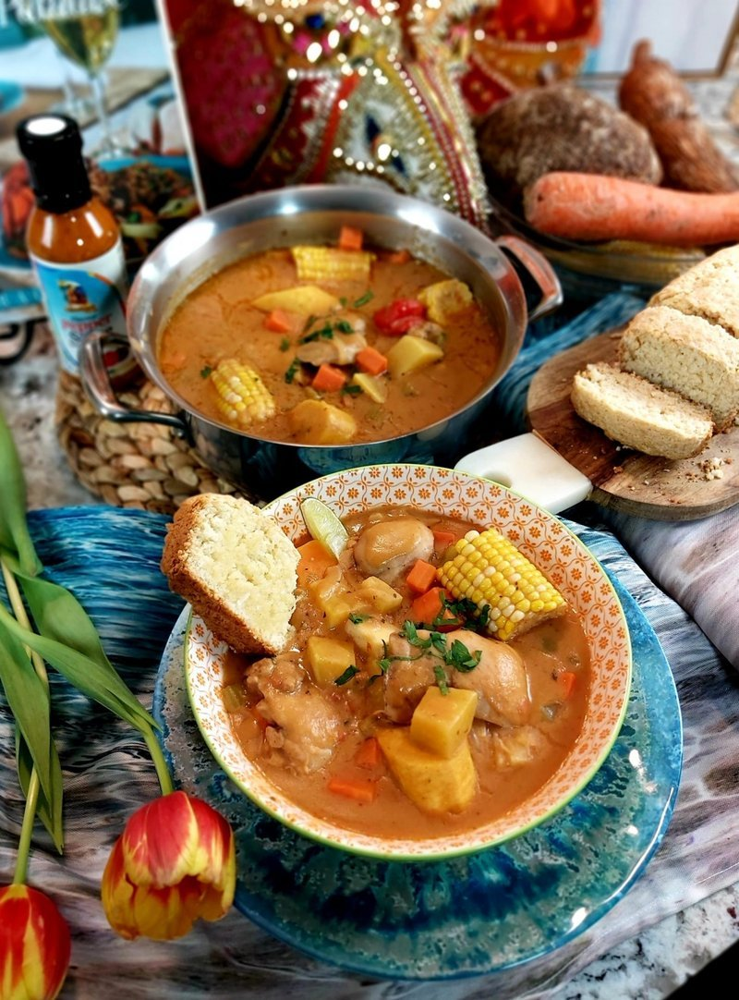

# Bahamian Stew Chicken

*A Bahamian Sunday stew: chicken thighs seared and simmered in a dark roux base with sweet potato, cassava, carrots, corn and plantain. Thyme is the herb.*

**Serves:** 4

**Prep Time:** 25 minutes

**Cook Time:** 50 minutes

## Overview
A dark, brown-roux-thickened stew that sits closer to Louisiana gumbo than to Jamaican brown stew chicken, a tell of how strong the Gulf Coast crossover is in Bahamian cooking. The dark roux is the defining step: flour cooked in oil until it goes the colour of cocoa or dark caramel, building toasted-nut depth that the rest of the dish leans on. The flavour profile is layered savoury: thyme as the dominant herb, smoked paprika for smoke, allspice (in the seasoned salt) for Caribbean lift, a single Scotch bonnet for fruity heat, lime juice at the end to wake everything up. The vegetables make it a complete dish, sweet potato, cassava, carrot, corn-on-the-cob pieces and yellow plantain, all hearty and starchy, all picking up the dark sauce. Smell is roasted flour, thyme, and slow-cooked tomato. Not hard but not quick, the roux needs unbroken attention for 5-8 minutes to avoid burning, and the rest is patient stewing. A Sunday-lunch staple across the Bahamas, traditionally served with rice and Johnny Cake (a Bahamian cornbread), and the kind of dish where the leftovers on day two are arguably better than day one.

## Ingredients

### Seasoned salt
- 2 tablespoons fine sea salt
- 1 teaspoon garlic powder
- 1 teaspoon onion powder
- ¼ teaspoon ground cumin
- 1 teaspoon smoked paprika

### Stew
- 8 boneless skinless chicken thighs
- 1 tablespoon white vinegar (for rinsing)
- 60 ml red wine vinegar
- 240 ml vegetable oil
- 80 g plain flour
- 1 teaspoon tomato paste
- ½ sweet onion (thinly sliced)
- 2 celery stalks (diced)
- 240 ml fire-roasted diced tomatoes (or regular diced tomatoes)
- 1.9 litres chicken stock
- 1 bay leaf
- 1 Caribbean sweet potato (peeled, diced)
- 1 regular sweet potato (peeled, diced)
- 1 piece cassava (~200 g, peeled, diced)
- 1 carrot (large, peeled, diced)
- 2 corn cobs (cut into 7 cm pieces)
- 1 yellow plantain (cut into 5 cm pieces)
- 1 teaspoon fresh thyme leaves
- 1 teaspoon dried oregano
- 2 tablespoons chopped parsley
- 1 Scotch bonnet (diced; **optional, with gloves**)
- 1 lime (juice)
- salt
- pepper
- Lime wedges to serve

## Method

### Stage 1 - Seasoned salt
1. Combine the salt, garlic powder, onion powder, cumin and smoked paprika in a small bowl.

### Stage 2 - Prep and season the chicken
1. Rinse the chicken in cold water with the white vinegar; drain; pat dry.
1. Place in a bowl. Pour the red wine vinegar over and toss.
1. Sprinkle the seasoned-salt blend generously over both sides of each thigh.

### Stage 3 - Sear
1. Heat ½ cup (120 ml) of the oil in a wide skillet over medium-high heat.
1. Sear the thighs in batches, 3 minutes per side, until golden brown.
1. Set aside on a plate.

### Stage 4 - Dark roux
1. Tip the remaining 120 ml oil into a large heavy pot over medium heat.
1. Whisk in the flour continuously.
1. Cook 5-8 minutes, stirring without stopping, until the roux is a deep brown - the colour of dark caramel.
1. Stir in the tomato paste; cook 1 minute.

### Stage 5 - Aromatics
1. Add the sliced onion and diced celery to the pot.
1. Cook 1 minute, stirring.
1. Add the fire-roasted diced tomatoes; stir 3 minutes.

### Stage 6 - Build the stew
1. Carefully pour in the chicken stock (it'll spit; use oven mitts). Stir and bring to a boil.
1. Add the bay leaf, sweet potatoes, cassava, carrot, corn pieces and plantain.
1. Return the seared chicken thighs and any resting juices.
1. Reduce to a medium simmer; cover the lid slightly ajar; cook 15 minutes.

### Stage 7 - Finish
1. The stew should coat the back of a spoon by now. If it's too thin, simmer uncovered 5 minutes.
1. Add the thyme, oregano, parsley and Scotch bonnet (if using).
1. Squeeze in the lime juice.
1. Taste; adjust salt and pepper.
1. Cook 5 more minutes.

### Stage 8 - Serve
1. Ladle into deep bowls. Make sure each bowl gets a piece of corn, plantain and at least one chicken thigh.
1. Serve with lime wedges and a piece of Johnny Cake on the side if you have one.

## Notes
- **Dark roux is the dish:** the longer you cook the flour-oil mixture, the deeper the colour and flavour. Aim for a colour somewhere between peanut butter and dark caramel. Don't burn it - if you see black flecks, start over.
- **Cassava is firmer than potato:** peel it carefully (the skin is bark-like). It holds shape through the stew where a regular potato would break down.
- **Plantain ripeness:** yellow plantain with black spots adds sweetness; green plantain is starchy and savoury. The recipe calls for yellow; pick what you can find.
- **Scotch bonnet gloves:** standard practice. Two minutes of mincing transfer enough capsaicin to burn skin for hours.

## Storage
- Keeps 3 days refrigerated; reheats beautifully and deepens overnight.
- Freezes 2 months. The plantain can go slightly soft on thaw; everything else holds.
