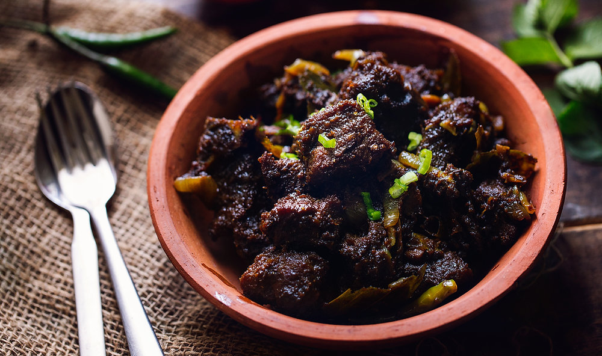

# Beef Bhuna

*Bangladeshi dry-style beef curry: chunks of chuck slow-bhuna'd in their own juices with onion, ginger, garlic and a heavy spice load until the gravy clings tight to the meat.*

**Serves:** 6

**Prep Time:** 20 minutes

**Cook Time:** 2 hours

## Overview
Bhuna is a cooking technique more than a fixed recipe: bhuna means "fried" in the slow sense, the meat cooked down in its own moisture and the masala until the oil splits away and the spices coat the meat in a glossy, dark, intensely concentrated layer. Beef bhuna is the Bangladeshi weekend version, a Friday family lunch in Dhaka, served with rice or porota and a fistful of slit green chillies. The cut is shoulder or chuck, with fat through it; the spice base is onion, ginger, garlic and tomato cooked down hard, with cumin, coriander, turmeric, chilli and the bhuna garam masala (cinnamon, cardamom, clove, mace). The pot gets stirred every fifteen minutes for two hours; you do not walk away.

## Ingredients

- 1 kg beef shoulder or chuck, in 3 cm cubes (fat left on)
- 6 tbsp mustard oil
- 4 large onions, finely sliced
- 4 cm fresh ginger, made into a paste
- 8 garlic cloves, made into a paste
- 2 medium tomatoes, finely chopped
- 2 tsp turmeric powder
- 2 tsp chilli powder
- 2 tbsp ground coriander
- 1 tbsp ground cumin
- 2 tsp salt, plus more to taste
- 1 cinnamon stick (5 cm)
- 6 green cardamom pods, lightly crushed
- 2 black cardamom pods, lightly crushed
- 6 cloves
- 2 bay leaves
- 1 tsp garam masala
- 4 green chillies, slit
- 1 tsp sugar
- 300 ml warm water (added in stages)
- A small handful of fresh coriander, chopped

## Method

### Stage 1 - Sweat the onions
1. Heat the mustard oil in a heavy-based pot until shimmering; let it cool 30 seconds.
2. Add the sliced onions and a pinch of salt; cook over medium heat for 15 minutes, stirring often, until deep golden brown.
3. Push the onions aside, drop in the cinnamon, cardamoms, cloves and bay; let them sizzle 30 seconds.

### Stage 2 - Build the masala base
1. Stir in the ginger and garlic pastes; cook 2 minutes until the raw smell goes.
2. Add the chopped tomatoes; cook 5 minutes until they break down completely.
3. Tip in the turmeric, chilli powder, coriander, cumin and salt; fry 2 minutes with a splash of water to stop the spices burning.

### Stage 3 - Bhuna the beef
1. Add the cubed beef; turn the cubes in the masala to coat every side.
2. Cover and cook over low-medium heat for 30 minutes, stirring every 5 minutes. The beef releases its own juices; do not add water yet.
3. Uncover; raise the heat to medium and stir hard for 10 minutes as the moisture cooks off, the masala darkens, and the oil starts to split out.

### Stage 4 - The long bhuna
1. Add 100 ml warm water; cover and cook for 40 minutes, stirring every 10 minutes.
2. Add another 100 ml water; cover and cook for 30 minutes more.
3. By now the beef should be fork-tender and the gravy thick. If the meat needs longer, add 100 ml more water and cook another 20 minutes.

### Stage 5 - Finish
1. Uncover; stir in the garam masala, green chillies and sugar.
2. Cook uncovered for 5 minutes, stirring, until the masala clings tight to the beef and oil pools at the edge of the pot.
3. Off the heat, scatter with chopped coriander.

## Notes
- **Fat is required.** Lean stewing beef goes stringy. Shoulder, chuck or brisket with marbled fat is what gives the gravy its body.
- **The oil split is the signal.** Bhuna is properly cooked only when you see oil separating around the edges; this is a visible test, not a clock test.
- **No browning step.** Unlike a European stew, the beef is not seared first; it goes into the masala raw and tenderises in the wet phase.
- **Stir, do not abandon.** Two-hour bhuna gets the deepest flavour but requires checking and stirring every 10 to 15 minutes so the masala does not catch.
- **Mustard oil reads sharp.** If you find it too pungent, swap to a neutral oil; the bhuna will still work, just rounder.

## Variations
- **With potato (alu beef bhuna):** add 4 small peeled, halved potatoes in Stage 4 with the second water; they soak up the masala.
- **With coconut:** stir in 100 ml thick coconut milk in Stage 5 for a Chittagong-style finish.
- **Spicier:** double the chilli powder, add 2 sliced bird's-eye chillies in Stage 4.
- **With raw papaya:** add 1 tbsp raw green papaya paste to Stage 3; the enzymes speed-tenderise the beef.
- **Slow-cooker:** Stages 1-3 on the hob, then transfer to a slow-cooker on low for 6 hours; finish on the hob to drive off moisture for the proper bhuna texture.

## Serving
Plain rice or porota (flaky layered flatbread) · slit green chillies · raw onion rings dressed with lime and salt · a thin dal alongside

## Storage
- Refrigerate up to 4 days; flavour deepens significantly by day 2
- Freezes well for 3 months in portioned containers
- Reheat slowly on the hob with a tablespoon of water; do not boil hard or the meat tightens
